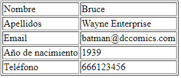

# El llenguatge PHP

??? abstract "Duració i criteris d'avaluació"

    Duració estimada: 26 hores

    <hr />

    | Resultat d'aprenentatge | Criteris d'avaluació|
    | -------                 | -------             |
    | 2. Escriu sentències executables per un servidor Web reconeixent i aplicant procediments d'integració del codi en llenguatges de marques. | a) S'han reconegut els mecanismes de generació de pàgines Web a partir de llenguatges de marques amb codi embegut. <br/> b) S'han identificat les principals tecnologies associades.  <br/> c) S'han utilitzat etiquetes per a la inclusió de codi en el llenguatge de marques.  <br/> d) S'ha reconegut la sintaxi del llenguatge de programació que s'ha d'utilitzar.  <br/> e) S'han escrit sentències simples i s'ha comprovat els seus efectes en el document resultant.  <br/> f) S'han utilitzat directives per a modificar el comportament predeterminat.  <br/> g) S'han utilitzat els diferents tipus de variables i operadors disponibles en el llenguatge.  <br/> h) S'han identificat els àmbits d'utilització de les variables.  <br/> |
    | 3. Escriu blocs de sentències embeguts en llenguatges de marques, seleccionant i utilitzant les estructures de programació.  | a) S'han utilitzat mecanismes de decisió en la creació de blocs de sentències. <br/> b) S'han utilitzat bucles i s'ha verificat el seu funcionament.  <br/> c) S'han utilitzat *«arrays»* per a emmagatzemar i recuperar conjunts de dades.  <br/> d) S'han creat i utilitzat funcions.  <br/> e) S'han utilitzat formularis Web per a interactuar amb l'usuari del navegador Web.  <br/> f) S'han emprat mètodes per a recuperar la informació introduïda en el formulari.  <br/> g) S'han afegit comentaris al codi.  <br/> |


## PHP

{align=right & width=300}

* Acrònim de *Personal Home Page*
* Llenguatge de propòsit general, encara que el seu fort és el *desarollo web.
* Sintaxi similar a C / Java
* El codi s'executa en el servidor (en *Apatxe* mitjançant *mod_php*)
* El client rep el resultat generat després d'interpretar el codi en el servidor.
* El codi s'emmagatzema en arxiu amb extensió `.*php`.

L'última versió és la 8.1, de Novembre de 2021.

La seua documentació és extensa i està traduïda: <https://www.php.net/manual/es/>.

### Codi embegut

Els blocs de codi s'escriuen entre **`<?php`** y **`?>`**, mentre que les sentències se separen mitjançant **`;`**.

``` html+php
<!DOCTYPE html>
<html lang="es">
<head>
<meta charset="UTF-8">
<title>PHP fácil</title>
</head>
<body>
<!-- Muestra una frase con HTML -->
Hola mundo<br>
<!-- Muestra una frase con PHP -->
<?php echo "Es muy fácil programar en PHP."; ?>
</body>
</html>
```

!!! tip "Només etiquetes d'obertura"
    Si el nostre codi només contindrà codi PHP i res d'html, com per exemple, quan codifiquem classes o interfícies, només posarem l'etiqueta d'obertura, per a així indicar que és una arxiu de php pur.

### Generant contingut

Tenim tres possibilitats a l'hora de generar contingut en els nostres documents PHP:

  * **`echo`**`expresión`; 
  * **`print`**`(expresión);`
  * **`<?=`**` expresión ?>`

Les que utilitzarem són `echo` quan ho fem dins d'un bloc d'instruccions i `<?=` quan només anem a mostrar el valor d'una variable dins d'un fragment HTML.

``` html+php
<!DOCTYPE html>
<html lang="es">
<head>
<meta charset="UTF-8">
<meta name="viewport" content="width=device-width, initial-scale=1.0">
<title>Echo y print</title>
</head>
<body>
<p><?php echo "Este texto se mostrará en la página web." ?></p>
<p><?= "Este texto se mostrará en la página web." ?></p>
<p><?php print("Este texto se mostrará en la página web.") ?></p>
</body>
</html>
```

### Comentaris

Podem utilitzar comentaris d'una línia o de bloc:

``` html+php
<?php
// Este es un comentario de una sola línea
/*
  Este es
  un comentario
  que ocupa
  varias líneas
*/ 
?>
```

### Errors

Si hi ha un error d'execució, es produeix un *Fatal Error*.

``` console
Fatal error: Uncaught Error: Call to undefined function plint() in C:\xampp\htdocs\202echo.php:11
 Stack trace:
 #0 {main}
	thrown in C:\xampp\htdocs\202echo.php on line 11
```

Des de PHP 5 es llancen com una excepció. Més endavant veurem l'ús de `try` / `catch`.

### Variables

* No és necessari declarar-les prèviament.
* Comencen per `$`, per exemple `$nom`. Després del `$`, el següent caràcter ha de ser una lletra en minúscula (recomanació) o guió baix `_`. Després ja es poden posar números.
* Són case *sensitive*: `$*var != $*vAR`
* No es declara el seu tipus, el tipat és dinàmic. S'assigna en temps d'execució depenent del valor assignat.
* Convenient inicialitzar-les, sinó donen error.


``` php
<?php
$nombre = "Aitor";
$nombreCompleto = "Aitor Medrano";
$numero = 123;
$numero2 = 456;
$pi = 3.14;
$suerte = true;
$sinValor;

echo $sinValor;
?>
```

!!! info "Tipus"
    Encara que a priori no hi ha tipus de dades, internament PHP treballa amb quatre tipus escalars: *boolean*, *integer*, *float* i *string* i quatre tipus compostos: *array*, *object*, *callable* i *iterable*. Existeix un tipus especial per a *null* (més informació en <http://php.net/manual/es/language.types.null.php>).

### Constants

Són variables el valor dels quals no varien. Existeixen dues possibilitats:

* `define(NOMBRE, valor);`
* `const NOMBRE; // PHP > 5.3`

``` php
<?php
define("PI", 3.1416);
const IVA = 0.21;

echo PI, " ", IVA; // No se pone el símbolo dolar
?>
```

* Es declaren sempre en MAJÚSCULES
* Hi ha un conjunt de constants ja predefinides, també conegudes com *magic constants*: <https://www.php.net/manual/es/language.constants.predefined.php>

## Operadors

### Arimètics

| Exemple    | Nom           | Resultadt
|------------|---------------| ---
| `-$a`      | Negació       | Oposat de `$a`.
| `$a + $b`  | Suma          | Suma de `$a` i `$b`.
| `$a - $b`  | Resta         | Diferència de `$a` i `$b`.
| `$a * $b`  | Multiplicació | Producte de `$a` i `$b`.
| `$a / $b`  | Divisió       | Cocient de `$a` i `$b`.
| `$a % $b`  | Mòdul / Resto | Resta de `$a` dividit per `$b`.
| `$a ** $b` | Potència      | Resultat de `$a` elevat a `$b`. 

En el cas de **cadenes**, si volem concatenar-les, s'utilitza l'operador `.`:

``` php
<?php
$x = 33;
$y = 11;
$z = $x + $y;
echo "La suma de 33 y 11 es ".44."<br />";
echo "La suma de ".$x." y ".$y." es ".(33 + 11)."<br />";
echo "La suma de ".$x." y ".$y." es ".$z."<br />";
?>
```

Realment, en comptes de concatenar cadenes amb variables, podem imprimir-les directament ja que s'expandeixen automàticament:

``` php
<?php
echo "La suma de $x y $y es $z <br />";
?>
```

A vegades, necessitem envoltar el nom de la variable entre claus per a poder unir més text al resultat:

``` php
<?php
$color = "rojo";
echo "El plural de $color el ${color}s";
?>
```

Més endavant estudiarem algunes funcions per al tractament de cadenes.

### Comparació

| Exemple                | Nom                          | Resultat
|------------------------|------------------------------| ---
| `$a == $b`             | Igual                        | `true` si `$a` és igual a `$b` despres de la conversió de tipus.
| `$a === $b`            | Idèntic, Comparació estricta | `true` si `$a` és igual a `$b`, i són del mateix tipus de dades.
| `$a != $b`, `$a <> $b` | Diferent                     |`true` si `$a` no és igual a `$b` despres de la conversió de tipus.
| `$a !== $b`            | No idèntic                   |`true` si `$a` no és igual a `$b`, o si no són del mateix tipus.
| `$a < $b`              | Menor que                    |`true` si `$a` és estrictament menor que `$b`.
| `$a > $b`              | Major que                    |`true` si `$a` és estrictamente major que `$b`.
| `$a <= $b`             | Menor o igual que            |`true` si `$a` és menor o igual que `$b`.
| `$a >= $b`             | Major o igual que            |`true` si `$a` és major o igual que `$b`.
| `$a <=> $b`            | Nau espacial                 | Torna `-1`, `0` o `1` cuando `$a` és respectivament menor, igual, o major que `$b`.
| `$a ?? $b ?? $c`       | Fussió de *null*             | El primer operador d'esquerra a dreta que existisca i no siga `null`. `null` si no hi ha valors definits i no són `null`. PHP >= 7.

### Lògics

| Exemple                 | Nom                 | Resultat
|-------------------------|---------------------| ---
| `$a and $b`, `$a && $b` | *And* (i)           | `true` si tant `$a` com `$b` sòn `true`.
| `$a or $b`, `$a         || $b`                 | *Or* (o inclusiva) | `true` si qualsevol de `$a` o `$b` són `true`.
| `$a xor $b`             | *Xor* (o exclusiva) | `true` si `$a` o `$b` són `true`, pero no ambdós.
| `!$a`                   | *Not* (no)          | `true` si `$a` no és `true`.

### Assignació

| Exemple    | Nom                      | Resultat
|------------|--------------------------| ---
| `$a = $b`  | Assignació               | Assign a `$a` el valor de `$b`
| `$a += $b` | Assignació de la suma    | Li afegix a `$a` el valor de `$b`. Equivalent a `$a = $a + $b`
| `$a -= $b` | Assignació de la resta   | Li resta a `$a` el valor de `$b`. Equivalent a `$a = $a - $b`
| `$a *= $b` | Assignació del producte  | Assigna a `$a` el producte de `$a` per `$b`. Equivalent a `$a = $a * $b`
| `$a /= $b` | Assignació de la divisió | Assigna a `$a` el concient de `$a` entre `$b`. Equivalent a `$a = $a / $b`
| `$a %= $b` | Assignació de la resta   | Assigna a `$a` la resta de dividir `$a` entre `$b`. Equivalent a `$a = $a % $b`
| `$a .= $b` | Concatenació             | Concatena a `$a` la cadena `$b`. Equivalent a `$a = $a . $b`
| `$a++`     | Increment                | Incrementa `$a` en una unitat. Equivalent a `$a = $a + 1`
| `$a--`     | Decrement                | Decrementa `$a` en una unitat. Equivalent a `$a = $a - 1`

!!! Tip "Prioritat dels operadors"
    Recorda la prioritat. Primer els parèntesis, després la negació (`!`), productes/divisions, sumes/restes, comparacions, lògics i finalment es realitza l'assignació.
    Més informació en <https://www.php.net/manual/es/language.operators.precedence.php>

!!! question "Autoavaluació"
    Si `$a=5` i `$b=4`, esbrina el valor de `$c` si `$c = $a*2 > $b+5 && !($b<>4)`

## Treballant amb formularis

Les dades s'envien via URL amb el format `var1=valor1&var2=valor2…`. Per exemple: `exemple.php?nom=Bruce&cognom=Wayne`

Es divideix en dos passos:

1. Generar un formulari amb `action='arxiu.php' method='GET'`
2. En l'arxiu `.php` llegir les dades amb `$_GET['nombreVar']`

Separarem sempre que podem el codi HTML del de PHP.
Per exemple, el formulari el col·loquem en `saluda.html`:

``` html
<form action="saluda.php" method="get">
    <p><label for="nombre">Nombre: </label>
    <input type="text" name="nombre" id="nombre"></p>
    <p><label for="apellido1">Primer apellido:</label> 
    <input type="text" name="apellido1" id="apellido1"></p>
    <p><input type="submit" value="enviar"></p>
</form>
```

I arrepleguem les dades en `saluda.php`:

``` php
<?php
$nombre = $_GET["nombre"];
$apellido1 = $_GET["apellido1"];

echo "Hola $nombre $apellido1";
?>
```

Si el volguérem realitzar tot en un únic arxiu (la qual cosa no és recomanable), podem fer-ho així:

``` html+php
<form action="" method="get">
    <p><label for="nombre">Nombre: </label>
    <input type="text" name="nombre" id="nombre"></p>
    <p><label for="apellido1">Primer apellido:</label>
    <input type="text" name="apellido1" id="apellido1"></p>
    <input type="submit" value="enviar">
</form>
<p>
    <?php
    if(isset($_GET['nombre'])) {
        $nombre = $_GET["nombre"];
        $apellido1 = $_GET["apellido1"];

        echo "Hola $nombre $apellido1";
    }
    ?>
</p>
```

El treball amb formularis l'estudiarem en profunditat en la unitat 4, i veurem que a més de `*GET`, podem enviar les dades amb `POST`.

## Condicions

La condició simple es realitza mitjançant la instrucció `if`. Entre parèntesi es posa la condició que es avalua a `true` o `false`. Si no es posen claus, en comptes d'obrir un bloc, s'executarà només la següent instrucció.

!!! warning "Sempre claus"
    És recomanable posar claus sempre encara que en el moment de codificar només hi haja una única instrucció. D'aquesta manera, es queda preparat per a afegir més contingut en el futur sense provocar *bugs*.

``` php
<?php
$hora = 8; // La hora en formato de 24 horas
if ($hora === 8) {
    echo "Suena el despertador.";
}
echo "<br>";
if ($hora === 8)
    echo "Suena el despertador.";
?>
```

Les condicions compostes mitjançant `if-else`:

``` php
<?php
$hora = 17; // La hora en formato de 24 horas
if ($hora <= 12) {
    echo "Son las " . $hora . " de la mañana";
} else {
    echo "Son las " . ($hora - 12) . " de la tarde";
}
?>
```

Les condicions niades mitjançant `if-else if-else`:

``` php
<?php
$hora = 14; // La hora en formato de 24 horas
if ($hora === 8) {
    echo "Es la hora de desayunar.";
} else if ($hora === 14) {
    echo "Es la hora de la comida.";
} else if ($hora === 21) {
    echo "Es la hora de la cena.";
} else {
    echo "Ahora no toca comer.";
}
?>
```

La sentència `switch` també permet treballar amb condicions múltiples:

``` php
<?php
$hora = 14; // La hora en formato de 24 horas
switch ($hora) {
    case 9:
        echo "Es la hora de desayunar.";
        break;
    case 14:
        echo "Es la hora de la comida.";
        break;
    case 21:
        echo "Es la hora de la cena.";
        break;
    default:
        echo "Ahora no toca comer";
}
?>
```

!!! warning "No oblides el `break`"
    Un error molt comú és oblidar la instrucció `break` després de cada cas. Si no ho posem, executarà el següent cas automàticament.

Finalment, també tenim l'operador ternari `condició ? valorTrue : valorFalse`

``` php
<?php
$hora = 14;
$formato = ($hora > 12) ? 24 : 12;
echo "El formato es de $formato horas"
?>
```

Si volem comprovar si una variable té valor i si no donar-li un valor determinat, usarem l'operador `?:` (es coneix com l'operador Elvis - <https://en.wikipedia.org/wiki/Elvis_operator>) amb la sintaxi `expressió ?: valorSiVacio`:

``` php
<?php
$nombre = $_GET['nombre'] ?: "desconocido"
?>
```

## Bucles

Mitjançant la instrucció `while`:

``` php
<?php
$i = 1;
while ($i <= 10) {
    echo "Línea " . $i;
    echo "<br>";
    $i++;
}
?>
```

Mitjançant la instrucció `do-while`:

``` php
<?php
do {
    $dado = rand(1, 6);
    // rand() devuelve un valor aleatorio 
    echo "Tirando el dado... ";
    echo "ha salido un " . $dado . ".";
    echo "<br>";
} while ($dado != 5);
echo "¡Bien! Saco una ficha de casa.";
?>
```

Mitjançant la instrucció `for`:

``` php
<?php
// Bucle ascendente
for ($i = 1; $i <= 10; $i++) {
    echo "Línea " . $i;
    echo "<br>";
}

// Bucle descendente
for ($i = 10; $i >= 0; $i--) {
    echo "Línea " . $i;
    echo "<br>";
}
?>
```

Més endavant estudiarem el bucle `foreach` per a recórrer arrays.

PHP, de la mateixa manera que Java i C, permet trencar els bucles mitjançant la instrucció `break`.
Al seu torn, `continue` permet saltar a la següent iteració.

!!! danger "Si pots, evita `break` i `continue`"
    Personalment, no m'agrada el seu ús. Preferisc l'ús de variables *flag* per a controlar l'eixida dels bucles. Per exemple:

    ``` php
    <?php
    $salir = false;
    for ($i = 1; $i <= 10 && !$salir; $i++) {
      if ($i === 5) {
        echo "Salgo cuando i=5";
        $salir = true;
      }
    }
    ?>
    ```

## Arrays

Per a emmagatzemar dades compostes, podem utilitzar tant arrays senzills com arrays associatius (similars a un mapa). En realitat tots els arrays són mapes ordenats compostos de parells clau-valor.

!!! caution "Compte amb mesclar tipus"
    Com el tipat és dinàmic, nostres arrays poden contenir dades de diferents tipus. No es recomana mesclar els tipus.

De la mateixa manera que Java, es defineixen mitjançant claudàtors, són 0-index, i es pot assignar un valor a un posició determinada:

``` php
<?php
$frutas = array("naranja", "pera", "manzana");

$frutas2 = ["naranja", "pera", "manzana"];

$frutas3 = [];
$frutas3[0] = "naranja";
$frutas3[1] = "pera";
$frutas3[] = "manzana"; // lo añade al final
```

Podem obtindre la grandària del array mitjançant la funció `count(array)`. Per a recórrer el array farem ús d'un bucle `for`:

``` php
<?php
$tam = count($frutas); // tamaño del array

for ($i=0; $i<count($frutas); $i++) {
    echo "Elemento $i: $frutas[$i] <br />";
}
```

Una altra manera de recórrer els arrays, fins i tot més elegant, és fer ús de `foreach`. La seua sintaxi és `foreach (array as element)`:

``` php
<?php
// Mitjançant foreach no necessitem saber la grandària del array
foreach ($frutas as $fruta) {
    echo "$fruta <br />";
}
```

### Arrays associatius

Cada element és un parell clau-valor. En comptes d'accedir per la posició, el fem mitjançant una clau. Així doncs, per a cada clau s'emmagatzema un valor.

A l'hora de recórrer aquest tipus de arrays, mitjançant `foreach` separem cada element en una parella `clau => valor`:

``` php
<?php
$capitales = ["Italia" => "Roma",
    "Francia" => "Paris",
    "Portugal" => "Lisboa"];
$capitalFrancia = $capitales["Francia"]; // se accede al elemento por la clave, no la posición

$capitales["Alemania"] = "Berlín"; // añadimos un elemento

echo "La capital de Francia es $capitalFrancia <br />";
echo "La capital de Francia es {$capitales["Francia"]} <br />";

$capitales[] = "Madrid"; // se añade con la clave 0 !!! ¡¡¡No asignar valores sin clave!!!

foreach ($capitales as $valor) { // si recorremos un array asociativo, mostraremos los valores
    echo "$valor <br />";
}

foreach ($capitales as $pais => $ciudad) { // separamos cada elemento en clave => valor
    echo "$pais : $ciudad <br />";
}
```

### Operacions

* `print_r($array)`: mostra el contingut de tot el `$array`. Si volem mostrar el contingut amb un format determinat, hem de recórrer el array amb `foreach`.
* `var_dump($mixed)`: mostra el contingut de l'element rebut. Mostra més informació que `print_r`.
* `$elem = array_pop($array)`: elimina l'últim `$element`
* `array_push($array, $elem)`: afig un `$element` al final
* `$booleà = in_array($elem, $array)`: esbrina si `$elem` està en el `$array`

=== "PHP"

    ``` php
    <?php
    $frutas = ["naranja", "pera", "manzana"];

    array_push($frutas, "piña");
    print_r($frutas);

    $ultFruta = array_pop($frutas);
    if (in_array("piña", $frutas)) {
        echo "<p>Queda piña</p>";
    } else {
        echo "<p>No queda piña</p>";
    }
    print_r($frutas);
    ```

=== "Consola"

    ``` console
    Array
    (
      [0] => naranja
      [1] => pera
      [2] => manzana
      [3] => piña
    )
    <p>No queda piña</p>
    Array
    (
      [0] => naranja
      [1] => pera
      [2] => manzana
    )
    ```

* `$claus = array_keys($array)`: retorna les claus del `$array` associatiu
* `$tam = count($array)`: retorna la grandària de `$array`
* `sort($array)`: ordena els elements del `$array`
* `isset($array[element])`: indica si existeix/té valor element dins del array
* `unset($array[element])`: elimina l'element del array (deixa un buit)

=== "PHP"

    ``` php
    <?php
    $capitales = array("Italia" => "Roma",
    "Francia" => "Paris",
    "Portugal" => "Lisboa");

    $paises = array_keys($capitales);
    print_r($paises);
    sort($paises);
    print_r($paises);

    unset($capitales["Francia"]);
    print_r($capitales);
    ```

=== "Consola"

    ``` console
    Array
    (
      [0] => Italia
      [1] => Francia
      [2] => Portugal
    )
    Array
    (
      [0] => Francia
      [1] => Italia
      [2] => Portugal
    )
    Array
    (
      [Italia] => Roma
      [Portugal] => Lisboa
    )
    ```

En assignar un array a un altre es realitza una còpia. Compte amb aquesta operació que pot consumir molts recursos.

=== "PHP"

    ``` php
    <?php
    $nombres = ["Juan", "Ana", "Pedro", "Laura"];
    $copia = $nombres;
    sort($nombres);
    print_r($nombres);
    print_r($copia);
    ```

=== "Consola"

    ``` console
    Array
    (
        [0] => Ana
        [1] => Juan
        [2] => Laura
        [3] => Pedro
    )
    Array
    (
        [0] => Juan
        [1] => Ana
        [2] => Pedro
        [3] => Laura
    )
    ```

Existeixen moltíssimes més funcions per a treballar amb arrays. Pots consultar roda la informació en la [documentació oficial](https://www.php.net/manual/es/ref.array.php).

!!! tip "Articles per a aprofundir en les operacions amb arrays"
    * Un article molt complet (en anglés) de [Com treballar amb arrays en PHP de la manera correcta](https://code.tutsplus.com/tutorials/working-with-php-arrays-in-the-right-way--cms-28606).
    * Un altre article recomanable (en anglés) és [Com ordenar arrays en PHP](https://code.tutsplus.com/tutorials/how-to-sort-arrays-in-php--cms-32313).

### Arrays bidimensionales

Consisteix en un array de arrays, ja siguen arrays seqüencials o associatius. Pot haver-hi N dimensiones.
``` php
<?php
$persona["nombre"] = "Bruce Wayne";
$persona["telefonos"] = ["966 123 456", "636 636 636"]; // array de arrays ordinarios
$persona["profesion"] = ["dia" => "filántropo", "noche" => "caballero oscuro"]; // array de arrays asociativos

echo $persona['nombre']." por la noche trabaja de ".$persona['profesion']['noche'];
```
Combinant els arrays associatius en diverses dimensions podem emmagatzemar la informació com si fora una taula:

``` php
<?php
$menu1 = ["Plato1" => "Macarrones con queso", "Plato2" => "Pescado asado", "Bebida" => "Coca-Cola", "Postre" => "Helado de vainilla"];
$menu2 = ["Plato1" => "Sopa", "Plato2" => "Lomo con patatas", "Bebida" => "Agua", "Postre" => "Arroz con leche"];
$menus = [$menu1, $menu2]; // creamos un array a partir de arrays asociativos

foreach ($menus as $menudeldia) {
  echo "Menú del día<br/>";

  foreach ($menudeldia as $platos => $comida) {
    echo "$platos: $comida <br/>";
  }
}

// Per a accedir a un element concret es nien els claudàtors
$postre0 = $menus[0]["Postre"];
```

Encara que puga semblar una bona idea crear aquest tipus d'estructures, és millor utilitzar objectes conjuntament amb arrays (possiblement arrays d'altres objectes) per a crear estructures complexes que permeten modelar millor els problemes.

## Funcions

Al no declarar-se els tipus de dades, els paràmetres de les funcions no tenen tipus ni s'indica el tipus de dada que retornen. El pas de paràmetres es realitza per valor, és a dir, es realitza una còpia de la variable.

``` php
<?php
function nombreFuncion($par1, $par2, ...) {
  // código
  return $valor;
}

$resultado = nombreFuncion($arg1, $arg2, …);
?>
```

Per exemple:

``` php
<?php
function diaSemana() {
    $semana = [ "lunes", "martes", "miércoles",
        "jueves", "viernes", "sábado", "domingo" ];
    $dia = $semana[rand(0, 6)];
    return $dia;
}

$diaCine = diaSemana();
echo "El próximo $diaCine voy al cine.";
?>
```

### Paràmetres per referència

Si volem passar un paràmetre per referència, en la declaració de la funció, indicarem els paràmetres mitjançant l'operador `&`* per a indicar la direcció de memòria de la variable.

``` php
<?php
function duplicarPorValor($argumento) {
    $argumento = $argumento * 2;
    echo "Dentro de la función: $argumento.<br>";
}
function duplicarPorReferencia(&$argumento) {
    $argumento = $argumento * 2;
    echo "Dentro de la función: $argumento.<br>";
}

$numero1 = 5;
echo "Antes de llamar: $numero1.<br>";
duplicarPorValor($numero1);
echo "Después de llamar: $numero1.<br>";
echo "<br>";

$numero2 = 7;
echo "Antes de llamar: $numero2.<br>";
duplicarPorReferencia($numero2);
echo "Después de llamar: $numero2.<br>";
?>
```

### Paràmetres per defecte / opcionals

Permeten assignar valors en la declaració, i posteriorment, deixar l'argument en blanc.

``` php
<?php
function obtenerCapital($pais = "todos") {
    $capitales = array("Italia" => "Roma",
    "Francia" => "Paris",
    "Portugal" => "Lisboa");

    if ($pais == "todos") {
        return array_values($capitales);
    } else {
        return $capitales[$pais];
    }
}

print_r(obtenerCapital());
echo "<br/>";
echo obtenerCapital("Francia");
```

En el cas de conviure amb una altra mena de paràmetres, els paràmetres que tenen el valor assignat per defecte sempre es col·loquen al final.

``` php
<?php
function saluda($nombre, $prefijo = "Sr") {
    echo "Hola ".$prefijo." ".$nombre;
}

saluda("Aitor", "Mr");
saluda("Aitor");
saluda("Marina", "Srta");
```

### Paràmetres variables

Podem tindre funcions on en la declaració no indiquem la quantitat de dades d'entrada.

* `$arrayArgs = func_get_args();` --> Obté un array amb els paràmetres
* `$quantitat = func_num_args();` --> Obté la quantitat de paràmetres rebuts
* `$valor = func_get_arg(numArgumento);` --> Obté el paràmetre que ocupa la posició `numArgumento`.

Aquestes funcions no es poden passar com a paràmetre a una altra funció (com a funcions variable, que veurem més endavant). Per a això, hem de guardar prèviament la funció en una variable.

``` php
<?php
function sumaParametros() {
    if (func_num_args() == 0) {
        return false;
    } else {
        $suma = 0;

        for ($i = 0; $i < func_num_args(); $i++) {
            $suma += func_get_arg($i);
        }

        return $suma;
    }
}

echo sumaParametros(1, 5, 9); // 15
?>
```

Des de PHP 5.6, es pot utilitzar l'operador `...` (*variadics*) el qual "disfressa" els paràmetres com un array:

``` php
<?php
function sumaParametrosMejor(...$numeros) {
    if (count($numeros) == 0) {
        return false;
    } else {
        $suma = 0;

        foreach ($numeros as $num) {
            $suma += $num;
        }

        return $suma;
    }
}

echo sumaParametrosMejor(1, 5, 9); // 15
?>
```

!!! tip "Més usos de `...`"
    També es pot utilitzar per a dividir un array en variables separades per a proporcionar arguments

    ``` php
    <?php
    function suma($a, $b) {
        return $a + $b;
    }

    echo suma(...[1, 5])."<br />";

    $a = [1, 5];
    echo suma(...$a);
    ?>
    ```

### Arguments amb nom

Des de PHP 8.0 podem passar els arguments amb el nom (a més de per posició, com hem fet fins ara). Els arguments amb nom es passen posant el nom com a prefix del paràmetres separat per dos punts: `$resultat = funcion( arg1 : valor1, arg2 : valor2);`

Aquesta característica complementa els parametros opcionals permitiendonos saltar el seu valor:

``` php
<?php
function funcionArgumentosNombre($a, $b = 2, $c = 4) {
  echo "$a $b $c";
}
funcionArgumentosNombre(c: 3, a: 1); // "1 2 3"
```

Tant els paràmetres opcionals com els obligatoris poden tindre nom, però els arguments amb nom s'han de posar després dels que no ho tenen.
``` php
<?php
funcionArgumentosNombre(1, c: 3); // "1 2 3"
```

### Funcions amb tipus

Des de PHP7 en les funcions, tant els paràmetre com la seua devolució, permeten la definició de tipus. Això es coneix com *strict_types* (tipificació estricta) i cal definir-ho en la primera línia de cada arxiu `.php` perquè el propi interprete PHP comprove els tipus i llance errors si els tipus són incorrectes, mitjançant la sentència

``` php
<?php
declare(strict_types=1);
```

Així doncs, definirem  els tipus dels paràmetres i dels valors retornats mitjançant els tipus:
`int`, `float`, `string`, `bool`, `object` i `array`.

Si una funció no retorna res s'indica mitjançant el tipus `void`.

``` php
<?php
declare(strict_types=1);

function suma(int $a, int $b) : int {
    return $a + $b;
}

$num = 33;
echo suma(10, 30);
echo suma(10, $num);
echo suma("10", 30); // error por tipificación estricta, sino daría 40
?>
```

### Abast

Les variables definides fora de les funcions tenen abast *global**: accessibles des de qualsevol funció.
Els paràmetres d'una funció i les variables declarades dins d'una funció (es coneixen com a variables locals) només són accessibles des de dins de la mateixa funció → aconseguisca de *funció**.

En cas de conflicte, tenen prioritat les variables locals. Per a evitar el conflicte, dins de la funció, podem declarar la variable com a `global`.

=== "Abast local"

    ``` php
    <?php
    function miCiudad() {
        $ciudad = "Elche";
        echo "Dentro de la función: $ciudad.<br>";
    }

    $ciudad = "Alicante";
    echo "Antes de la función: $ciudad.<br>";
    miCiudad();
    echo "Después de la función: $ciudad.<br>"
    ?>
    ```

=== "Abast global"

    ``` php
    <?php
    function miCiudad() {
        global $ciudad;
        $ciudad = "Elche";
        echo "Dentro de la función: $ciudad.<br>";
    }
    
    $ciudad = "Alicante";
    echo "Antes de llamar: $ciudad.<br>";
    miCiudad();
    echo "Después de llamar: $ciudad.<br>"
    ?>
    ```

!!! important "No globals"
    Per favor, cal evitar l'ús de variables globals dins de les funcions.
    En el cas de necessitar-les, és millor passar-les com a paràmetre a les funcions.

### Funcions variable

* Permet assignar una funció a una variable.
* Nom de la funció entre cometes.
* Si una variable va seguida de parèntesi, PHP buscarà una funció amb el seu valor.

``` php
<?php
$miFuncionSuma = "suma";
echo $miFuncionSuma(3,4); // invoca a la función suma
?>
```

!!! info "Funcions anònimes"
    PHP permet la definició i ús de funcions anònimes, és a dir, funcions que no tenen nom, i s'utilitzen principalment per a gestionar els *callbacks*. Aquest tipus de funcions s'utilitza molt en **JavaScript** per a gestionar els esdeveniments i promeses.

    ``` php
    <?php
    $anonima = function() {
        echo "Hola";
    };
    $anonima();
    
    $anonimaConParametro = function($nombre) {
        echo "Hola ".$nombre;
    };
    $anonimaConParametro("Aitor");
    
    // Uso de variables externas a la función anónima --> `use`
    $mensaje = "Hola";
    $miClosure = function() use ($mensaje) {
        echo $mensaje;
    };
    $miClosure();
    
    // Uso de parámetros
    $holaPHP = function($arg) use ($mensaje) {
        echo $mensaje." ".$arg;
    };
    $holaPHP("PHP");
    ?>
    ```
    Des de PHP 7.4 s'han introduït les funciones fletxa (arrow functions) per a simplificar la seua definició i ús.

    Teniu més informació sobre funcions anònimes i fletxa en el següent article (en anglés): [Funcions anònimes i fletxa en PHP](https://code.tutsplus.com/tutorials/anonymous-and-arrow-functions-in-php--cms-36725)

### Biblioteca de funcions

Podem agrupar un conjunt de funcions en un arxiu, per a permetre la seua reutilització.
Posteriorment, s'inclou amb:

* `include(arxiu);` / `include_once(arxiu);`
* `require(arxiu);` / `require_once(arxiu);`

Si no troba l'arxiu, `require` llança un error fatal, `include` l'ignora
Les funcions `_once` només es carreguen una vegada, si ja ha sigut inclosa prèviament, no el torna a fer, evitant bucles.

Per exemple, col·loquem les funcions en l'arxiu `biblioteca.php`:


``` php
<?php
function suma(int $a, int $b) : int {
    return $a + $b;
}

function resta(int $a, int $b) : int {
    return $a - $b;
}
?>
```

I posteriorment en un altre arxiu:

``` php
<?php 
include_once("biblioteca.php");
echo suma(10,20);
echo resta(40,20);
?>
```

### Plantilles mitjançant `include`

Mitjançant l'ús de la instrucció `include` també podem separar fragments de codi PHP/HTML que vulguem reutilitzar en els nostres llocs web i crear un sistema molt senzill de plantilles. Per exemple, separarem una pàgina en tres parts, primer la part superior en `encapçalat.php`:

``` html+php
<!DOCTYPE html>
<html lang="es">
<head>
<meta charset="UTF-8">
<meta name="viewport" content="width=device-width, initial-scale=1.0">
<title><?= $titulo ?></title>
</head>
<body>
```

La part de baix, per exemple, només contindrà HTML i la col·loquem en `peu.html`:
``` html
<footer>Aitor Medrano</footer>
</body>
</html>
```

I després ens centrem únicament en el contingut que canvia en `pagina.php`:

``` html+php
<?php
$titulo = "Página con includes";
include("encapçalat.php");
?>
<h1><?= $titulo ?></h1>
<?php
include("peu.html");
?>
```

## Funcions predefinides

El llenguatge ofereix un ventall de funcions ja definides, agrupades per la seua funcionalitat: <https://www.php.net/manual/es/funcref.php>

### Cadenes

Ja hem vist que es poden crear amb cometes simples (`''`, sense interpretació) o cometes dobles (`""`, interpreten el contingut i les seqüències de fuita `\n`, `\t`, `\$`, `{`, … - *magic quotes)

``` php
<?php
"Me llamo $nombre"
"Son 30 {$moneda}s"
?>
```

S'accedeixen als caràcters com si fora un array.

``` php
<?php
$cadena = “Yo soy Batman”;
$ygriega = $cadena[0];
?>
```

A més de `echo`, podem mostrar les cadenes mitjançant la funció `printf`. Aquesta funció ve heretada del llenguatge C, i en la cadena s'indica el tipus de dada a formatar i genera una eixida formatada. Si vull guardar el resultat en una variable, podem utilitzar `sprintf`.

``` php
<?php
$num = 33;
$nombre = "Larry Bird";
printf("%s llevaba el número %d", $nombre, $num); // %d -> número decimal, %s -> string
$frase = sprintf("%s llevaba el número %d", $nombre, $num);
echo $frase
?>
```

Teniu molts més exemples en <https://www.w3schools.com/php/func_string_printf.asp>

#### Operacions bàsiques

Totes les funcions es poden consultar en <https://www.php.net/manual/es/ref.strings.php>

Les més importants són:

* `strlen`: obté la longitud d'una cadena i retorna un nombre enter
* `substr`: retorna una subcadena de la cadena original
* `str_replau`: reemplaça caràcters en una cadena
* `strtolower` i `strtoupper`: Transformen una cadena de caràcters en la mateixa cadena en minúscules o majúscules respectivament.

``` php
<?php
$cadena = "El caballero oscuro";
$tam = strlen($cadena);
echo "La longitud de '$cadena' es: $tam <br />";

$oscuro = substr($cadena, 13); // desde 13 al final
$caba = substr($cadena, 3, 4); // desde 3, 4 letras
$katman = str_replace("c", "k", $cadena);
echo "$oscuro $caba ahora es $katman";

echo "Grande ".strtoupper($cadena);
?>
```

Si volem treballar amb caràcters ASCII de manera individual, són útils les funcions:

* `chr`: obté el caràcter a partir d'un ASCII
* `ord`: obté l'ASCII d'un caràcter

``` php
<?php
function despues(string $letra): string {
	$asciiLetra = ord($letra);
	return chr($asciiLetra + 1);
}

echo despues("B");
?>
```

Si volem netejar cadenes, tenim les funcions:

* `trim`: elimina els espais al principi i al final
* `ltrim` / `rtrim` o `chop`: Elimina els espais inicials / finals d'una cadena.
* `str_pad`: emplena la cadenes fins a una longitud especificada i amb el caràcter o caràcters especificats.

``` php
<?php
$cadena = " Programando en PHP ";
$limpia = trim($cadena); // "Programando en PHP"

$sucia = str_pad($limpia, 23, "."); // "Programando en PHP....."
?>
```

#### Comparant i buscant

La comparació de cadenes pot ser amb conversió de tipus mitjançant `==` o estricta amb `===`.
També funcionen els operadors `<` i `>` si ambdues són cadenes.
En comparar cadenes amb valors numericos podem utilitzar:

* `strcmp`: 0 iguals, <0 si `a<b` o >0 si `a>b`
* `strcasecmp`: les passa a minúscules i compara
* `strncmp` / `strncasecmp`: compara els N primers caràcters
* `strnatcmp`: comparacions naturals

``` php
<?php
$frase1 = "Alfa";
$frase2 = "Alfa";
$frase3 = "Beta";
$frase4 = "Alfa5";
$frase5 = "Alfa10";

var_dump( $frase1 == $frase2 ); // true
var_dump( $frase1 === $frase2 ); // true
var_dump( strcmp($frase1, $frase2) ); // 0
var_dump( strncmp($frase1, $frase5, 3) ); // 0
var_dump( $frase2 < $frase3 ); // true
var_dump( strcmp($frase2, $frase3) ); // -1
var_dump( $frase4 < $frase5 ); // false
var_dump( strcmp($frase4, $frase5) ); // 4 → f4 > f5
var_dump( strnatcmp($frase4, $frase5) ); // -1 → f4 < f5
?>
```

Si el que volem és buscar dins d'una cadena, tenim:

* `strpos` / `strrpos`: cerca en una cadena i retorna la posició de la primera/última ocurrència.
* `strstr` / `strchr (àlies)`: cerca una cadena i retorna la subcadena a partir d'on l'ha trobada
* `stristr`: ignora les majúscules

``` php
<?php
$frase = "Quien busca encuentra, eso dicen, a veces";
$pos1 = strpos($frase, ","); // encuentra la primera coma
$pos2 = strrpos($frase, ","); // encuentra la última coma
$trasComa = strstr($frase, ","); // ", eso dicen, a veces"
?>
```

Si volem esbrinar que conté les cadenes, tenim un conojunto de funcions de comprovacions de tipus, es coneixen com les funcions *ctype* que retornen un booleà:

* `ctype_alpha` → lletres
* `ctype_alnum` → alfanumèrics
* `ctype_digit` → dígits
* `ctype_punct` → caràcters de puntuació, sense espais
* `ctype_space` → són espais, tabulador, salt de línia

``` php
<?php
$prueba1 = "hola";
$prueba2 = "hola33";
$prueba3 = "33";
$prueba4 = ",.()[]";
$prueba5 = " ,.()[]";

echo ctype_alpha($prueba1)."<br>"; // true
echo ctype_alnum($prueba2)."<br>"; // true
echo ctype_digit($prueba3)."<br>"; // true
echo ctype_punct($prueba4)."<br>"; // true
echo ctype_space($prueba5)."<br>"; // false
echo ctype_space($prueba5[0])."<br>"; // true
?>
```

#### Treballant amb subcadenes

Si volem trencar les cadenes en trossos, tenim:

* `explode`: converteix en array la cadena mitjançant un separador.
* `implode` / `join`: passa un array a cadena amb un separador
* `str_split` / `chunk_split`: passa una cadena a una array/cadena cada X caràcters

``` php
<?php
$frase = "Quien busca encuentra, eso dicen, a veces";
$partes = explode(",", $frase);

$ciudades = ["Elche", "Aspe", "Alicante"];
$cadenaCiudades = implode(">", $ciudades);

$partes3cadena = chunk_split($frase, 3);
// Qui 
// en 
// bus 
// ca 
// ...
$partes3array = str_split($frase, 3);
// ["Qui", "en ", "bus", "ca ", "enc", …] 
?>
```

Si volem treballar amb tokens:

* `strtok(cadena, separador)`
* i dins del bucle: `strtok(separador)`

Finalment, per a separar-la sobre la base del format:

* `sscanf`: a l'inrevés que `sprintf`, crea un array a partir de la cadena i el patró.

Finalment, altres operacions que podem realitzar per a treballar amb subcadenes són:

* `substr_count`: nombre de vegades que apareix la subcadena dins de la cadena
* `substr_replau`: reemplaça part de la cadena a partir de la seua posició, i opcionalment, longitud

``` php
<?php
$batman = "Bruce Wayne es Batman";
$empresa = substr($batman, 6, 5); // Wayne
$bes = substr_count($batman, "B"); // 2
// Bruce Wayne es camarero
$camarero1 = substr_replace($batman, "camarero", 15);
$camarero2 = substr_replace($batman, "camarero", -6); // quita 6 desde el final
// Bruno es Batman
$bruno = substr_replace($batman, "Bruno", 0, 11);
?>
```

També disposem d'una sèrie de funcions que faciliten les codificacions des d'i cap a HTML:

* `htmlentities`: converteix a entitats HTML, per exemple, `á` per `ￃﾡ`, `ñ` per `ￃﾱ`, `<` per&lt;` `, etc..
* `htmlspecialchars`: idem però només amb els caràcters especials (`&`, `"`, `'`, `<`, `>`, ...)
* `striptags`: elimina etiquetes HTML.
* `nl2br`: canvia salts de línia per `<br />`.
* `rawurlencode` / `rawurldecode`: codifica/descodifica una URL (espais, ...).

Aquestes funcions les utilitzarem en la unitat 4.- Programació Web.

### Matemátiques

Disposem tant de constants com funcions ja definides per a treballar amb operacions matemàtiques: <https://www.php.net/manual/es/ref.math.php>

* Constants ja definides
    * `M_PI`, `M_E`, `M_EULER`, `M_LN2`, `M_LOG2E`
    * `PHP_INT_MAX`, `PHP_FLOAT_MAX`
* Funciones de càlcul
    * `pow`, `sqrt`, `log`, `decbin`, `bindec`, `decoct`, `dechex`, `base_convert`, `max`, `min`
* Funcions trigonomètriques
    * `sense`, `cos`, `tan`, `deg2rad`, `rad2deg`
* Funcions per a treballar amb números aleatoris
    * `rand`, `mt_rand` (més ràpida)

Encara que la majoria d'elles són molt específiques de problemes matemàtics / estadístics, és molt comú que hàgem d'arredonir i/o formatar els càlculs abans de mostrar-los a l'usuari.

Mitjançant la funció `number_format(numere, cantidadDecimales, separadorDecimales, separadorMiles)` podermos passar números a cadena amb decimals i/o separadors de decimals i/o de milers.

``` php
<?php
$nf = 1234.5678;
echo number_format($nf, 2); // 1,234.57
echo number_format($nf, 2, "M", "#"); // 1#234M57
?>
```

Per a arredonir, tenim `abs` per al valor absolut i `round` per a arredonir, `ceil` per a aproximació per excés i `floor` per defecte.

``` php
<?php
$num = 7.7;
$siete = floor($num);
$ocho = ceil($num);

$otro = 4.49;
$cuatro = round($otro);
$cuatrocinco = round($otro, 1);
$cinco = round($cuatrocinco);
?>
```

### Tipus de dades

Finalment, per a realitzar conversions de dades o si volem treballar amb tipus de dades, tenim les següents funcions:

* `floatval`, `intval`, `strval`: retorna una variable de la mena de la funció indicada
* `settype`: força la conversió
* `gettype`: obté el tipus
* `is_int`, `is_float`, `is_string`, `is_array`, `is_object`: retorna un booleà a partir del tipus rebut

``` php
<?php
$uno = 1;
var_dump(is_int($uno)); // true
$unofloat = floatval($uno);
settype($uno, "string");
var_dump(is_int($uno)); // false
var_dump(is_string($uno)); // true
settype($uno, "float");
var_dump(is_int($uno)); // false
var_dump(is_float($uno)); // true
var_dump(is_int(intval($uno))); // true
?>
```

## Referències

* [Manual de PHP](https://www.php.net/manual/es/index.php)
* [PHP en 2020](https://www.jesusamieiro.com/wp-content/uploads/2020/10/20201024-hacktoberday-PHP-en-2020.pdf), por Jesús Amieiro
* [Apunts de PHP](https://www.mclibre.org/consultar/php/) de Bartolomé Sintes, profesor del IES Abastos de Valencia
* [Guía de Estilo - PSR](http://coppeldev.github.io/php/standards/coppel.html)
* [PHP - La manera correcta](http://phpdevenezuela.github.io/php-the-right-way/)

## Activitats

### PHP bàsic

200. Visualitza el vídeo de Jesús Amieiro sobre [PHP en 2020](https://www.youtube.com/watch?v=o3iwaqslgum&t=12724s) a partir del minut 3.32 (són 40 minuts aproximadament).

     * Quina relació existeix entre PHP i Facebook?
     * Respecte al rendiment, quina versió mínima hauríem d'utilitzar?
     * Per què PHP té mala fama?

201. `201.php`: tresfrases - Mostra 3 frases, cadascuna en un paràgraf utilitzant les tres possibilitats que existeixen de mostrar contingut.
     Després d'això, introdueix dos comentaris, un de bloc i un altre d'una línia.

202. `202.php`: calculs -Escriu un programa que utilitze les variables `$x` i `$i`. Assigna'ls els valors `166` i `999` respectivament.
     A continuació, mostra per pantalla el valor de cada variable, la suma, la resta, la divisió i la multiplicació.
     {align=right}

203. `203.php`: dadessPersonals -Escriu un programa que emmagatzeme en variables el teu nom, primer cognom, segon cognom, email, any de naixement i telèfon. Després mostra'ls per pantalla dins d'una taula.

204. `204.html` i `204.php`: dadesPersonals - És el mateix exercici que l'anterior, però separant la lògica. En el primer arxiu crearem el formulari per a introduir les dades, i després recollim les dades i generem la taula en el segon arxiu.

!!! tip "[Construir formulari Boostrap online](https://bootstrapformbuilder.com/)"

205. `205.html`i `205.php`: madlib -A partir d'un nom, un verb, un adjectiu i un adverbi, crea una història que continga aquests elements. Per exemple:

* Entrada: gos / caminar / blau / ràpidament
* Eixida: T'agrada caminar amb el teu gos blau ràpidament ?

206. `206.php`: anys - Després de llegir l'edat d'una persona, mostrar l'edat que tindrà dins de 10 anys i fa 10 anys.
     A més, mostra quin any serà en cadascun dels casos.
     Finalment, mostra l'any de jubilació suposant que treballaràs fins als 67 anys.
     En aquest cas, no fa falta que prèviament crees un formulari, pots provar l'exercici via URL: `206anyos.php?edat=33`.

!!! tip "`$anyoActual = date("Y");`"

207. `207.php`: dines -A partir d'una quantitat de diners, mostrar la seua descomposició en bitllets (500, 200, 100, 50, 20, 10, 5) i monedes (2, 1), perquè el nombre d'elements siga mínim.
     No s'ha d'utilitzar cap instrucció condicional. Per exemple, en introduir `139` ha de mostrar:


     1 bitllet de 100
    
     0 bitllet de 50
    
     1 bitllet de 20
    
     1 bitllet de 10
    
     1 bitllet de 5 
    
     2 moneda de 2 

    !!! tip "Pots forçar a realitzar la divisió sencera mitjançant la funció `intdiv($dividend, $divisor)` o passar un número flotant a enter pots usar la funció `intval()`"

208.`208.php`: posnegzero - A partir d'un `numero`, mostra per pantalla si el número és `positiu`, `negatiu` o `zero`.

209.`209.php`: major3 -Sense fer ús de condicions amb operadors lògics, mostra el major de tres números (`a`, `b` i `c`).

210. `210.php`: nomEdat - A partir d'una `edat` mostra per pantalla:

     * `bebé` si té menys de 3 anys
     * `xiquet` si té entre 3 i 12 anys
     * `adolescent` entre 13 i 17 anys
     * `adult` entre 18 i 66
     * `jubilat` a partir de 67

211. `211.php`: rellotge - Escriu un programa que funcione similar a un rellotge, de manera que a partir dels valors de `hora`, `minut` i `segon` mostre l'hora dins d'un segon. Després de les `23.59:59` seran les `0:0:0`.

{align=right & width=150}

212. `212.php`: ecuacio2g - Crea un programa que resolga una equació de 2n grau del tipus `ax² + bx + c = 0`.
     Tingues en compte que pot tindre 2, 1 o no tindre solució depenent del valor del discriminant `b²-4ac`.

    !!! tip "Per a calcular l'arrel quadrada hauràs d'utilitzar la funció `sqrt()`"

213. `index.php` : index - Completa el fitxer index.php per enllaçar tots els exercicis
 
Exercicis d'investigació:

214. Investiga perquè serveix l'operador nau espacial, disponible des de PHP7 (<https://www.php.net/manual/es/migration70.new-features.php>). Explica amb un parell de línies el seu propòsit i mitjançant codi demostra el seu ús.
215. Investiga per a què serveix la instrucció `match()`, disponible des de PHP8 (<https://www.php.net/manual/es/control-structures.match.php>). Explica amb un parell de línies el seu propòsit i mitjançant codi demostra el seu ús.

### Bucles

220. Escriu un programa que mostre els nombres parells del 0 al 50 (dins d'una llista desordenada).

221. Escriu un programa que sume els números de l'1 al 10.

222. A partir d'una `base` i `exponent`, mitjançant l'acumulació de productes, calcula la potència utilitzant la instrucció `for`.

223. Mostra dins d'una taula HTML la taula de multiplicar del `nombre` que reba com a paràmetre. Utilitza `<thead>` amb els seus respectius `<th>` i `<tbody`> per a dibuixar la taula. Per exemple:

    a | * | b | = | a*b
    -- | -- | -- | -- | --
    7  | * | 1 | = | 7
    7  | * | 2 | = | 14
    ...
    7  | * | 10 | = | 70


224. `224.html`: Crea un formulari que permeta llegir una `quantitat`.
     `224.php`: a partir de la quantitat, prepara un formulari amb tantes caixes de dades com el seu valor.
     Finalment a partir de les dades de totes les caixes de la pàgina anterior, suma'ls i mostra el total.

    !!! tip inline end
        Per a guardar una dada oculta pots utilitzar un camp de formulari de tipus ocult: `<input type="hidden" name="cantidad" value="33" />`

225. `225.html` i `225.php`: Apartir d'un nombre de `files` i `columnes`, crear una taula amb aqueixa grandària.
     Les cel·les han d'estar emplenades amb els valors de les coordenades de cada cel·la.

226. `226.html` i `226.php`: Basant-te en l'exercici anterior, emplena la taula de manera que només les vores tinguen contingut, quedant-se la resta de cel·les en blanc.
     {align=right & width=200}

227. `227.html` i `227.php`:Basant-te en l'exercici anterior, ara només ha d'aparéixer el contingut dels dues diagonals.

228. `228.php`: Crea un programa que mostre per pantalla un quadrat exactament igual (fixa't bé en els encapçalats, tant de les files com de les columnes) al de la imatge amb les taules de multiplicar.


### Arrays

230. `230.php`: Emplena un array amb 50 números aleatoris compresos entre el 0 i el 99, i després mostra-ho en una llista desordenada.
     Per a crear un número aleatori, utilitza la funció `rand(inici, fi)`. Per exemple:

    ``` php
    $num = rand(0, 99)
    ```

231. `231.html`: Prepara un formulari amb un caixa de text que realitze a una pregunta a l'usuari.
     `231.php`: A partir de l'anterior, crea un programa que mostre la pregunta rebuda i genere una resposta de manera aleatòria entre un conjunt de respostes predefinides, emmagatzemades en un array: Si, no, potser, clar que sí, per descomptat que no, no ho tinc clar, segur, jo diria que sí, ni de coña, etc..*.

232. `232.php`: A partir de l'exercici 230, genera un array aleatori de 33 elements amb números compresos entre el 0 i 100 i calcula:

     * El major
     * El menor
     * La mitjana

233. `233.php`: Emplena un array de 100 elements de manera aleatòria amb valors `M` o `F` (per exemple `["M", "M", "F", "M", ...]`). Una vegada completat, torna a recórrer-ho i calcula quants elements hi ha de cadascun dels valors emmagatzemant el resultat en un array associatiu `['M' => 44, 'F' => 66]` (no utilitzes variables per a comptar les `M` o les `F`).
     Finalment, mostra el resultat per pantalla

234. `234.php`: Torna a realitzar l'exercici 207, el de les monedes (500, 200, 100, 50, 20, 10, 5, 2, 1), però fent ús de arrays i un bucle.
     Emmagatzema el resultat en un array associatiu.
     Mostra el resultat en una llista desordenada únicament amb les quantitats que tenen algun valor.

235. `235.php`: Mitjançant un array associatiu, emmagatzema el nom i l'alçada de 5 persones (`nom => alçada`).
     Posteriorment, recorre el array i mostra-ho en una taula HTML.
     Finalment afig una última fila a la taula amb l'altura mitjana.

236. `236.php`: Mitjançant un array bidimensional, emmagatzema el nom, altura i email de 5 persones. Per a això, crea un array de persones, sent cada persona un array associatiu: `[ ['nom'=>'Aitor', 'altura'=>182, 'email'=>'aitor@correo.com'],[…],… ]`
     Posteriorment, recorre el array i mostra-ho en una taula HTML.

237. `237.html` i `237.php`: a partir d'un formulari amb un camp de `quantitat` de persones, generar un nou formulari per a llegir el nom, altura i email de `quantitat` persones.
`237.php`: A partir de les persones introduïdes, mostrar les seues dades en una taula, i posteriorment, destacar les dades del més alt i el del més baix.

238. `238.php`: Emplena un array bidimensional de 6 files per 9 columnes amb números aleatoris compresos entre 100 i 999 (tots dos inclosos). Tots els números han de ser diferents, és a dir, no es pot repetir cap. 
Mostra a continuació per pantalla el contingut del array de tal forma que:

     * La columna del màxim ha d'aparéixer en blau.
     * La fila del mínim ha d'aparéixer en verd
     * La resta de números han d'aparéixer en negre.

### Funcions

240. `functions.php`: Crea les següents funcions:

     * Una funció que esbrine si un número és parell: `esParell(int $num): bool`
     * Una funció que retorne un array de grandària `$tam` amb números aleatoris comprés entre `$min` i `$max` : `arrayAleatori(int $tam, int $min, int $max) : array`
     * Una funció que reba un `$array` per referència i retorne la quantitat de nombres parells que hi ha emmagatzemats: `countParells(array &$array): int`

241. `functions.php`: Crea les següents funcions:

     * Una funció que retorne el major de tots els números rebuts com a paràmetres: `function major(): int`. No pots usar la funció `max()`.
     * Una funció que concatene tots els paràmetres rebuts separant-los amb un espai: `function concatenar(...$paraules) : string`. Utilitza l'operador `...`.

242. `functions.php`: Afig les següents funcions:

     * `digits(int $num): int` → retorna la quantitat de dígits d'un número.
     * `digitN(int $num, int $post): int` → retorna el dígit que ocupa, començant per l'esquerra, la posició `$post`.
     * `llevaDarrere(int $num, int $cant): int` → li lleva per darrere (dreta) `$cant` dígits.
     * `llevaDavant(int $num, int $cant): int` → li lleva per davant (esquerra) `$cant` dígits.

    Per a provar les funcions, fes ús tant de pas d'arguments posicionals com arguments amb nom.

243. `functions.php`: Crea una biblioteca amb dues funcions:

     * peseta2euros: passa de pessetes a euros
     * euro2pesetes: passa d'euros a pessetes

    Cada funció ha de rebre dos paràmetres:

    * La quantitat a transformar
    * La cotització, amb un paràmetre per defecte amb el factor de transformació.

    `243.php`: utilitza per construir un formulari que faça la transformació en ambdos sentits.

244. `244.php`: A partir d'una quantitat de productes, llegir el nom i cost de la quantitat de productes indicats (similar a l'exercici 237, però aquesta vegada no fa falta crear el formulari amb la quantitat, es rep mitjançant un paràmetre GET via URL). 

    `244.php`: Després de llegir les dades del tiquet de compra, enumera en una taula els productes, amb el seu preu en euros i pessetes, i finalment, en una última fila, totalitzar en totes dues monedes.

245. Simularem un formulari d'accés:

     * `245.php`: el formulari d'entrada, que sol·licita l'usuari i contrasenya.
     * `245.php`: rep les dades i comprova si són correctes (els usuaris es guarden en un array associatiu en el fitxer `247password.php`).Utilitza  `include`.
     * `245.php`: L'usuari introduït és correcte
     * `245.php`: L'usuari és incorrecte. Informar si tots dos estan mal o només la contrasenya. Tornar a mostrar el formulari d'accés.

### Funcions predefinides

Tots els exercicis s'han de realitzar creant noves funcions per a encapsular el codi.
A més de la pròpia funció, l'exercici ha de contindre codi per a poder provar-lo.

250. `250fraseImpares.php`: Lee una frase i retorna una nova amb solo els caràcters de les posicions imparelles.
251. `251vocales.php`: A partir d'una frase, retorna la quantitat de cadascuna de les vocals, i el total d'elles.
252. `252analizador.php`: A partir d'una frase amb paraules només separades per espais, retornar
     * Lletres totals i quantitat de paraules
     * Una línia per cada paraula indicant la seua grandària

!!! tip  "no es pot usar `str_word_count`"
       
 `252analizadorWC.php`: Investiga que fa la funció `str_word_count`, i torna a fer l'exercici.

253. `253cani.php`: EsCrIu UnA fUnCiÓ qUe TrAnSfOrMe UnA cAdEnA eN cAnI.
254. `254palindromo.php`: Escriu una funció que retorne un booleà indicant si una paraula és palíndroma (es llig igual d'esquerra a dreta que de dreta a esquerra, per exemple, “lligar és ser agil”).
255. `255codificar.php`: Utilitzant les funcions per a treballar amb caràcters, a partir d'una cadena i un desplaçament:
     * Si el desplaçament és 1, substitueix l'A per B, la B per C, etc.
     * El desplaçament no pot ser negatiu
     * Si s'ix de l'abecedari, ha de tornar a començar
     * Cal respectar els espais, punts i comes.
256. `256filtrado.html`: Crea un programa que permeta a l'usuari llegir un conjunt de números separats per espais.
     `256filtrado.php`: El programa filtrarà els números llegits per a tornar a mostrar únicament els nombres parells i indicarà la quantitat existent.
     ```
     Dona'm números: 1 4 7 9 23 10 8
     Els 3 nombres parells són: 4 10 8
     ```
257. `257investiga.php`: Investiga les següents funcions de cadena (explica per a què serveixen mitjançant comentaris, i programa un xicotet exemple de cadascuna d'elles): `ucwords`, `strrev`, `str_repeat` i `md5`.

Els següents exercicis es basen en la generació de números aleatoris.

260. `260generador.php`: Crea una funció que permet generar una lletra aleatòria, majúscula o minúscula.
261. `261generaContrasenya.php`: Crea una funció que a partir d'una grandària, genere una contrasenya aleatòria composta de lletres i dígits de manera aleatòria.
262. `262quinielas.php`: Crea les següents funcions:
     * `quinigol() : array` --> Genera un array multidimensional amb 6 resultats aleatoris amb combinacions `[012M, 012M]`
     * `travessa() : array` --> Genera un array amb una combinació de travessa generada de manera aleatòria: 14 resultats amb `1X2` i el ple al quinze amb `[012M, 012M]`
     * `taula(array $travessa) : string` --> transforma un array d'una quniela en una taula HTML