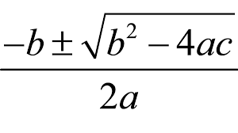

# El lenguaje PHP

??? abstract "Duración y criterios de evaluación"

    Duración estimada: 32 sesiones

    <hr />

    Resultado de aprendizaje:

    2. Escribe sentencias ejecutables por un servidor Web reconociendo y aplicando procedimientos de integración del código en lenguajes de marcas.

    Criterios de evaluación:

    1. Se han reconocido los mecanismos de generación de páginas Web a partir de lenguajes de marcas con código embebido.
    2. Se han identificado las principales tecnologías asociadas.
    3. Se han utilizado etiquetas para la inclusión de código en el lenguaje de marcas.
    4. Se ha reconocido la sintaxis del lenguaje de programación que se ha de utilizar.
    5. Se han escrito sentencias simples y se han comprobado sus efectos en el documento resultante.
    6. Se han utilizado directivas para modificar el comportamiento predeterminado.
    7. Se han utilizado los distintos tipos de variables y operadores disponibles en el lenguaje.
    8. Se han identificado los ámbitos de utilización de las variables.

    <hr />

    Resultado de aprendizaje:

    3. Escribe bloques de sentencias embebidos en lenguajes de marcas, seleccionando y utilizando las estructuras de programación.

    Criterios de evaluación:

    1. Se han utilizado mecanismos de decisión en la creación de bloques de sentencias.
    2. Se han utilizado bucles y se ha verificado su funcionamiento.
    3. Se han utilizado “arrays” para almacenar y recuperar conjuntos de datos.
    4. Se han creado y utilizado funciones.
    5. Se han utilizado formularios web para interactuar con el usuario del navegador Web.
    6. Se han empleado métodos para recuperar la información introducida en el formulario.
    7. Se han añadido comentarios al código.

## PHP

{align=right & width=300}

* Acrónimo de *Personal Home Page*
* Lenguaje de propósito general, aunque su fuerte es el desarollo web.
* Sintaxis similar a C / Java
* El código se ejecuta en el servidor (en *Apache* mediante mod_php)
* El cliente recibe el resultado generado tras interpretar el código en el servidor.
* El código se almacena en archivo con extensión `.php`.

La última versión es la 8.0 (Nov 2019), la 7.0 salió en Diciembre de 2015. Además de numerosas nuevas funcionalidades que iremos viendo durante el curso, tiene más de dos veces mejor rendimiento que PHP5.

Su documentación es extensa y está traducida: <https://www.php.net/manual/es/>.

### Código embebido

Los bloques de código se escriben entre **`<?php`** y **`?>`**, mientras que las sentencias se separan mediante **`;`**.

``` html+php
<!DOCTYPE html>
<html lang="es">
<head>
<meta charset="UTF-8">
<title>PHP fácil</title>
</head>
<body>
<!-- Muestra una frase con HTML -->
Hola mundo<br>
<!-- Muestra una frase con PHP -->
<?php echo "Es muy fácil programar en PHP."; ?>
</body>
</html>
```

### Generando contenido

Tenemos tres posibilidad a la hora de generar contenido en nuestros documentos PHP:

* **`echo`**`expresión;`
* **`print`**`(expresión);`
* **`<?=`**` expresión ?>`

Las que vamos a utilizar son `echo` cuando lo hagamos dentro de un bloque de instrucciones y `<?=` cuando sólo vayamos a mostrar el valor de una variable dentro de un fragmento HTML.

``` html+php
<!DOCTYPE html>
<html lang="es">
<head>
<meta charset="UTF-8">
<meta name="viewport" content="width=device-width, initial-scale=1.0">
<title>Echo y print</title>
</head>
<body>
<p><?php echo "Este texto se mostrará en la página web." ?></p>
<p><?= "Este texto se mostrará en la página web." ?></p>
<p><?php print("Este texto se mostrará en la página web.") ?></p>
</body>
</html>
```

### Comentarios

Podemos utilizar comentarios de una línea o de bloque:

``` html+php
<?php
// Este es un comentario de una sola línea
/*
  Este es
  un comentario
  que ocupa
  varias líneas
*/ 
?>
```

### Errores

Si hay un error de ejecución, se produce un *Fatal Error*.

``` console
Fatal error: Uncaught Error: Call to undefined function plint() in C:\xampp\htdocs\202echo.php:11
 Stack trace:
 #0 {main}
	thrown in C:\xampp\htdocs\202echo.php on line 11
```

Desde PHP 5 se lanzan como una excepción. Más adelante veremos el uso de `try` / `catch`.

### Variables

* No es necesario declararlas previamente.
* Comienzan por `$`, por ejemplo `$nombre`. Tras el `$`, el siguiente caracter debe ser una letra o guión bajo `_`. Luego ya se pueden poner números.
* Son *case sensitive*: `$var != $VaR`
* No se declara su tipo, el tipado es dinámico. Se asigna en tiempo de ejecución dependiendo del valor asignado.
* Conveniente inicializarlas, sino dan error.

``` html+php
<?php
$nombre = "Aitor";
$nombreCompleto = "Aitor Medrano";
$numero = 123;
$numero2 = 456;
$pi = 3.14;
$suerte = true;
$sinValor;

echo $sinValor;
?>
```

!!! info "Tipos"
    Aunque a priori no hay tipos de datos, internamente PHP trabaja con cuatro tipos escalares: *boolean*, *integer*, *float* y *string* y cuatro tipos compuestos: *array*, *object*, *callable* e *iterable*. Existe un tipo especial para *null* (más información en <http://php.net/manual/es/language.types.null.php>).

### Constantes

Son variables cuyo valor no varían. Existen dos posibilidades:

* `define(NOMBRE, valor);`
* `const NOMBRE; // PHP > 5.3`

``` php
<?php
define("PI", 3.1416);
const IVA = 0.21;

echo PI, " ", IVA; // No se pone el símbolo dolar
?>
```

* Se declaran siempre en MAYÚSCULAS
* Hay un conjunto de constantes ya predefinidas, también conocidas como *magic constants*: <https://www.php.net/manual/es/language.constants.predefined.php>

## Operadores

### Ariméticos

| Ejemplo | Nombre | Resultado
| ---   | ---   | ---
| `+$a` | Identidad | Conversión de `$a` a `int` o `float` según el caso.
| `-$a` | Negación | Opuesto de `$a`.
| `$a + $b` | Suma | Suma de `$a` y `$b`.
| `$a - $b` | Resta | Diferencia de `$a` y `$b`.
| `$a * $b` | Multiplicación | Producto de `$a` y `$b`.
| `$a / $b` | División | Cociente de `$a` y `$b`.
| `$a % $b` | Módulo / Resto | Resto de `$a` dividido por `$b`.
| `$a ** $b` | Potencia | Resultado de `$a` elevado a `$b`. PHP >= 5.6.

En el caso de cadenas, si queremos concatenarlas, se utiliza el operador `.`:

``` php
<?php
$x = 33;
$y = 11;
$z = $x + $y;
echo "La suma de 33 y 11 es ".44."<br />";
echo "La suma de ".$x." y ".$y." es ".(33 + 11)."<br />";
echo "La suma de ".$x." y ".$y." es ".$z."<br />";
?>
```

### Comparación

| Ejemplo | Nombre | Resultado
| ---   | ---   | ---
| `$a == $b` | Igual | `true` si `$a` es igual a `$b` tras de la conversión de tipos.
| `$a === $b` | Idéntico, Comparación estricta | `true` si `$a` es igual a `$b`, y son del mismo tipo de dato.
| `$a != $b`, `$a <> $b` | Diferente |`true` si `$a` no es igual a `$b` después de la conversión de tipos.
| `$a !== $b` | No idéntico |`true` si `$a` no es igual a `$b`, o si no son del mismo tipo.
| `$a < $b` | Menor que |`true` si `$a` es estrictamente menor que `$b`.
| `$a > $b` | Mayor que |`true` si `$a` es estrictamente mayor que `$b`.
| `$a <= $b` | Menor o igual que |`true` si `$a` es menor o igual que `$b`.
| `$a >= $b` | Mayor o igual que |`true` si `$a` es mayor o igual que `$b`.
| `$a <=> $b` | Nave espacial | Devuelve `-1`, `0` o `1` cuando `$a` es respectivamente menor, igual, o mayor que `$b`. PHP >= 7.
| `$a ?? $b ?? $c` | Fusión de *null* | El primer operando de izquierda a derecha que exista y no sea `null`. `null` si no hay valores definidos y no son `null`. PHP >= 7.

### Lógicos

| Ejemplo | Nombre | Resultado
| ---   | ---   | ---
| `$a and $b`, `$a && $b` | *And* (y) | `true` si tanto `$a` como `$b` son `true`.
| `$a or $b`, `$a || $b`| *Or* (o inclusivo) | `true` si cualquiera de `$a` o `$b` es `true`.
| `$a xor $b` | *Xor* (o exclusivo) | `true` si `$a` o `$b` es `true`, pero no ambos.
| `!$a` | *Not* (no) | `true` si `$a` no es `true`.

### Asignación

| Ejemplo | Nombre | Resultado
| ---   | ---   | ---
| `$a = $b` | Asignación | Asigna a `$a` el valor de `$b`
| `$a += $b` | Asignación de la suma | Le suma a `$a` el valor de `$b`. Equivalente a `$a = $a + $b`
| `$a -= $b` | Asignación de la resta | Le resta a `$a` el valor de `$b`. Equivalente a `$a = $a - $b`
| `$a *= $b` | Asignación del producto | Asigna a `$a` el producto de `$a` por `$b`. Equivalente a `$a = $a * $b`
| `$a *= $b` | Asignación de la división | Asigna a `$a` el conciente de `$a` entre `$b`. Equivalente a `$a = $a / $b`
| `$a %= $b` | Asignación del resto | Asigna a `$a` el resto de dividir `$a` entre `$b`. Equivalente a `$a = $a % $b`
| `$a .= $b` | Concatenación | Concatena a `$a` la cadena `$b`. Equivalente a `$a = $a . $b`
| `$a++` | Incremento | Incrementa `$a` en una unidad. Equivalente a `$a = $a + 1`
| `$a++` | Decremento | Decrementa `$a` en una unidad. Equivalente a `$a = $a - 1`

!!! Tip "Prioridad de los operadores"
    Recuerda la prioridad. Primero los paréntesis, luego la negación (`!`), productos/divisiones, sumas/restas, comparaciones, lógicos y por último se realiza la asignación.
    Más información en <https://www.php.net/manual/es/language.operators.precedence.php>

!!! question "Autoevaluación"
    Si `$a=5` y `$b=4`, averigua el valor de `$c` si `$c = $a*2 > $b+5 && !($b<>4)`

## Trabajando con formularios

Los datos se envían via URL con el formato `var1=valor1&var2=valor2…`. Por ejemplo: `ejemplo.php?nombre=Bruce+apellido1=Wayne`

Se divide en dos pasos:

1. Generar un formulario con `action='archivo.php' method='GET'`
2. En el archivo `.php` leer los datos con `$_GET['nombreVar']`

Vamos a separar siempre que podamos el código HTML del de PHP.
Por ejemplo, el formulario lo colocamos en `saluda.html`:

``` html
<form action="saluda.php" method="get">
  <p><label for="nombre">Nombre: </label>
  <input type="text" name="nombre" id="nombre"></p>
  <p><label for="apellido1">Primer apellido:</label> 
  <input type="text" name="apellido1" id="apellido1"></p>
  <p><input type="submit" value="enviar"></p>
</form>
```

Y recogemos los datos en `saluda.php`:

``` php
<?php
$nombre = $_GET["nombre"];
$apellido1 = $_GET["apellido1"];

echo "Hola $nombre $apellido1";
?>
```

Si lo quisiéramos realizar todo en un único archivo (lo cual no es recomendable), podemos hacerlo así:

``` html+php
<form action="" method="get">
  <p><label for="nombre">Nombre: </label>
  <input type="text" name="nombre" id="nombre"></p>
  <p><label for="apellido1">Primer apellido:</label>
  <input type="text" name="apellido1" id="apellido1"></p>
  <input type="submit" value="enviar">
</form>
<p>
  <?php
  if(isset($_GET['nombre'])) {
      $nombre = $_GET["nombre"];
      $apellido1 = $_GET["apellido1"];
      
      echo "Hola $nombre $apellido1";
  }
  ?>
</p>
```

El trabajo con formularios lo estudiaremos en profundidad en la unidad 4, y veremos que además de `GET`, podemos enviar los datos con `POST`.

## Condiciones

La condición simple se realiza mediante la instrucción `if`. Entre paréntesis se pone la condición que se evalua a `true` o `false`. Si no se ponen llaves, en vez de abrir un bloque, se ejecutará sólo la siguiente instrucción.

!!! warning "Siempre llaves"
    Es recomendable poner llaves siempre aunque en el momento de codificar sólo haya una única instrucción. De este modo, se queda preparado para añadir más contenido en el futuro sin provocar *bugs*.

``` php
<?php
$hora = 8; // La hora en formato de 24 horas
if ($hora == 8) {
    echo "Suena el despertador.";
}
echo "<br>";
if ($hora == 8)
    echo "Suena el despertador.";
?>
```

Las condiciones compuesta mediante `if-else`:

``` php
<?php
$hora = 17; // La hora en formato de 24 horas
if ($hora <= 12) {
  echo "Son las " . $hora . " de la mañana";
} else {
  echo "Son las " . ($hora - 12) . " de la tarde";
}
?>
```

Las condiciones anidadas mediante `if-else if-else`:

``` php
<?php
$hora = 14; // La hora en formato de 24 horas
if ($hora == 8) {
  echo "Es la hora de desayunar.";
} else if ($hora == 14) {
  echo "Es la hora de la comida.";
} else if ($hora == 21) {
  echo "Es la hora de la cena.";
} else {
  echo "Ahora no toca comer.";
}
?>
```

La sentencia `switch` también permite trabajar con condiciones múltiples:

``` php
<?php
$hora = 14; // La hora en formato de 24 horas
switch ($hora) {
  case 9:
    echo "Es la hora de desayunar.";
    break;
  case 14:
    echo "Es la hora de la comida.";
    break;
  case 21:
    echo "Es la hora de la cena.";
    break;
  default:
    echo "Ahora no toca comer";
}
?>
```

!!! warning "No olvides el `break`"
    Un error muy común es olvidar la instrucción `break` tras cada caso. Si no lo ponemos, ejecutará el siguiente caso automáticamente.

Finalmente, también tenemos el operador ternario `condición ? valorTrue : valorFalse`:

``` php
<?php
$hora = 14;
$formato = ($hora > 12) ? 24 : 12;
echo "El formato es de $formato horas"
?>
```

Si queremos comprobar si una variable tiene valor y si no darle un valor determinado, usaremos el operador `?:` (se conoce como el operador *Elvis* - <https://en.wikipedia.org/wiki/Elvis_operator>) con la sintáxis `expresión ?: valorSiVacio`:

``` php
<?php
$nombre = $_GET['nombre'] ?: "desconocido"
?>
```

## Bucles

Mediante la instrucción `while`:

``` php
<?php
$i = 1;
while ($i <= 10) {
  echo "Línea " . $i;
  echo "<br>";
  $i++;
}
?>
```

Mediante la instrucción `do-while`:

``` php
<?php
do {
  $dado = rand(1, 6);
  // rand() devuelve un valor aleatorio 
  echo "Tirando el dado... ";
  echo "ha salido un " . $dado . ".";
  echo "<br>";
} while ($dado != 5);
echo "¡Bien! Saco una ficha de casa.";
?>
```

Mediante la instrucción `for`:

``` php
<?php
// Bucle ascendente
for ($i = 1; $i <= 10; $i++) {
  echo "Línea " . $i;
  echo "<br>";
}

// Bucle descendente
for ($i = 10; $i >= 0; $i--) {
  echo "Línea " . $i;
  echo "<br>";
}
?>
```

PHP, del mismo modo que Java y C, permite romper los bucles mediante la instrucción `break`.
A su vez, `continue` permite saltar a la siguiente iteración.

Personalmente, no me gusta su uso. Prefiero el uso de variables *flag* para controlar la salida de los bucles. Por ejemplo:

``` php
<?php
$salir = false;
for ($i = 1; $i <= 10 && !$salir; $i++) {
  if ($i === 5) {
    echo "Salgo cuando i=5";
    $salir = true;
  }
}
?>
```

## Arrays

## Referencias

* [PHP en 2020](https://www.jesusamieiro.com/wp-content/uploads/2020/10/20201024-hacktoberday-PHP-en-2020.pdf), por Jesús Amieiro

## Actividades

### PHP

200. Visualiza el vídeo de Jesús Amieiro sobre [PHP en 2020](https://www.youtube.com/watch?v=o3IwAqslGUM&t=12724s) a partir del minuto 3:32 (son 40 minutos aproximadamente).
201. `201tresfrases.php`: Muestra 3 frases, cada una en un párrafo utilizando las tres posibilidades que existen de mostrar contenido.
Tras ello, introduce dos comentarios, uno de bloque y otro de una línea.
202. `202calculos.php`: Escribe un programa que utilice las variables `$x` y `$y`. Asígnales los valores `166` y `999` respectivamente.
A continuación, muestra por pantalla el valor de cada variable, la suma, la resta, la división y la multiplicación.
{align=right}
203. `203datosPersonales.php`: Escribe un programa que almacene en variables tu nombre, primer apellido, segundo apellido, email, año de nacimiento y teléfono. Luego muéstralos por pantalla dentro de una tabla.
204. `204datosPersonales.html` y `204datosPersonales.php`: Es el mismo ejercicio que el anterior, pero separando la lógica. En el primer archivo crearemos el formulario para introducir los datos, y luego recogemos los datos y generamos la tabla en el segundo archivo.

205. `205madlib.php`: A partir de un nombre, un verbo, un adjetivo y un adverbio, crea una historia que contenga dichos elementos. Por ejemplo:

    * Entrada: perro / caminar / azul / rápidamente
    * Salida: ¿ Te gusta caminar con tu perro azul rápidamente ?

    * `205madlib2.php` Crea un madlib más extenso, leyendo más datos de entrada.

206. `206anyos.php`: Tras leer la edad de una persona, mostrar la edad que tendrá dentro de 10 años y hace 10 años.
Además, muestra qué año será en cada uno de los casos.
Finalmente, muestra el año de jubilación suponiendo que trabajarás hasta los 65 años.

    Tip: `$anyoActual = date("Y");`

207. `207dinero.php`: A partir de una cantidad de dinero, mostrar su descomposición en billetes  (500, 200, 100, 50, 20, 10, 5) y monedas (2, 1), para que el número de elementos sea mínimo.
No se utilizar ninguna instrucción condicional.
Por ejemplo, al introducir `139` debé mostrar:

``` out
1 billete de 100
1 billete de 20
1 billete de 10
1 billete de 5
2 monedas de 2
```

208. `208mayor3.php`: Sin hacer uso de condiciones compuestas, muestra el mayor de tres números (`a`, `b` y `c`).
    
    `208mayor3c.php`: Utiliza condiciones compuestas.

209. `209posnegcero.php`: A partir de un `numero`, muestra por pantalla si el número es `positivo`, `negativo` o `cero`.

210. `210nombreEdad.php`: A partir de una `edad` muestra por pantalla:

* `bebé` si tiene menos de 3 años
* `niño` si tiene entre 3 y 12 años
* `adolescente` entre 13 y 17 años
* `adulto` entre 18 y 66
* `jubilado` a partir de 67

211. `211reloj.php`: Escribe un programa que funcione similar a un reloj, de manera que a partir de los valores de `hora`, `minuto` y `segundo` muestre la hora dentro de un segundo. Tras las `23:59:59` serán las `0:0:0`. 

212. `212calendario.php`: Escribe un programa similar a un calendario de manera que a partir de `dia`, `mes` y `anyo` muestre la fecha dentro de un día. Debes tener en cuenta que no todos los meses tienen 30 días. En este caso, no vamos a tener en cuenta los años bisiestos.

{align=right & width=200}

213. `214ecuacion2g.php`: Crea un programa que resuelva una ecuación de 2º grado del tipo `ax² + bx + c = 0`.
Ten en cuenta que puede tener 2, 1 o no tener solución.

Ejercicios de investigación:

214. Investiga para que sirve el operador nave espacial, disponible desde PHP7 (<https://www.php.net/manual/es/migration70.new-features.php>). Explica mediante un par de líneas su propósito, y mediante código demuestra su uso.
215. Investiga para qué sirve la instrucción `match()`, disponible desde PHP8 (<https://www.php.net/manual/es/control-structures.match.php>). Explica mediante un par de líneas su propósito, y mediante código demuestra su uso.

### Bucles

220. `220pares050.php:` Escribe un programa que muestre los números pares del 0 al 50 (dentro de una lista desordenada).

    `220paresAB.php`: A partir del anterior, refactorizar para que funcione con `inicio` y `fin`.

221. `221suma110.php`: Escribe un programa que sume los números 1 al 10.

    `221sumaAB.php`: A partir del anterior, refactorizar para que funcione con `inicio` y `fin`.

222. `222potencia.php`: A partir de una base y exponente, mediante la acumulación de productos, calcula la potencia utilizando la instrucción `for`.

    `222potenciaWhile.php`: Reescribe el ejercicio anterior haciendo uso sólo de `while`.
    `222potenciaDoWhile.php`: Reescribe el ejercicio anterior haciendo uso sólo de `do-while`.

223. `223tablaMultiplicar.php`: Muestra dentro de una tabla HTML la tabla de multiplicar de un número. Utiliza `<thead>` con sus respectivos `<th>` y `<tbody`> para dibujar la tabla. Por ejemplo:

    a | * | b | = | a*b
    -- | -- | -- | -- | --
    7  | * | 1 | = | 7
    7  | * | 2 | = | 14
    ...
    7  | * | 10 | = | 70

224. `224formulario.html`: Crea un formulario que permite leer una `cantidad`.
`224leerDatos.php`: a partir de `cantidad`, prepara un formulario con tantas cajas de datos como su valor. Finalmente, en `224sumarDatos.php`: a partir de los datos de todas las cajas de la página anterior, sumalos y muestra el total.
225. `225formulario.html` y `225tabla.php`: A partir de un número de `filas` y `columnas`, crear una tabla con ese tamaño.
Las celdas deben estar rellenadas con los valores de las coordenadas de cada celda.
226. `226formulario.html` y `226cuadrado.php`: Basándote en el ejercicio anterior, rellena la tabla de manera que solo los bordes tengan contenido, quedándose el resto de celdas en blanco.
{align=right & width=200}
227. `227formulario.html` y `227equis.php`: Basándote en el ejercicio anterior, ahora sólo debe aparecer el contenido de los dos diagonales.
228. `228cuadradoMultiplicar.php`: Crea un programa que muestre por pantalla un cuadrado exactamente igual (fíjate bien en los encabezados, tanto de las filas como de las columnas) al de la imagen con las tablas de multiplicar.

### Arrays

230. `228cuadradoMultiplicar.php`: Crea un programa que muestre por pantalla un cuadrado exactamente igual (fíjate bien en los encabezados, tanto de las filas como de las columnas) al de la imagen con las tablas de multiplicar.`228cuadradoMultiplicar.php`: Crea un programa que muestre por pantalla un cuadrado exactamente igual (fíjate bien en los encabezados, tanto de las filas como de las columnas) al de la imagen con las tablas de multiplicar.