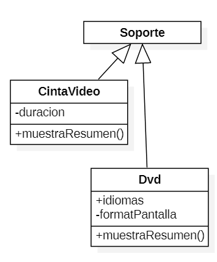
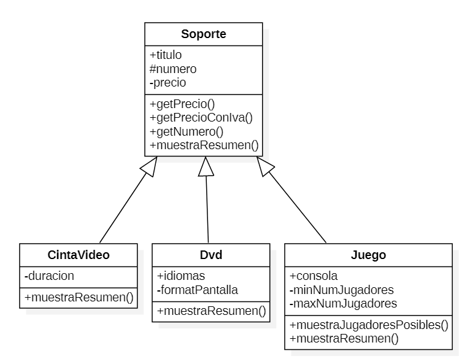
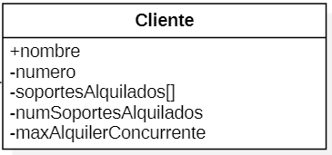

# PHP Orientado a Objetos

??? abstract "Duración y criterios de evaluación"

    Duración estimada: 18 sesiones

    <hr />

    Resultado de aprendizaje:

    5. Desarrolla aplicaciones Web identificando y aplicando mecanismos para separar el código de presentación de la lógica de negocio.

    Criterios de evaluación:

    1. Se han identificado las ventajas de separar la lógica de negocio de los aspectos de presentación de la aplicación. 
    2. Se han analizado tecnologías y mecanismos que permiten realizar esta separación y sus características principales. 
    3. Se han utilizado objetos y controles en el servidor para generar el aspecto visual de la aplicación web en el cliente. 
    4. Se han utilizado formularios generados de forma dinámica para responder a los eventos de la aplicación Web. 
    6. Se han escrito aplicaciones Web con mantenimiento de estado y separación de la lógica de negocio. 
    7. Se han aplicado los principios de la programación orientada a objetos. 
    8. Se ha probado y documentado el código.

## Clases y Objetos

PHP sigue un paradigma de programación orientada a objetos (POO) basada en clases.

Un clase es un plantilla que define las propiedades y métodos para poder crear objetos. De este manera, un objeto es una instancia de una clase.

Tanto las propiedades como los métodos se definen con una visibilidad (quien puede acceder)

* Privado - `private`:  Sólo puede acceder la propia clase.
* Protegido - `protected`: Sólo puede acceder la propia clase o sus descendientes.
* Público - `public`: Puede acceder cualquier otra clase.

Para declarar una clase, se utiliza la palabra clave `class` seguido del nombre de la clase. Para instanciar un objeto a partir de la clase, se utiliza `new`:

``` php
<?php
class NombreClase {
// propiedades
// y métodos
}

$ob = new NombreClase();
```

!!! important "Clases con mayúscula"
    Todas las clases empiezan por letra mayúscula.

Cuando un proyecto crece, es normal modelar las clases mediante UML (¿recordáis *Entornos de Desarrollo*?). La clases se representan mediante un cuadrado, separando el nombre, de las propiedades y los métodos:

{ width=500 }

Una vez que hemos creado un objeto, se utiliza el operador `->` para acceder a una propiedad o un método:

``` php
$objeto->propiedad;
$objeto->método(parámetros);
```

Si desde dentro de la clase, queremos acceder a una propiedad o método de la misma clase, utilizaremos la referencia `$this`;

``` php
$this->propiedad;
$this->método(parámetros);  
```

Así pues, como ejemplo, codificaríamos una persona en el fichero `Persona.php` como:

``` php
<?php
class Persona {
    private string $nombre;

    public function setNombre(string $nom) {
        $this->nombre=$nom;
    }

    public function imprimir(){
        echo $this->nombre;
        echo '<br>';
    }
}

$bruno = new Persona(); // creamos un objeto
$bruno->setNombre("Bruno Díaz");
$bruno->imprimir();
```

Aunque se pueden declarar varias clases en el mismo archivo, es una mala práctica. Así pues, cada fichero contedrá una sola clase, y se nombrará con el nombre de la clase.

## Encapsulación

Las propiedades se definen privadas o protegidas (si queremos que las clases heredadas puedan acceder).

Para cada propiedad, se añaden métodos públicos (*getter/setter*):

``` php
public setPropiedad(tipo $param)
public getPropiedad() : tipo
```

Las constantes se definen públicas para que sean accesibles por todos los recursos.

``` php
<?php
class MayorMenor {
    private int $mayor;
    private int $menor;

    public function setMayor(int $may) {
        $this->mayor = $may;
    }

    public function setMenor(int $men) {
        $this->menor = $men;
    }

    public function getMayor() : int {
        return $this->mayor;
    }

    public function getMenor() : int {
        return $this->menor;
    }
}
```

### Recibiendo y enviando objetos

Es recomendable indicarlo en el tipo de parámetros. Si el objeto puede devolver nulos se pone `?` delante del nombre de la clase.

!!! important "Objetos por referencia"
    Los objetos que se envían y reciben como parámetros siempre se pasan por referencia.

``` php hl_lines="2"
<?php
function maymen(array $numeros) : ?MayorMenor {
    $a = max($numeros);
    $b = min($numeros);

    $result = new MayorMenor();
    $result->setMayor($a);
    $result->setMenor($b);

    return $result;
}

$resultado =  maymen([1,76,9,388,41,39,25,97,22]);
echo "<br>Mayor: ".$resultado->getMayor();
echo "<br>Menor: ".$resultado->getMenor();
```

## Constructor

El constructor de los objetos se define mediante el método mágico `__construct`.
Puede o no tener parámetros, pero sólo puede haber un único constructor.

``` php hl_lines="5"
<?php
class Persona {
    private string $nombre;

    public function __construct(string $nom) {
        $this->nombre = $nom;
    }

    public function imprimir(){
      echo $this->nombre;
      echo '<br>';
    }
}

$bruno = new Persona("Bruno Díaz");
$bruno->imprimir();
```

### Constructores en PHP 8

Una de las grandes novedades que ofrece PHP 8 es la simplificación de los constructores con parámetros, lo que se conoce como *promoción de las propiedades del constructor*.

Para ello, en vez de tener que declarar las propiedades como privadas o protegidas, y luego dentro del constructor tener que asignar los parámetros a estás propiedades, el propio constructor promociona las propiedades.

Veámoslo mejor con un ejemplo. Imaginemos una clase `Punto` donde queramos almacenar sus coordenadas:

``` php
<?php
class Punto {
    protected float $x;
    protected float $y;
    protected float $z;

    public function __construct(
        float $x = 0.0,
        float $y = 0.0,
        float $z = 0.0
    ) {
        $this->x = $x;
        $this->y = $y;
        $this->z = $z;
    }
}
```

En PHP 8, quedaría del siguiente modo (mucho más corto, lo que facilita su legibilidad):

``` php
<?php
class Punto {
    public function __construct(
        protected float $x = 0.0,
        protected float $y = 0.0,
        protected float $z = 0.0,
    ) {}
}
```

!!! info "El orden importa"
    A la hora de codificar el orden de los elementos debe ser:

    ``` php
    <?php
    declare(strict_types=1);

    class NombreClase {
        // propiedades

        // constructor

        // getters - setters

        // resto de métodos
    }
    ?>
    ```

## Clases estáticas

Son aquellas que tienen propiedades y/o métodos estáticos (también se conocen como *de clase*, por que su valor se comparte entre todas las instancias de la misma clase).

Se declaran con `static` y se referencian con `::`.

* Si queremos acceder a un método estático, se antepone el nombre de la clase: `Producto::nuevoProducto()`.
* Si desde un método queremos acceder a una propiedad estática de la misma clase, se utiliza la referencia `self`: `self::$numProductos`

``` php
<?php
class Producto {
    const IVA = 0.23;
    private static $numProductos = 0; 

    public static function nuevoProducto() {
        self::$numProductos++;
    }
}

Producto::nuevoProducto();
$impuesto = Producto::IVA;
```

También podemos tener clases normales que tengan alguna propiedad estática:

``` php
<?php
class Producto {
    const IVA = 0.23;
    private static $numProductos = 0; 
    private $codigo;

    public function __construct(string $cod) {
        self::$numProductos++;
        $this->codigo = $cod;
    }

    public function mostrarResumen() : string {
        return "El producto ".$this->codigo." es el número ".self::$numProductos;
    }
}

$prod1 = new Producto("PS5");
$prod2 = new Producto("XBOX Series X");
$prod3 = new Producto("Nintendo Switch");
echo $prod3->mostrarResumen();
```

## Introspección

Al trabajar con clases y objetos, existen un conjunto de funciones ya definidas por el lenguaje que permiten obtener información sobre los objetos:

* `instanceof`: permite comprobar si un objeto es de una determinada clase
* `get_class`: devuelve el nombre de la clase
* `get_declared_class`: devuelve un array con los nombres de las clases definidas
* `class_alias`: crea un alias
* `class_exists` / `method_exists` / `property_exists`: `true` si la clase / método / propiedad está definida
* `get_class_methods` / `get_class_vars` / `get_object_vars`: Devuelve un array con los nombres de los métodos / propiedades de una clase / propiedades de un objeto que son accesibles desde dónde se hace la llamada.

Un ejemplo de estas funciones puede ser el siguiente:

``` php
<?php
$p = new Producto("PS5");
if ($p instanceof Producto) {
    echo "Es un producto";
    echo "La clase es ".get_class($p);

    class_alias("Producto", "Articulo");
    $c = new Articulo("Nintendo Switch");
    echo "Un articulo es un ".get_class($c);

    print_r(get_class_methods("Producto"));
    print_r(get_class_vars("Producto"));
    print_r(get_object_vars($p));

    if (method_exists($p, "mostrarResumen")) {
        $p->mostrarResumen();
    }
}
```

!!! caution "Clonado"
    Al asignar dos objetos no se copian, se crea una nueva referencia. Si queremos una copia, hay que clonarlo mediante el método `clone(object) : object`

    Si queremos modificar el clonado por defecto, hay que definir el método mágico `__clone()` que se llamará después de copiar todas las propiedades.

    Más información en <https://www.php.net/manual/es/language.oop5.cloning.php>

## Herencia

PHP soporta herencia simple, de manera que una clase solo puede heredar de otra, no de dos clases a la vez. Para ello se utiliza la palabra clave `extends`. Si queremos que la clase A hereda de la clase B haremos:

``` php
class A extends B
```

El hijo hereda los atributos y métodos públicos y protegidos.

!!! warning "Cada clase en un archivo"
    Como ya hemos comentado, deberíamos colocar cada clase en un archivo diferente para posteriormente utilizarlo mediante `include`. En los siguiente ejemplo los hemos colocado junto para facilitar su legibilidad.

Por ejemplo, tenemos una clase `Producto` y una `Tv` que hereda de `Producto`:

``` php
<?php
class Producto {
    public $codigo;
    public $nombre;
    public $nombreCorto;
    public $PVP;

    public function mostrarResumen() {
        echo "<p>Prod:".$this->codigo."</p>";
    }
}

class Tv extends Producto {
    public $pulgadas;
    public $tecnologia;
}
```

Podemos utilizar las siguientes funciones para averiguar si hay relación entre dos clases:

* `get_parent_class(object): string`
* `is_subclass_of(object, string): bool`

``` php
<?php
$t = new Tv();
$t->codigo = 33;
if ($t instanceof Producto) {
    echo $t->mostrarResumen();
}

$padre = get_parent_class($t);
echo "<br>La clase padre es: " . $padre;
$objetoPadre = new $padre;
echo $objetoPadre->mostrarResumen();

if (is_subclass_of($t, 'Producto')) {
    echo "<br>Soy un hijo de Producto";
}
```

### Sobreescribir métodos

Podemos crear métodos en los hijos con el mismo nombre que el padre, cambiando su comportamiento.
Para invocar a los métodos del padre -> `parent::nombreMetodo()`

``` php
<?php
class Tv extends Producto {
   public $pulgadas;
   public $tecnologia;

   public function mostrarResumen() {
      parent::mostrarResumen();
      echo "<p>TV ".$this->tecnologia." de ".$this->pulgadas."</p>";
   }
}
```

### Constructor en hijos

En los hijos no se crea ningún constructor de manera automática. Por lo que si no lo hay, se invoca automáticamente al del padre. En cambio, si lo definimos en el hijo, hemos de invocar al del padre de manera explícita.

=== "PHP7"

    ``` php
    <?php
    class Producto {
        public string $codigo;

        public function __construct(string $codigo) {
            $this->codigo = $codigo;
        }

        public function mostrarResumen() {
            echo "<p>Prod:".$this->codigo."</p>";
        }
    }
    
    class Tv extends Producto {
        public $pulgadas;
        public $tecnologia;

        public function __construct(string $codigo, int $pulgadas, string $tecnologia) {
            parent::__construct($codigo);
            $this->pulgadas = $pulgadas;
            $this->tecnologia = $tecnologia;
        }

        public function mostrarResumen() {
            parent::mostrarResumen();
            echo "<p>TV ".$this->tecnologia." de ".$this->pulgadas."</p>";
        }
    }
    ```

=== "PHP8"

    ``` php
    <?php
    class Producto {
        public function __construct(private string $codigo) { }

        public function mostrarResumen() {
            echo "<p>Prod:".$this->codigo."</p>";
        }        
    }
    
    class Tv extends Producto {

        public function __construct(
            string $codigo,
            private int $pulgadas,
            private string $tecnologia)
        {
            parent::__construct($codigo);
        }

        public function mostrarResumen() {
            parent::mostrarResumen();
            echo "<p>TV ".$this->tecnologia." de ".$this->pulgadas."</p>";
        }
    }
    ```

## Clases abstractas

Las clases abstractas obligan a heredar de una clase, ya que no se permite su instanciación. Se define mediante `abstract class NombreClase {`.  
Una clase abstracta puede contener propiedades y métodos no-abstractos, y/o métodos abstractos.

``` php
<?php
// Clase abstracta
abstract class Producto {
    private $codigo;
    public function getCodigo() : string {
        return $this->codigo;
    }
    // Método abstracto
    abstract public function mostrarResumen();
}
```

Cuando una clase hereda de una clase abstracta, obligatoriamente debe implementar los métodos que tiene el padre marcados como abstractos.

``` php
<?php
class Tv extends Producto {
    public $pulgadas;
    public $tecnologia;

    public function mostrarResumen() { //obligado a implementarlo
        echo "<p>Código ".$this->getCodigo()."</p>";
        echo "<p>TV ".$this->tecnologia." de ".$this->pulgadas."</p>";
    }
}

$t = new Tv();
echo $t->getCodigo();
```

## Clases finales

Son clases opuestas a abstractas, ya que evitan que se pueda heredar una clase o método para sobreescribirlo.

``` php
<?php
class Producto {
    private $codigo;

    public function getCodigo() : string {
        return $this->codigo;
    }

    final public function mostrarResumen() : string {
        return "Producto ".$this->codigo;
    }
}

// No podremos heredar de Microondas
final class Microondas extends Producto {
    private $potencia;

    public function getPotencia() : int {
        return $this->potencia;
    }

    // No podemos implementar mostrarResumen()
}
```

## Interfaces

Permite definir un contrato con las firmas de los métodos a cumplir. Así pues, sólo contiene declaraciones de funciones y todas deben ser públicas.

Se declaran con la palabra clave `interface` y luego las clases que cumplan el contrato lo realizan mediante la palabra clave `implements`.

``` php
<?php
interface Nombreable {
// declaración de funciones
}
class NombreClase implements NombreInterfaz {
// código de la clase
```

Se permite la herencia de interfaces. Además, una clase puede implementar varios interfaces (en este caso, sí soporta la herecia múltiple, pero sólo de interfaces).

``` php
<?php
interface Mostrable {
    public function mostrarResumen() : string;
}

interface MostrableTodo extends Mostrable {
    public function mostrarTodo() : string;
}

interface Facturable {
    public function generarFactura() : string;
}

class Producto implements MostrableTodo, Facturable {
    // Implementaciones de los métodos
    // Obligatoriamente deberá implementar public function mostrarResumen, mostrarTodo y generarFactura
}
```

## Métodos encadenados

Sigue el planteamiento de la programación funcional, y también se conoce como *method chaining*. Plantea que sobre un objeto se realizan varias llamadas.

``` php
<?php
$p1 = new Libro();
$p1->setNombre("Harry Potter");
$p1->setAutor("JK Rowling");
echo $p1;

// Method chaining
$p2 = new Libro();
$p2->setNombre("Patria")->setAutor("Aramburu");
echo $p2;
```

Para facilitarlo, vamos a modificar todos sus métodos mutadores (que modifican datos, *setters*, ...) para que devuelvan una referencia a `$this`:

``` php
<?php
class Libro {
    private string $nombre;
    private string $autor;

    public function getNombre() : string {
        return $this->nombre;
    }
    public function setNombre(string $nombre) : Libro { 
        $this->nombre = $nombre;
        return $this;
    }

    public function getAutor() : string {
        return $this->autor;
    }
    public function setAutor(string $autor) : Libro {
        $this->autor = $autor;
        return $this;
    }

    public function __toString() : string {
        return $this->nombre." de ".$this->autor;
    }
}
```

## Métodos mágicos

Todas las clases PHP ofrecen un conjunto de métodos, también conocidos como *magic methods* que se pueden sobreescribir para sustituir su comportamiento. Algunos de ellos ya los hemos utilizado.

Ante cualquier duda, es conveniente consultar la [documentación oficial](https://www.php.net/manual/es/language.oop5.magic.php).

Los más destacables son:

* `__construct()`
* `__destruct()` → se invoca al perder la referencia. Se utiliza para cerrar una conexión a la BD, cerrar un fichero, ...
* `__toString()` → representación del objeto como cadena. Es decir, cuando hacemos `echo $objeto` se ejecuta automáticamente este método.
* `__get(propiedad)`, `__set(propiedad, valor)` → Permitiría acceder a las propiedad privadas, aunque siempre es más legible/mantenible codificar los *getter/setter*.
* `__isset(propiedad)`, `__unset(propiedad)` → Permite averiguar o quitar el valor a una propiedad.
* `__sleep()`, `__wakeup()` → Se ejecutan al recuperar (*unserialize^*) o almacenar un objeto que se serializa (*serialize*), y se utilizan para permite definir qué propiedades se serializan.
* `__call()`, `__callStatic()` → Se ejecutan al llamar a un método que no es público. Permiten sobrecargan métodos.

## Espacio de nombres

Desde PHP 5.3 y también conocidos como *Namespaces*, permiten organizar las clases/interfaces, funciones y/o constantes de forma similar a los paquetes en *Java*.

!!! tip "Recomendación"
    Un sólo namespace por archivo y crear una estructura de carpetas respectando los niveles/subniveles (igual que se hace en *Java*)

Se declaran en la primera línea mediante la palabra clave `namespace` seguida del nombre del espacio de nombres asignado (cada subnivel se separa con la barra invertida `\`):

Por ejemplo, para colocar la clase `Producto` dentro del *namespace* `Dwes\Ejemplos` lo haríamos así:

``` php
<?php
namespace Dwes\Ejemplos;

const IVA = 0.21;

class Producto {
    public $nombre;
      
    public function muestra() : void {
        echo"<p>Prod:" . $this->nombre . "</p>";
    }
}
```

### Acceso

Para referenciar a un recurso que contiene un namespace, primero hemos de tenerlo disponible haciendo uso de `include` o `require`. Si el recurso está en el mismo *namespace*, se realiza un acceso directo (se conoce como acceso sin cualificar).

Realmente hay tres tipos de acceso:

* sin cualificar: `recurso`
* cualificado: `rutaRelativa\recurso` → no hace falta poner el *namespace* completo
* totalmente cualificado: `\rutaAbsoluta\recurso`

``` php
<?php
namespace Dwes\Ejemplos;

include_once("Producto.php");

echo IVA; // sin cualificar
echo Utilidades\IVA; // acceso cualificado. Daría error, no existe \Dwes\Ejemplos\Utilidades\IVA
echo \Dwes\Ejemplos\IVA; // totalmente cualificado

$p1 = new Producto(); // lo busca en el mismo namespace y encuentra \Dwes\Ejemplos\Producto
$p2 = new Model\Producto(); // daría error, no existe el namespace Model. Está buscando \Dwes\Ejemplos\Model\Producto
$p3 = new \Dwes\Ejemplos\Producto(); // \Dwes\Ejemplos\Producto
```

Para evitar la referencia cualificada podemos declarar el uso mediante `use` (similar a hacer `import` en *Java*). Se hace en la cabecera, tras el `namespace`:

Los tipos posibles son:

* `use const nombreCualificadoConstante`
* `use function nombreCualificadoFuncion`
* `use nombreCualificadoClase`
* `use nombreCualificadoClase as NuevoNombre` // para renombrar elementos

Por ejemplo, si queremos utilizar la clase `\Dwes\Ejemplos\Producto` desde un recurso que se encuentra en la raíz, por ejemplo en `inicio.php`, haríamos:

``` php
<?php
include_once("Dwes\Ejemplo\Producto.php");

use const Dwes\Ejemplos\IVA;
use \Dwes\Ejemplos\Producto;

echo IVA;
$p1 = new Producto();
```

!!! tip "To `use` or not to `use`"
    En resumen, `use` permite acceder sin cualificar a recursos que están en otro *namespace*. Si estamos en el mismo espacio de nombre, no necesitamos `use`.

### Organización

Todo proyecto, conforme crece, necesita organizar su código fuente. Se plantea una organización en la que los archivos que interactuan con el navegador se colocan en el raíz, y las clases que definamos van dentro de un namespace (y dentro de su propia carpeta `src` o `app`).

<figure>

<figcaption>Organización del código fuente</figcaption>
</figure>

!!! tip "Organización, includes y usos"
    * Colocaremos cada recurso en un fichero aparte.
    * En la primera línea indicaremos su *namespace* (si no está en el raíz).
    * Si utilizamos otros recursos, haremos un `include_once` de esos recursos (clases, interfaces, etc...).
        * Cada recurso debe incluir todos los otros recursos que referencie: la clase de la que hereda, interfaces que implementa, clases utilizadas/recibidas como parámetros, etc...
    * Si los recursos están en un espacio de nombres diferente al que estamos, emplearemos `use` con la ruta completa para luego utilizar referencias sin cualificar.

### Autoload

¿No es tedioso tener que hacer el `include` de las clases? El *autoload* viene al rescate.

Así pues, permite cargar las clases (no las constantes ni las funciones) que se van a utilizar y evitar tener que hacer el `include_once` de cada una de ellas. Para ello, se utiliza la función `spl_autoload_register`

``` php
<?php
spl_autoload_register( function( $nombreClase ) {
    include_once $nombreClase.'.php';
} );
?>
```

!!! question "¿Por qué se llaman *autoload*?"
    Porque antes se realizaba mediante el método mágico `__autoload()`, el cual está *deprecated* desde PHP 7.2

Y ¿cómo organizamos ahora nuestro código aprovechando el *autoload*?

<figure style="float: right;">
    
    <figcaption>Organización con autoload</figcaption>
</figure>

Para facilitar la búsqueda de los recursos a incluir, es recomendable colocar todas las clases dentro de una misma carpeta. Nosotros la vamos a colocar dentro de `app` (más adelante, cuando estudiemos *Laravel* veremos el motivo de esta decisión). Otras carpetas que podemos crear son `test` para colocar las pruebas *PhpUnit* que luego realizaremos, o la carpeta `vendor` donde se almacenarán las librerías del proyecto (esta carpeta es un estándard dentro de PHP, ya que *Composer* la crea automáticamente).

Como hemos colocado todos nuestros recursos dentro de `app`, ahora nuestro `autoload.php` (el cual colocamos en la carpeta raíz) sólo va a buscar dentro de esa carpeta:

``` php
<?php
spl_autoload_register( function( $nombreClase ) {
    include_once "app/".$nombreClase.'.php';
} );
?>
```

!!! tip "Autoload y rutas erróneas"
    En *Ubuntu* al hacer el *include* de la clase que recibe como parámetro, las barras de los namespace (`\`) son diferentes a las de las rutas (`/`). Por ello, es mejor que utilicemos el fichero autoload:

    ``` php
    <?php
    spl_autoload_register( function( $nombreClase ) {
        $ruta = "app\\".$nombreClase.'.php';
        $ruta = str_replace("\\", "/", $ruta); // Sustituimos las barras
        include_once $ruta';
    } );
    ?>
    ```

## Gestión de Errores

PHP clasifica los errores que ocurren en diferentes niveles. Cada nivel se identifica con una constante. Por ejemplo:

* `E_ERROR`: errores fatales, no recuperables. Se interrumpe el script.
* `E_WARNING`: advertencias en tiempo de ejecución. El script no se interrumpe.
* `E_NOTICE`: avisos en tiempo de ejecución.  

Podéis comprobar el listado completo de constantes de <https://www.php.net/manual/es/errorfunc.constants.php>

Para la configuración de los errores podemos hacerlo de dos formas:

* A nivel de `php.ini`:
    * `error_reporting`: indica los niveles de errores a notificar
        * `error_reporting = E_ALL & ~E_NOTICE` -> Todos los errores menos los avisos en tiempo de ejecución.
    * `display_errors`: indica si mostrar o no los errores por pantalla. En entornos de producción es común ponerlo a `off`
* mediante código con las siguientes funciones:
    * `error_reporting(codigo)` -> Controla qué errores notificar
    * `set_error_handler(nombreManejador)` -> Indica que función se invocará cada vez que se encuentre un error. El manejador recibe como parámetros el nivel del error y el mensaje

A continuación tenemos un ejemplo mediante código:

=== "Funciones para la gestión de errores"

    ``` php
    <?php
    error_reporting(E_ALL & ~E_NOTICE & ~E_WARNING);
    $resultado = $dividendo / $divisor;

    error_reporting(E_ALL & ~E_NOTICE);
    set_error_handler("miManejadorErrores");
    $resultado = $dividendo / $divisor;
    restore_error_handler(); // vuelve al anterior

    function miManejadorErrores($nivel, $mensaje) {
        switch($nivel) {
            case E_WARNING:
                echo "<strong>Warning</strong>: $mensaje.<br/>";
                break;
            default:
                echo "Error de tipo no especificado: $mensaje.<br/>";
        }
    }
    ```

=== "Consola"

    ```
    Error de tipo no especificado: Undefined variable: dividendo.
    Error de tipo no especificado: Undefined variable: divisor.
    Error de tipo Warning: Division by zero.
    ```

## Excepciones

La gestión de excepciones forma parte desde PHP 5. Su funcionamiento es similar a *Java*, haciendo uso de un bloque `try / catch / finally`.
Si detectamos una situación anómala y queremos lanzar una excepción, deberemos realizar `throw new Exception` (adjuntando el mensaje que lo ha provocado).

``` php
<?php
try {
    if ($divisor == 0) {
        throw new Exception("División por cero.");
    }
    $resultado = $dividendo / $divisor;
} catch (Exception $e) {
    echo "Se ha producido el siguiente error: ".$e->getMessage();
}
```

La clase `Exception` es la clase padre de todas las excepciones. Su constructor recibe `mensaje[,codigoError][,excepcionPrevia]`.

A partir de un objeto `Exception`, podemos acceder a los métodos `getMessage()`y `getCode()` para obtener el mensaje y el código de error de la excepción capturada.

El propio lenguaje ofrece un conjunto de excepciones ya definidas, las cuales podemos capturar (y lanzar desde PHP 7). Se recomienda su consulta en la [documentación oficial](https://www.php.net/manual/es/class.exception.php).

### Creando excepciones

Para crear una excepción, la forma más corta es crear una clase que únicamente herede de `Exception`.

``` php
<?php
class HolaExcepcion extends Exception {}
```

Si queremos, y es recomendable dependiendo de los requisitos, podemos sobrecargar los métodos mágicos, por ejemplo, sobrecargando el constructor y llamando al constructor del padre, o rescribir el método `__toString` para cambiar su mensaje:

``` php
<?php
class MiExcepcion extends Exception {
    public function __construct($msj, $codigo = 0, Exception $previa = null) {
        // código propio
        parent::__construct($msj, $codigo, $previa);
    }
    public function __toString() {
        return __CLASS__ . ": [{$this->code}]: {$this->message}\n";
    }
    public function miFuncion() {
        echo "Una función personalizada para este tipo de excepción\n";
    }
}
```

Si definimos una excepción de aplicación dentro de un *namespace*, cuando referenciemos a `Exception`, deberemos referenciarla mediante su nombre totalmente cualificado (`\Exception`), o utilizando `use`:

=== "Mediante nombre totalmente cualificado"
    ``` php
    <?php
    namespace \Dwes\Ejemplos;

    class AppExcepcion extends \Exception {}
    ```
=== "Mediante `use`"
    ``` php
    <?php
    namespace \Dwes\Ejemplos;

    use Exception;

    class AppExcepcion extends Exception {}
    ```

### Excepciones múltiples

Se pueden usar excepciones múltiples para comprobar diferentes condiciones. A la hora de capturarlas, se hace de más específica a más general.

``` php
<?php
$email = "ejemplo@ejemplo.com";
try {
    // Comprueba si el email es válido
    if(filter_var($email, FILTER_VALIDATE_EMAIL) === FALSE) {
        throw new MiExcepcion($email);
    }
    // Comprueba la palabra ejemplo en la dirección email
    if(strpos($email, "ejemplo") !== FALSE) {
        throw new Exception("$email es un email de ejemplo no válido");
    }
} catch (MiExcepcion $e) {
    echo $e->miFuncion();
} catch(Exception $e) {
    echo $e->getMessage();
}
```

!!! question "Autoevaluación"
    ¿Qué pasaría al ejectuar el siguiente código?
    ``` php
    <?php
    class MainException extends Exception {}
    class SubException extends MainException {}

    try {
        throw new SubException("Lanzada SubException");
    } catch (MainException $e) {
        echo "Capturada MainException " . $e->getMessage();
    } catch (SubException $e) {
        echo "Capturada SubException " . $e->getMessage();
    } catch (Exception $e) {
        echo "Capturada Exception " . $e->getMessage();
    }
    ```

Si en el mismo `catch` queremos capturar varias excepciones, hemos de utilizar el operador `|`:

``` php
<?php
class MainException extends Exception {}
class SubException extends MainException {}

try {
    throw new SubException("Lanzada SubException");
} catch (MainException | SubException $e ) {
    echo "Capturada Exception " . $e->getMessage();
}
```

Desde PHP 7, existe el tipo `Throwable`, el cual es un interfaz que implementan tanto los errores como las excepciones, y nos permite capturar los dos tipos a la vez:

``` php
<?php
try {
    // tu codigo
} catch (Throwable $e) {
    echo 'Forma de capturar errores y excepciones a la vez';
}
```

Si sólo queremos capturar los errores fatales, podemos hacer uso de la clase `Error`:

``` php
<?php
try {
    // Genera una notificación que no se captura
    echo $variableNoAsignada;
    // Error fatal que se captura
    funcionQueNoExiste();
} catch (Error $e) {
    echo "Error capturado: " . $e->getMessage();
}
```

### Relanzar excepciones

En las aplicaciones reales, es muy común capturar una excepción de sistema y lanzar una de aplicación que hemos definido nostros.
También podemos lanzar las excepciones sin necesidad de estar dentro de un `try/catch`.

``` php
<?php
class AppException extends Exception {}

try {
    // Código de negocio que falla
} catch (Exception $e) {
    throw new AppException("AppException: ".$e->getMessage(), $e->getCode(), $e);
}
```

## SPL

*Standard PHP Library* es el conjunto de funciones y utilidades que ofrece PHP, como:

* Estructuras de datos
    * Pila, cola, cola de prioridad, lista doblemente enlazada, etc... 
* Conjunto de iteradores diseñados para recorrer estructuras agregadas
    * arrays, resultados de bases de datos, árboles XML, listados de directorios, etc.

Podéis consultar la documentación en <https://www.php.net/manual/es/book.spl.php> o ver algunos ejemplos en <https://diego.com.es/tutorial-de-la-libreria-spl-de-php>

También define un conjunto de excepciones que podemos utilizar para que las lancen nuestras aplicaciones:

* `LogicException` (`extends Exception`)
    * `BadFunctionCallException`
    * `BadMethodCallException`
    * `DomainException`
    * `InvalidArgumentException`
    * `LengthException`
    * `OutOfRangeException`
* `RuntimeException` (`extends Exception`)
    * `OutOfBoundsException`
    * `OverflowException`
    * `RangeException`
    * `UnderflowException`
    * `UnexpectedValueException`

También podéis consultar la documentación de estas excepciones en <https://www.php.net/manual/es/spl.exceptions.php>.

## Referencias

* [Manual de PHP](https://www.php.net/manual/es/index.php)
* [Manual de OO en PHP - www.desarrolloweb.com](https://desarrolloweb.com/manuales/manual-php.html#manual68)
## Actividades

300. Investiga la diferencia entre un paradigma orientado a objetos basado en clases (*PHP*) respecto a uno basado en prototipos (*JavaScript*).

### Objetos

301. `301Empleado.php`: Crea una clase `Empleado` con su nombre, apellidos y sueldo.
Encapsula las propiedades mediante *getters/setters* y añade métodos para:
    * Obtener su nombre completo → `getNombreCompleto(): string`
    * Que devuelva un booleano indicando si debe o no pagar impuestos (se pagan cuando el sueldo es superior a 3333€) → `debePagarImpuestos(): bool`
302. `302EmpleadoTelefonos.php`: Copia la clase del ejercicio anterior y modifícala.
Añade una propiedad privada que almacene un array de números de teléfonos.
Añade los siguientes métodos:
    * `public function anyadirTelefono(int $telefono) : void` → Añade un teléfono al array
    * `public function listarTelefonos(): string` → Muestra los teléfonos separados por comas
    * `public function vaciarTelefonos(): void` → Elimina todos los teléfonos
303. `303EmpleadoConstructor.php`: Copia la clase del ejercicio anterior y modifícala.
Elimina los *setters* de `nombre` y `apellidos`, de manera que dichos datos se asignan mediante el constructor (utiliza la sintaxis de PHP7).
Si el constructor recibe un tercer parámetro, será el sueldo del `Empleado`. Si no, se le asignará 1000€ como sueldo inicial.

    `303EmpleadoConstructor8.php`: Modifica la clase y utiliza la sintaxis de PHP 8 de promoción de las propiedades del constructor.

304. `304EmpleadoConstante.php`: Copia la clase del ejercicio anterior y modifícala.
Añade una constante `SUELDO_TOPE` con el valor del sueldo que debe pagar impuestos, y modifica el código para utilizar la constante.
305. `305EmpleadoSueldo.php`: Copia la clase del ejercicio anterior y modifícala.
Cambia la constante por una variable estática `sueldoTope`, de manera que mediante *getter/setter* puedas modificar su valor.
306. `306EmpleadoStatic.php`: Copia la clase del ejercicio anterior y modifícala.
Completa el siguiente método con una cadena HTML que muestre los datos de un empleado dentro de un párrafo y todos los teléfonos mediante una lista ordenada (para ello, deberás crear un *getter* para los teléfonos):
    * `public static function toHtml(Empleado $emp): string`

    <figure style="float: right;">
        
        <figcaption>Ejercicio 307</figcaption>
    </figure>

307. `307Persona.php`: Copia la clase del ejercicio anterior en `307Empleado.php` y modifícala.  
Crea una clase `Persona` que sea padre de `Empleado`, de manera que `Persona` contenga el nombre y los apellidos, y en `Empleado` quede el salario y los teléfonos.

308. `308PersonaH.php`: Copia las clases del ejercicio anterior y modifícalas. Crea en `Persona` el método estático `toHtml(Persona $p)`, y modifica en `Empleado` el mismo método `toHtml(Persona $p)`, pero cambia la firma para que reciba una `Persona` como parámetro.  
    Para acceder a las propiedades del empleado con la persona que recibimos como parámetro, comprobaremos su tipo:

    ``` php
    <?php
    class Empleado extends Persona {
        /// resto del código


        public static function toHtml(Persona $p): string {
            if ($p instanceof Empleado) {
                // Aqui ya podemos acceder a las propiedades y métodos de Empleado
            }
        }
    }
    ```

309. `309PersonaE.php`: Copia las clases del ejercicio anterior y modifícalas.  
Añade en `Persona` un atributo `edad`  
A la hora de saber si un empleado debe pagar impuestos, lo hará siempre y cuando tenga más de 21 años y dependa del valor de su sueldo.
Modifica todo el código necesario para mostrar y/o editar la edad cuando sea necesario.

310. `310PersonaS.php`: Copia las clases del ejercicio anterior y modifícalas.  
Añade nuevos métodos que hagan una representación de todas las propiedades de las clases `Persona` y `Empleado`, de forma similar a los realizados en HTML, pero sin que sean estáticos, de  manera que obtenga los datos mediante `$this`.
    * `function public __toString(): string`

!!! tip "*Magic methods*"
    El método `__toString()` es un método mágico que se invoca automáticamente cuando queremos obtener la representación en cadena de un objeto.

311. `311PersonaA.php`: Copia las clases del ejercicio anterior y modifícalas.  
Transforma `Persona` a una clase abstracta donde su método estático `toHtml(Persona $p)` tenga que ser redefinido en todos sus hijos.

312. `312Trabajador.php`: Copia las clases del ejercicio anterior y modifícalas.
    * Cambia la estructura de clases conforme al gráfico respetando todos los métodos que ya están hechos.
    * `Trabajador` es una clase abstracta que ahora almacena los `telefonos` y donde `calcularSueldo` es un método abstracto de manera que:
        * El sueldo de un `Empleado` se calcula a partir de las horas trabajadas y lo que cobra por hora.
        * Para los `Gerente`s, su sueldo se incrementa porcentualmente en base a su edad: `salario + salario*edad/100`

    <figure>
        
        <figcaption>Ejercicio 312</figcaption>
    </figure>

313. `313Empresa.php`: Utilizando las clases de los ejercicios anteriores:
    * Crea una clase `Empresa` que además del nombre y la dirección, contenga una propiedad con un array de `Trabajador`es, ya sean `Empleado`s o `Gerente`s. 
    * Añade *getters/setters* para el nombre y dirección.
    * Añade métodos para añadir y listar los trabajadores.
        * `public function anyadirTrabajador(Trabajador $t)`
        * `public function listarTrabajadoresHtml() : string` -> utiliza `Trabajador::toHtml(Persona $p)`
    * Añade un método para obtener el coste total en nóminas.
        * `public function getCosteNominas(): float` -> recorre los trabajadores e invoca al método `calcularSueldo()`.

314. `314EmpresaI.php`: Copia las clases del ejercicio anterior y modifícalas.
    * Crea un interfaz JSerializable, de manera que ofrezca los métodos:
        * `toJSON(): string` → utiliza la función [`json_encode(mixed)`](https://www.php.net/manual/es/function.json-encode.php). Ten en cuenta que como tenemos las propiedades de los objetos privados, debes recorrer las propiedades y colocarlas en un mapa. Por ejemplo:
        ``` php
        <?php
        public function toJSON(): string {
            foreach ($this as $clave => $valor) {
                $mapa->$clave = $valor;
            }
            return json_encode($mapa);
        }
        ?>
        ```
        * `toSerialize(): string` → utiliza la función [`serialize(mixed)`](https://www.php.net/manual/es/function.serialize.php)
    * Modifica todas las clases que no son abstractas para que implementen el interfaz creado.


### Proyecto Videoclub

En los siguientes ejercicios vamos a simular un pequeño proyecto de un Videoclub (basado en la propuesta que hace el tutorial de desarrolloweb.com), el cual vamos a realizar mediante un desarrollo incremental y siguiendo la práctica de programación en parejas (*pair programming*).

Antes de nada, crea un repositorio privado en GitHub y sube el proyecto actual de *Videoclub*. Una vez creado, invita a tu compañero al repositorio como colaborador.

* Inicializa en local tu repostorio de git, mediante `git init`
* Añade y sube los cambios a tu repositorio, mediante `git add .` y luego `git commit -m 'Inicializando proyecto'.`
* Conecta tu repositorio con GitHub y sube los cambios (mira la instrucciones de GitHub: comandos `git remote` y `git push`).
* Tu compañero deberá descargar el proyecto con sus credenciales.

!!! warning "Proyecto no real"
    El siguiente proyecto está pensado desde un punto de vista formativo. Algunas de las decisiones que se toman no se deben usar (como hacer `echo` dentro de las clases) o probar el código comparando el resultado en el navegador.

Cada clase debe ir en un archivo php separado. Para facilitar su implementación, se muestra la estructura UML del modelo y un fragmento de código para probar las clases:

<figure style="float: right;">
    
    <figcaption>Creamos el Soporte</figcaption>
</figure>

320. Crea una clase para almacenar soportes (`Soporte.php`). Esta clase será la clase padre de los diferentes soportes con los que trabaje nuestro videoclub (cintas de vídeo, videojuegos, etc...):

    * Crea el constructor que inicialice sus propiedades. Fíjate que la clase no tiene métodos *setters*.
    * Definir una constante mediante un propiedad privada y estática denominada `IVA con un valor del 21%
    * Crear un archivo (`inicio.php`) para usar las clases y copia el siguiente fragmento:

=== "Código de prueba"

    ``` php
    <?php
    include "Soporte.php";

    $soporte1 = new Soporte("Tenet", 22, 3); 
    echo "<strong>" . $soporte1->titulo . "</strong>"; 
    echo "<br>Precio: " . $soporte1->getPrecio() . " euros"; 
    echo "<br>Precio IVA incluido: " . $soporte1->getPrecioConIVA() . " euros";
    $soporte1->muestraResumen();
    ```

=== "Navegador"

    <pre>
    **Tenet**
    Precio: 3 euros
    Precio IVA incluido: 3.48 euros
    *Tenet*
    3 € (IVA no incluido)
    </pre>

<figure style="float: right;">
    
    <figcaption>Añadimos Cinta de Video</figcaption>
</figure>

321. Crea la clase `CintaVideo` la cual hereda de `Soporte`. Añade el atributo `duracion` y sobreescribe tanto el contructor como el método `muestraResumen` (desde `CintaVideo` deberás llamar al método `muestraResumen` del padre).

    Añade a `inicio.php` el código para probar la clase:

=== "Código de prueba"

    ``` php
    <?php
    include "CintaVideo.php";

    $miCinta = new CintaVideo("Los cazafantasmas", 23, 3.5, 107); 
    echo "<strong>" . $miCinta->titulo . "</strong>"; 
    echo "<br>Precio: " . $miCinta->getPrecio() . " euros"; 
    echo "<br>Precio IVA incluido: " . $miCinta->getPrecioConIva() . " euros";
    $miCinta->muestraResumen();
    ```

=== "Navegador"

    <pre>
    **Los cazafantasmas**
    Precio: 3.5 euros
    Precio IVA incluido: 4.06 euros
    Película en VHS:
    *Los cazafantasmas*
    3.5 € (IVA no incluido)
    Duración: 107 minutos
    </pre>

<figure style="float: right;">
    
    <figcaption>Añadimos Dvd</figcaption>
</figure>

322. Crea la clase `Dvd` la cual hereda de `Soporte`. Añade los atributos `idiomas` y `formatoPantalla`. A continuación sobreescribe tanto el contructor como el método `muestraResumen`.

    Añade a `inicio.php` el código para probar la clase:

=== "Código de prueba"

    ``` php
    <?php
    include "Dvd.php";

    $miDvd = new Dvd("Origen", 24, 15, "es,en,fr", "16:9"); 
    echo "<strong>" . $miDvd->titulo . "</strong>"; 
    echo "<br>Precio: " . $miDvd->getPrecio() . " euros"; 
    echo "<br>Precio IVA incluido: " . $miDvd->getPrecioConIva() . " euros";
    $miDvd->muestraResumen();
    ```

=== "Navegador"

    <pre>
    **Origen**
    Precio: 15 euros
    Precio IVA incluido: 17.4 euros
    Película en DVD:
    *Origen*
    15 € (IVA no incluido)
    Idiomas:es,en,fr
    Formato Pantalla:16:9
    </pre>

<figure style="float: right;">
    
    <figcaption>Añadimos Juego</figcaption>
</figure>

323. Crea la clase `Juego` la cual hereda de `Soporte`. Añade los atributos `consola`, `minNumJugadores` y `maxNumJugadores`. A continuación añade el método `muestraJugadoresPosibles`, el cual debe mostrar *Para un jugador*, *Para X jugadores* o *De X a Y jugadores* dependiendo de los valores de las atributos creados. Finalmente, sobreescribe tanto el contructor como el método `muestraResumen`.

    Añade a `inicio.php` el código para probar la clase:

=== "Código de prueba"

    ``` php
    <?php
    include "Juego.php";

    $miJuego = new Juego("The Last of Us Part II", 26, 49.99, "PS4", 1, 1); 
    echo "<strong>" . $miJuego->titulo . "</strong>"; 
    echo "<br>Precio: " . $miJuego->getPrecio() . " euros"; 
    echo "<br>Precio IVA incluido: " . $miJuego->getPrecioConIva() . " euros";
    $miJuego->muestraResumen();
    ```

=== "Navegador"

    <pre>
    **The Last of Us Part II**
    Precio: 49.99 euros
    Precio IVA incluido: 57.9884 euros
    Juego para: PS4
    *The Last of Us Part II*
    49.99 € (IVA no incluido)
    Para un jugador
    </pre>

Llegados a este punto, nuestro modelo es similar al siguiente diagrama:

<figure>
    
    <figcaption>Modelo inicial de Videoclub</figcaption>
</figure>

<figure style="float: right;">
    
    <figcaption>Añadimos Cliente</figcaption>
</figure>

324. Crear la clase `Cliente`. El constructor recibirá el `nombre`, `numero` y `maxAlquilerConcurrente`, este último pudiendo ser opcional y tomando como valor por defecto 3. Tras ello, añade *getter/setter* únicamente a `numero`, y un *getter* a `numSoportesAlquilados` (este campo va a almacenar un contador del total de alquileres que ha realizado). El array de soportes alquilados contedrá clases que hereden de `Soporte`. Finalmente, añade el método `muestraResumen` que muestre el nombre y la cantidad de alquileres (tamaño del array `soportesAlquilados`).

325. Dentro de `Cliente`, añade las siguiente operaciones:
    * `tieneAlquilado(Soporte $s): bool` → Recorre el array de soportes y comprueba si está el soporte
    * `alquilar(Soporte $s): bool` -→ Debe comprobar si el soporte está alquilado y si no ha superado el cupo de alquileres. Al alquilar, incrementará el `numSoportesAlquilados` y almacenará el soporte en el array. Para cada caso debe mostrar un mensaje informando de lo ocurrido.

326. Seguimos con `Cliente` para añadir las operaciones:
    * `devolver(int $numSoporte): bool` → Debe comprobar que el soporte estaba alquilado  y actualizar la cantidad de soportes alquilados. Para cada caso debe mostrar un mensaje informando de lo ocurrido
    * `listarAlquileres(): void` → Informa de cuantos alquileres tiene el cliente y los muestra.

Crea el archivo `inicio2.php` con el siguiente código fuente para probar la clase:

=== "Código de prueba"

    ``` php
    <?php
    include_once "CintaVideo.php";
    include_once "Dvd.php";
    include_once "Juego.php";
    include_once "Cliente.php";

    //instanciamos un par de objetos cliente
    $cliente1 = new Cliente("Bruce Wayne", 23);
    $cliente2 = new Cliente("Clark Kent", 33);

    //mostramos el número de cada cliente creado 
    echo "<br>El identificador del cliente 1 es: " . $cliente1->getNumero();
    echo "<br>El identificador del cliente 2 es: " . $cliente2->getNumero();

    //instancio algunos soportes 
    $soporte1 = new CintaVideo("Los cazafantasmas", 23, 3.5, 107);
    $soporte2 = new Juego("The Last of Us Part II", 26, 49.99, "PS4", 1, 1);  
    $soporte3 = new Dvd("Origen", 24, 15, "es,en,fr", "16:9");
    $soporte4 = new Dvd("El Imperio Contraataca", 4, 3, "es,en","16:9");

    //alquilo algunos soportes
    $cliente1->alquilar($soporte1);
    $cliente1->alquilar($soporte2);
    $cliente1->alquilar($soporte3);

    //voy a intentar alquilar de nuevo un soporte que ya tiene alquilado
    $cliente1->alquilar($soporte1);
    //el cliente tiene 3 soportes en alquiler como máximo
    //este soporte no lo va a poder alquilar
    $cliente1->alquilar($soporte4);
    //este soporte no lo tiene alquilado
    $cliente1->devolver(4);
    //devuelvo un soporte que sí que tiene alquilado
    $cliente1->devolver(2);
    //alquilo otro soporte
    $cliente1->alquilar($soporte4);
    //listo los elementos alquilados
    $cliente1->listaAlquileres();
    //este cliente no tiene alquileres
    $cliente2->devolver(2);
    ```

=== "Navegador"

    <pre>
    El identificador del cliente 1 es: 23
    El identificador del cliente 2 es: 33
    **Alquilado soporte a**: Bruce Wayne

    Película en VHS:
    *Los cazafantasmas*
    3.5 € (IVA no incluido)
    Duración: 107 minutos

    **Alquilado soporte a**: Bruce Wayne

    Juego para: PS4
    *The Last of Us Part II*
    49.99 € (IVA no incluido)
    Para un jugador

    **Alquilado soporte a**: Bruce Wayne

    Película en DVD:
    *Origen*
    15 € (IVA no incluido)
    Idiomas:es,en,fr
    Formato Pantalla:16:9

    El cliente ya tiene alquilado el soporte **Los cazafantasmas**

    Este cliente tiene 3 elementos alquilados. No puede alquilar más en este videoclub hasta que no devuelva algo

    No se ha podido encontrar el soporte en los alquileres de este cliente

    No se ha podido encontrar el soporte en los alquileres de este cliente

    Este cliente tiene 3 elementos alquilados. No puede alquilar más en este videoclub hasta que no devuelva algo

    **El cliente tiene 3 soportes alquilados**

    Película en VHS:
    *Los cazafantasmas*
    3.5 € (IVA no incluido)
    Duración: 107 minutos

    Juego para: PS4
    *The Last of Us Part II*
    49.99 € (IVA no incluido)
    Para un jugador

    Película en DVD:
    *Origen*
    15 € (IVA no incluido)
    Idiomas:es,en,fr
    Formato Pantalla:16:9

    Este cliente no tiene alquilado ningún elemento
    </pre>

327. Llegado a este punto, vamos a relacionar los clientes y los soportes mediante la clase `Videoclub`. Así pues crea la clase que representa el gráfico, teniendo en cuenta que:
    * `productos` es un array de `Soporte`
    * `socios` es una array de `Cliente`
    * Los métodos públicos de incluir algún soporte, crearán la clase y llamarán al método privado de `incluirProducto`, el cual es el encargado de introducirlo dentro del array.

El modelo completo quedará de la siguiente manera:

<figure>
    
    <figcaption>Modelo completo de Videoclub</figcaption>
</figure>

Y para probar el proyecto, dentro `inicio3.php` colocaremos:

=== "Código de prueba"

    ``` php
    <?php
    include_once "Videoclub.php"; // No incluimos nada más

    $vc = new Videoclub("Severo 8A"); 

    //voy a incluir unos cuantos soportes de prueba 
    $vc->incluirJuego("God of War", 19.99, "PS4", 1, 1); 
    $vc->incluirJuego("The Last of Us Part II", 49.99, "PS4", 1, 1);
    $vc->incluirDvd("Torrente", 4.5, "es","16:9"); 
    $vc->incluirDvd("Origen", 4.5, "es,en,fr", "16:9"); 
    $vc->incluirDvd("El Imperio Contraataca", 3, "es,en","16:9"); 
    $vc->incluirCintaVideo("Los cazafantasmas", 3.5, 107); 
    $vc->incluirCintaVideo("El nombre de la Rosa", 1.5, 140); 

    //listo los productos 
    $vc->listarProductos(); 

    //voy a crear algunos socios 
    $vc->incluirSocio("Amancio Ortega"); 
    $vc->incluirSocio("Pablo Picasso", 2); 

    $vc->alquilaSocioProducto(1,2); 
    $vc->alquilaSocioProducto(1,3); 
    //alquilo otra vez el soporte 2 al socio 1. 
    // no debe dejarme porque ya lo tiene alquilado 
    $vc->alquilaSocioProducto(1,2); 
    //alquilo el soporte 6 al socio 1. 
    //no se puede porque el socio 1 tiene 2 alquileres como máximo 
    $vc->alquilaSocioProducto(1,6); 

    //listo los socios 
    $vc->listarSocios();
    ```

=== "Navegador"

    <pre>
    Incluido soporte 0
    Incluido soporte 1
    Incluido soporte 2
    Incluido soporte 3
    Incluido soporte 4
    Incluido soporte 5
    Incluido soporte 6

    Listado de los 7 productos disponibles:
    1.- Juego para: PS4
    *God of War*
    19.99 € (IVA no incluido)
    Para un jugador
    2.- Juego para: PS4
    *The Last of Us Part II*
    49.99 € (IVA no incluido)
    Para un jugador
    3.- Película en DVD:
    *Torrente*
    4.5 € (IVA no incluido)
    Idiomas:es
    Formato Pantalla:16:9
    4.- Película en DVD:
    *Origen*
    4.5 € (IVA no incluido)
    Idiomas:es,en,fr
    Formato Pantalla:16:9
    5.- Película en DVD:
    *El Imperio Contraataca*
    3 € (IVA no incluido)
    Idiomas:es,en
    Formato Pantalla:16:9
    6.- Película en VHS:
    *Los cazafantasmas*
    3.5 € (IVA no incluido)
    Duración: 107 minutos
    7.- Película en VHS:
    *El nombre de la Rosa*
    1.5 € (IVA no incluido)
    Duración: 140 minutos

    Incluido socio 0
    Incluido socio 1

    **Alquilado soporte a**: Pablo Picasso

    Película en DVD:
    *Torrente*
    4.5 € (IVA no incluido)
    Idiomas:es
    Formato Pantalla:16:9

    ** Alquilado soporte a**: Pablo Picasso

    Película en DVD:
    *Origen*
    4.5 € (IVA no incluido)
    Idiomas:es,en,fr
    Formato Pantalla:16:9

    El cliente ya tiene alquilado el soporte Torrente

    Este cliente tiene 2 elementos alquilados. No puede alquilar más en este videoclub hasta que no devuelva algo

    Listado de 2 socios del videoclub:
    1.- **Cliente 0**: Amancio Ortega
    Alquileres actuales: 0
    2.- **Cliente 1**: Pablo Picasso
    Alquileres actuales: 2
    </pre>

328. Transforma `Soporte` a una clase abstracta y comprueba que todo sigue funcionando. ¿Qué conseguimos al hacerla abstracta?

329. Crea un interfaz `Resumible`, de manera que las clases que lo implementen deben ofrecer el método `muestraResumen()`. Modifica la clase `Soporte` y haz que implemente el interfaz. ¿Hace falta que también lo implementen los hijos?

### Proyecto Videoclub 2.0

Antes de comenzar con la segunda parte del videoclub, crea una etiqueta mediante `git tag` con el nombre `v0.329` y sube los cambios a GitHub.

330. Modifica las operaciones de alquilar, tanto en `Cliente` como en `Videoclub`, para dar soporte al encadenamiento de métodos.
Posteriormente, modifica el código de prueba para utilizar esta técnica.
331. Haciendo uso de *namespaces*:
    * Coloca todas las clases/interfaces en `Dwes\ProyectoVideoclub`
    * Cada clase debe hacer `include_once` de los recursos que emplea
    * Coloca el/los archivos de prueba en el raíz (sin espacio de nombres)
    * Desde el archivo de pruebas, utiliza `use` para poder realizar accesos sin cualificar
    * Etiqueta los cambios como `v0.331`.
332. Reorganiza las carpeta tal como hemos visto en los apuntes: `app`, `test` y `vendor`.
    * Crea un fichero `autoload.php` para registrar la ruta donde encontrar las clases
    * Modifica todo el código necesario, incluyendo `autoload.php` donde sea necesario y borrando los *includes* previos.
333. A continuación vamos a crear un conjunto de excepciones de aplicación. Estas excepciones son simples, no necesitan sobreescribir ningún método. Así pues, crea la excepción de aplicación `VideoclubException` en el *namespace* `Dwes\ProyectoVideoclub\Util`.
Posteriormente crea los siguientes hijos (deben heredar de `VideoclubException`), cada uno en su propio archivo:
    * `SoporteYaAlquiladoException`
    * `CupoSuperadoException`
    * `SoporteNoEncontradoException`
    * `ClienteNoEncontradoException`
334. En `Cliente`, modifica los métodos `alquilar` y `devolver`, para que hagan uso de las nuevas excepciones (lanzándolas cuando sea necesario) y funcionen como métodos encadenados. Destacar que estos métodos, no se capturar estás excepciones, sólo se lanzan.
En `Videoclub`, modifica `alquilarSocioPelicula` para capturar todas las excepciones que ahora lanza `Cliente` e informar al usuario en consecuencia.
335. Vamos a modificar el proyecto para que el videoclub sepa qué productos están o no alquilados:
    * En `Soporte`, crea una propiedad pública cuyo nombre sea `alquilado` que inicialmente estará a `false`. Cuando se alquile, se pondrá a `true`. Al devolver, la volveremos a poner a `false`.
    * En `Videoclub`, crea dos nuevas propiedades y sus getters:
        * `numProductosAlquilados`
        * `numTotalAlquileres`
336. Crea un nuevo método en `Videoclub` llamado `alquilarSocioProductos(int numSocio, array numerosProductos)`, el cual debe recibir un array con los productos a alquilar.  
Antes de alquilarlos, debe comprobar que todos los soportes estén disponibles, de manera que si uno no lo está, no se le alquile ninguno.
337. Crea dos nuevos métodos en `Videoclub`, y mediante la definición, deduce qué deben realizar:
    * `devolverSocioProducto(int numSocio, int numeroProducto)`
    * `devolverSocioProductos(int numSocio, array numerosProductos)`

    Deben soportar el encadenamiento de métodos.
    Recuerda actualizar la propiedad `alquilado` de los diferentes soportes.

Cuando hayas realizado todos los ejercicios, crea una etiqueta mediante `git tag` con el nombre `v0.337` y sube los cambios a GitHub.
