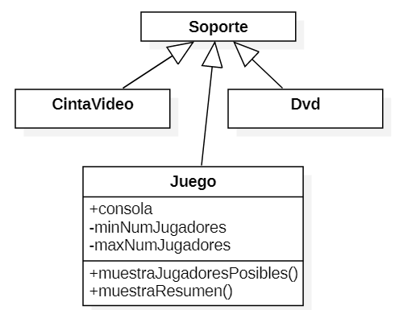

# PHP Orientant a Objectes

??? abstract "Duració i criteris d'avaluació"

    Duració estimada: 18 hores

    <hr />

    | Resultat d'aprenentatge | Criteris d'avaluació |
    | --------                | --------             |
    | 5. Desenvolupa aplicacions Web identificant i aplicant mecanismes per a separar el codi de presentació de la lògica de negoci.| a) S'han identificat els avantatges de separar la lògica de negoci dels aspectes de presentació de l'aplicació. <br/> b) S'han analitzat tecnologies i mecanismes que permeten realitzar aquesta separació i les seues característiques principals. <br/> c) S'han utilitzat objectes i controls en el servidor per a generar l'aspecte visual de l'aplicació Web en el client. <br/> d) S’han utilitzat formularis generats de forma dinàmica per a respondre als esdeveniments de l'aplicació Web. <br/> e) S'han identificat i aplicat els paràmetres relatius a la configuració de l'aplicació Web. <br/> f) S'han escrit aplicacions Web amb manteniment d'estat i separació de la lògica de negoci. <br/> g) S'han aplicat els principis de la programació orientada a objectes. <br/> g) S'ha provat i documentat el codi. |


## Classes i Objectes

PHP segueix un paradigma de programació orientada a objectes (POO) basada en classes.

Un classe és un plantilla que defineix les propietats i mètodes per a poder crear objectes. D'aquest manera, un objecte és una instància d'una classe.

Tant les propietats com els mètodes es defineixen amb una visibilitat (qui pot accedir)

* Privat - `private`: Només pot accedir la pròpia classe.
* Protegit - `protected`: Només pot accedir la pròpia classe o els seus descendents.
* Público - `public`: Pot accedir qualsevol altra classe.

Per a declarar una classe, s'utilitza la paraula clau `class` seguit del nom de la classe. Per a instanciar un objecte a partir de la classe, s'utilitza `new`:

``` php
<?php
class NomClase {
// propiedades
// y métodos
}

$ob = new NomClase();
```

!!! important "Classes amb majúscula"
    Totes les classes comencen per lletra majúscula.

Quan un projecte creix, és normal modelar les classes mitjançant UML (recordeu Entorns de Desenvolupament?). La classes es representen mitjançant un quadrat, separant el nom, de les propietats i els mètodes:

{ width=500 }

Una vegada que hem creat un objecte, s'utilitza l'operador `->` per a accedir a una propietat o un mètode:

``` php
$objeto->propiedad;
$objeto->método(parámetros);
```

Si des de dins de la classe, volem accedir a una propietat o mètode de la mateixa classe, utilitzarem la referència `$this`;

``` php
$this->propiedad;
$this->método(parámetros);  
```

Així doncs, com a exemple, codificaríem una persona en el fitxer `Persona.php` com:

``` php
<?php
class Persona {
    private string $nombre;

    public function setNombre(string $nom) {
        $this->nombre=$nom;
    }

    public function imprimir(){
        echo $this->nombre;
        echo '<br>';
    }
}

$bruno = new Persona(); // creamos un objeto
$bruno->setNombre("Bruno Díaz");
$bruno->imprimir();
```

Encara que es poden declarar diverses classes en el mateix arxiu, és una mala pràctica. Així doncs, cada fitxer contedrá una sola classe, i es nomenarà amb el nom de la classe.

## Encapsulació

Les propietats es defineixen privades o protegides (si volem que les classes heretades puguen accedir).

Per a cada propietat, s'afigen mètodes públics (*getter/setter*):

``` php
public setPropiedad(tipo $param)
public getPropiedad() : tipo
```

Les constants es defineixen públiques perquè siguen accessibles per tots els recursos.

``` php
<?php
class MayorMenor {
    private int $mayor;
    private int $menor;

    public function setMayor(int $may) {
        $this->mayor = $may;
    }

    public function setMenor(int $men) {
        $this->menor = $men;
    }

    public function getMayor() : int {
        return $this->mayor;
    }

    public function getMenor() : int {
        return $this->menor;
    }
}
```

### Rebent i enviant objectes

És recomanable indicar-ho en la mena de paràmetres. Si l'objecte pot retornar nuls es posa `?` davant del nom de la classe.

!!! important "Objectes per referència"
    Els objectes que s'envien i reben com a paràmetres sempre es passen per referència.

``` php hl_lines="2"
<?php
function maymen(array $numeros) : ?MayorMenor {
    $a = max($numeros);
    $b = min($numeros);

    $result = new MayorMenor();
    $result->setMayor($a);
    $result->setMenor($b);

    return $result;
}

$resultado =  maymen([1,76,9,388,41,39,25,97,22]);
echo "<br>Mayor: ".$resultado->getMayor();
echo "<br>Menor: ".$resultado->getMenor();
```

## Constructor

El constructor dels objectes es defineix mitjançant el mètode màgic `__construct`.
Pot o no tindre paràmetres, però només pot haver-hi un únic constructor.

``` php hl_lines="5"
<?php
class Persona {
    private string $nombre;

    public function __construct(string $nom) {
        $this->nombre = $nom;
    }

    public function imprimir(){
      echo $this->nombre;
      echo '<br>';
    }
}

$bruno = new Persona("Bruno Díaz");
$bruno->imprimir();
```

### Constructors en PHP 8

Una de les grans novetats que ofereix PHP 8 és la simplificació dels constructors amb paràmetres, la qual cosa es coneix com a promoció de les propietats del constructor*.

Per a això, en comptes d'haver de declarar les propietats com a privades o protegides, i després dins del constructor haver d'assignar els paràmetres a estàs propietats, el propi constructor promociona les propietats.

Vegem-ho millor amb un exemple. Imaginem una classe `Punt` on vulguem emmagatzemar les seues coordenades:

``` php
<?php
class Punto {
    protected float $x;
    protected float $y;
    protected float $z;

    public function __construct(
        float $x = 0.0,
        float $y = 0.0,
        float $z = 0.0
    ) {
        $this->x = $x;
        $this->y = $y;
        $this->z = $z;
    }
}
```

En PHP 8, quedaria de la següent manera (molt més curt, la qual cosa facilita la seua llegibilitat):

``` php
<?php
class Punto {
    public function __construct(
        protected float $x = 0.0,
        protected float $y = 0.0,
        protected float $z = 0.0,
    ) {}
}
```

!!! info "L'ordre importa"
    A l'hora de codificar l'ordre dels elements ha de ser:

    ``` php
    <?php
    declare(strict_types=1);

    class NombreClase {
        // propiedades

        // constructor

        // getters - setters

        // resto de métodos
    }
    ?>
    ```

## Classes estàtiques

Són aquelles que tenen propietats i/o mètodes estàtics (també es coneixen com *de classe*, perquè el seu valor es comparteix entre totes les instàncies de la mateixa classe).

Es declaren amb `static` i es referencien amb `::`.

* Si volem accedir a un mètode estàtic, s'anteposa el nom de la classe: `Producte::nuevoProducto()`.
* Si des d'un mètode volem accedir a una propietat estàtica de la mateixa classe, s'utilitza la referència `self`: `self::$numProductos`

``` php
<?php
class Producto {
    const IVA = 0.23;
    private static $numProductos = 0; 

    public static function nuevoProducto() {
        self::$numProductos++;
    }
}

Producto::nuevoProducto();
$impuesto = Producto::IVA;
```

## Classes estàtiques

També podem tindre classes normals que tinguen alguna propietat estàtica:

``` php
<?php
class Producto {
    const IVA = 0.23;
    private static $numProductos = 0; 
    private $codigo;

    public function __construct(string $cod) {
        self::$numProductos++;
        $this->codigo = $cod;
    }

    public function mostrarResumen() : string {
        return "El producto ".$this->codigo." es el número ".self::$numProductos;
    }
}

$prod1 = new Producto("PS5");
$prod2 = new Producto("XBOX Series X");
$prod3 = new Producto("Nintendo Switch");
echo $prod3->mostrarResumen();
```

## Introspecció

En treballar amb classes i objectes, existeixen un conjunt de funcions ja definides pel llenguatge que permeten obtindre informació sobre els objectes:

* `instanceof`: permet comprovar si un objecte és d'una determinada classe
* `get_class`: retorna el nom de la classe
* `get_declared_class`: retorna un array amb els noms de les classes definides
* `class_àlies`: crea un àlies
* `class_exists` / `method_exists` / `property_exists`: `true` si la classe / mètode / propietat està definida
* `get_class_methods` / `get_class_vars` / `get_object_vars`: Retorna un array amb els noms dels mètodes / propietats d'una classe / propietats d'un objecte que són accessibles des d'on es fa la crida.

Un exemple d'aquestes funcions pot ser el següent:

``` php
<?php
$p = new Producto("PS5");
if ($p instanceof Producto) {
    echo "Es un producto";
    echo "La clase es ".get_class($p);

    class_alias("Producto", "Articulo");
    $c = new Articulo("Nintendo Switch");
    echo "Un articulo es un ".get_class($c);

    print_r(get_class_methods("Producto"));
    print_r(get_class_vars("Producto"));
    print_r(get_object_vars($p));

    if (method_exists($p, "mostrarResumen")) {
        $p->mostrarResumen();
    }
}
```
!!! caution "Clonat"
    En assignar dos objectes no es copien, es crea una nova referència. Si volem una còpia, cal clonar-ho mitjançant el mètode `clone(object) : object`

    Si volem modificar el clonat per defecte, cal definir el mètode màgic `__clone()` que es dirà després de copiar totes les propietats.

    Més informació en <https://www.php.net/manual/es/language.oop5.cloning.php>

## Herència

PHP suporta herència simple, de manera que una classe només pot heretar d'una altra, no de dues classes alhora. Per a això s'utilitza la paraula clau `extends`. Si volem que la classe A hereta de la classe B farem:

``` php
class A extends B
```

El fill hereta els atributs i mètodes públics i protegits.

!!! warning "Cada classe en un arxiu"
Com ja hem comentat, hauríem de col·locar cada classe en un arxiu diferent per a posteriorment utilitzar-lo mitjançant `include`. En els següent exemple els hem col·locats junt per a facilitar la seua llegibilitat.

Per exemple, tenim una classe `Producte` i una `Tv` que hereta de `Producte`:

``` php
<?php
class Producto {
    public $codigo;
    public $nombre;
    public $nombreCorto;
    public $PVP;

    public function mostrarResumen() {
        echo "<p>Prod:".$this->codigo."</p>";
    }
}

class Tv extends Producto {
    public $pulgadas;
    public $tecnologia;
}
```

Podemos utilizar las siguientes funciones para averiguar si hay relación entre dos clases:

* `get_parent_class(object): string`
* `is_subclass_of(object, string): bool`

``` php
<?php
$t = new Tv();
$t->codigo = 33;
if ($t instanceof Producto) {
    echo $t->mostrarResumen();
}

$padre = get_parent_class($t);
echo "<br>La clase padre es: " . $padre;
$objetoPadre = new $padre;
echo $objetoPadre->mostrarResumen();

if (is_subclass_of($t, 'Producto')) {
    echo "<br>Soy un hijo de Producto";
}
```

### Sobreescriure mètodes

Podem crear mètodes en els fills amb el mateix nom que el pare, canviant el seu comportament.
Per a invocar als mètodes del pare -> `parent::nombreMetodo()`

``` php
<?php
class Tv extends Producto {
   public $pulgadas;
   public $tecnologia;

   public function mostrarResumen() {
      parent::mostrarResumen();
      echo "<p>TV ".$this->tecnologia." de ".$this->pulgadas."</p>";
   }
}
```

### Constructor en fills

En els fills no es crea cap constructor de manera automàtica. Pel que si no n'hi ha, s'invoca automàticament al del pare. En canvi, si el definim en el fill, hem d'invocar al del pare de manera explícita.

=== "PHP7"

    ``` php
    <?php
    class Producto {
        public string $codigo;

        public function __construct(string $codigo) {
            $this->codigo = $codigo;
        }

        public function mostrarResumen() {
            echo "<p>Prod:".$this->codigo."</p>";
        }
    }
    
    class Tv extends Producto {
        public $pulgadas;
        public $tecnologia;

        public function __construct(string $codigo, int $pulgadas, string $tecnologia) {
            parent::__construct($codigo);
            $this->pulgadas = $pulgadas;
            $this->tecnologia = $tecnologia;
        }

        public function mostrarResumen() {
            parent::mostrarResumen();
            echo "<p>TV ".$this->tecnologia." de ".$this->pulgadas."</p>";
        }
    }
    ```

=== "PHP8"

    ``` php
    <?php
    class Producto {
        public function __construct(private string $codigo) { }

        public function mostrarResumen() {
            echo "<p>Prod:".$this->codigo."</p>";
        }        
    }
    
    class Tv extends Producto {

        public function __construct(
            string $codigo,
            private int $pulgadas,
            private string $tecnologia)
        {
            parent::__construct($codigo);
        }

        public function mostrarResumen() {
            parent::mostrarResumen();
            echo "<p>TV ".$this->tecnologia." de ".$this->pulgadas."</p>";
        }
    }
    ```

## Classes abstractes

Les classes abstractes obliguen a heretar d'una classe, ja que no es permet la seua instanciación. Es defineix mitjançant `abstract class NombreClase {`.
Una classe abstracta pot contindre propietats i mètodes no-abstractes, i/o mètodes abstractes.

``` php
<?php
// Clase abstracta
abstract class Producto {
    private $codigo;
    public function getCodigo() : string {
        return $this->codigo;
    }
    // Método abstracto
    abstract public function mostrarResumen();
}
```

Quan una classe hereta d'una classe abstracta, obligatòriament ha d'implementar els mètodes que té el pare marcats com a abstractes.

``` php
<?php
class Tv extends Producto {
    public $pulgadas;
    public $tecnologia;

    public function mostrarResumen() { //obligado a implementarlo
        echo "<p>Código ".$this->getCodigo()."</p>";
        echo "<p>TV ".$this->tecnologia." de ".$this->pulgadas."</p>";
    }
}

$t = new Tv();
echo $t->getCodigo();
```

## Classes finals

Són classes oposades a abstractes, ja que eviten que es puga heretar una classe o mètode per a sobreescriure-ho.

``` php
<?php
class Producto {
    private $codigo;

    public function getCodigo() : string {
        return $this->codigo;
    }

    final public function mostrarResumen() : string {
        return "Producto ".$this->codigo;
    }
}

// No podremos heredar de Microondas
final class Microondas extends Producto {
    private $potencia;

    public function getPotencia() : int {
        return $this->potencia;
    }

    // No podemos implementar mostrarResumen()
}
```

## Interfícies

Permet definir un contracte amb les signatures dels mètodes a complir. Així doncs, només conté declaracions de funcions i totes han de ser públiques.

Es declaren amb la paraula clau `interface` i després les classes que complisquen el contracte el realitzen mitjançant la paraula clau `implements`.

``` php
<?php
interface Nombreable {
// declaración de funciones
}
class NombreClase implements NombreInterfaz {
// código de la clase
```

Se permite la herencia de interfaces. Además, una clase puede implementar varios interfaces (en este caso, sí soporta la herecia múltiple, pero sólo de interfaces).

``` php
<?php
interface Mostrable {
    public function mostrarResumen() : string;
}

interface MostrableTodo extends Mostrable {
    public function mostrarTodo() : string;
}

interface Facturable {
    public function generarFactura() : string;
}

class Producto implements MostrableTodo, Facturable {
    // Implementaciones de los métodos
    // Obligatoriamente deberá implementar public function mostrarResumen, mostrarTodo y generarFactura
}
```

## Mètodes encadenats

Segueix el plantejament de la programació funcional, i també es coneix com *method chaining*. Planteja que sobre un objecte es realitzen diverses crides.

``` php
<?php
$p1 = new Libro();
$p1->setNombre("Harry Potter");
$p1->setAutor("JK Rowling");
echo $p1;

// Method chaining
$p2 = new Libro();
$p2->setNombre("Patria")->setAutor("Aramburu");
echo $p2;
```

Per a facilitar-ho, modificarem tots els seus mètodes mutadores (que modifiquen dades, setters*, ...) perquè retornen una referència a `$this`:

``` php
<?php
class Libro {
    private string $nombre;
    private string $autor;

    public function getNombre() : string {
        return $this->nombre;
    }
    public function setNombre(string $nombre) : Libro { 
        $this->nombre = $nombre;
        return $this;
    }

    public function getAutor() : string {
        return $this->autor;
    }
    public function setAutor(string $autor) : Libro {
        $this->autor = $autor;
        return $this;
    }

    public function __toString() : string {
        return $this->nombre." de ".$this->autor;
    }
}
```

## Mètodes màgics

Totes les classes PHP ofereixen un conjunt de mètodes, també coneguts com *magic methods* que es poden sobreescriure per a substituir el seu comportament. Alguns d'ells ja els hem utilitzats.

Davant qualsevol dubte, és convenient consultar la [documentació oficial](https://www.php.net/manual/es/language.oop5.magic.php).

Els més destacables són:

* `__construct()`
* `__destruct()` → s'invoca en perdre la referència. S'utilitza per a tancar una connexió a la BD, tancar un fitxer, ...
* `__toString()` → representació de l'objecte com a cadena. És a dir, quan fem `tire $objecte` s'executa automàticament aquest mètode.
* `__get(propietat)`, `__set(propietat, valor)` → Permetria accedir a les propietat privades, encara que sempre és més llegible/mantenible codificar els *getter/setter*.
* `__isset(propietat)`, `__unset(propietat)` → Permet esbrinar o llevar el valor a una propietat.
* `__sleep()`, `__wakeup()` → S'executen en recuperar (*unserialize^) o emmagatzemar un objecte que se serialitza (*serialize), i s'utilitzen per a permet definir quines propietats se serialitzen.
* `__call()`, `__callStatic()` → S'executen en cridar a un mètode que no és públic. Permeten sobrecarreguen mètodes.

## Espai de noms

Des de PHP 5.3 i també coneguts com *Namespaces*, permeten organitzar les classes/interfícies, funcions i/o constants de manera similar als paquets a *Java*.

!!! tip "Recomanació"
    Un només namespace per arxiu i crear una estructura de carpetes respectant els anivelles/subnivells (igual que es fa a Java)

Es declaren en la primera línia mitjançant la paraula clau `namespace` seguida del nom de l'espai de noms assignat (cada subnivell se separa amb la barra invertida `\`):

Per exemple, per a col·locar la classe `Producte` dins del *namespace* `Dwes\Exemples` ho faríem així:

``` php
<?php
namespace Dwes\Exemples;

const IVA = 0.21;

class Producte {
    public $nombre;
      
    public function muestra() : void {
        echo"<p>Prod:" . $this->nombre . "</p>";
    }
}
```

### Accés

Per a referenciar a un recurs que conté un namespace, primer hem de tindre'l disponible fent ús de `include` o `require`. Si el recurs està en el mateix *namespace*, es realitza un accés directe (es coneix com a accés sense qualificar).

Realment hi ha tres tipus d'accés:

* sense qualificar: `recurs`
* qualificat: `rutaRelativa\recurs` → no fa falta posar el *namespace* complet
* totalment qualificat: `\rutaAbsoluta\recurs`

``` php
<?php
namespace Dwes\Ejemplos;

include_once("Producto.php");

echo IVA; // sin cualificar
echo Utilidades\IVA; // acceso cualificado. Daría error, no existe \Dwes\Ejemplos\Utilidades\IVA
echo \Dwes\Ejemplos\IVA; // totalmente cualificado

$p1 = new Producto(); // lo busca en el mismo namespace y encuentra \Dwes\Ejemplos\Producto
$p2 = new Model\Producto(); // daría error, no existe el namespace Model. Está buscando \Dwes\Ejemplos\Model\Producto
$p3 = new \Dwes\Ejemplos\Producto(); // \Dwes\Ejemplos\Producto
```

### Accés

Per a evitar la referència qualificada podem declarar l'ús mitjançant `use` (similar a fer `import` a Java). Es fa en la capçalera, després del `namespace`:

Els tipus Posibles són:

* `use const nombreCualificadoConstante`
* `use function nombreCualificadoFuncion`
* `use nombreCualificadoClase`
* `use nombreCualificadoClase as NuevoNombre` // per a canviar de nom elements

Per exemple, si volem utilitzar la classe `\Dwes\Exemples\Producte` des d'un recurs que es troba en l'arrel, per exemple en `inici.php`, faríem:

``` php
<?php
include_once("Dwes\Exemples\Producte.php");

use const Dwes\Exemples\IVA;
use \Dwes\Exemples\Producte;

echo IVA;
$p1 = new Producte();
```

!!! tip "To `use` or not to `use`"
    En resum, `use` permet accedir sense qualificar a recursos que estan en un altre *namespace*. Si estem en el mateix espai de nom, no necessitem `use`.

### Organització

Tot projecte, conforme creix, necessita organitzar el seu codi font. Es planteja una organització en la qual els arxius que interactuan amb el navegador es col·loquen en l'arrel, i les classes que definim van dins d'un namespace (i dins de la seua pròpia carpeta `src` o `app`).

<figure>

<figcaption>Organització del codi font</figcaption>
</figure>

!!! tip "Organització, includes i usos"
    * Col·locarem cada recurs en un fitxer a part.
    * En la primera línia indicarem la seua *namespace* (si no està en l'arrel).
    * Si utilitzem altres recursos, farem un `include_once` d'aqueixos recursos (classes, interfícies, etc...).
    * Cada recurs ha d'incloure tots els altres recursos que referencie: la classe de la qual hereta, interfícies que implementa, classes utilitzades/rebudes com a paràmetres, etc...
    * Si els recursos estan en un espai de noms diferent al que estem, emprarem `use` amb la ruta completa per a després utilitzar referències sense qualificar.

### Autoload

No és tediós haver de fer el `include` de les classes? El autolloeu* ve al rescat.

Així doncs, permet carregar les classes (no les constants ni les funcions) que s'utilitzaran i evitar haver de fer el `include_onze` de cadascuna d'elles. Per a això, s'utilitza la funció `spl_autolloeu_register`

``` php
<?php
spl_autoload_register( function( $nombreClase ) {
    include_once $nombreClase.'.php';
} );
?>
```

!!! question "Per què es diuen autoload?"
    Perquè abans es realitzava mitjançant el mètode màgic `__autoload()`, el qual està *deprecated* des de PHP 7.2

I com organitzem ara el nostre codi aprofitant el autoload?

<figure style="float: right;">
    
    <figcaption>Organització amb autoload</figcaption>
</figure>

Per a facilitar la cerca dels recursos a incloure, és recomanable col·locar totes les classes dins d'una mateixa carpeta. Nosaltres la col·locarem dins de `app` (més endavant, quan estudiem *Laravel* veurem el motiu d'aquesta decisió). Altres carpetes que podem crear són `test` per a col·locar les proves *PhpUnit* que després realitzarem, o la carpeta `vendor` on s'emmagatzemaran les llibreries del projecte (aquesta carpeta és un estándard dins de PHP, ja que *Composer* la crea automàticament).

Com hem col·locat tots els nostres recursos dins de `app`, ara nostre `autoload.php` (el qual col·loquem en la carpeta arrel) només buscarà dins d'aqueixa carpeta:

``` php
<?php
spl_autoload_register( function( $nombreClase ) {
    include_once "app/".$nombreClase.'.php';
} );
?>
```

!!! tip "autolloeu i rutes errònies"
    En *Ubuntu* en fer el *include* de la classe que rep com a paràmetre, les barres dels namespace (`\`) són diferents a les de les rutes (`/`). Per això, és millor que utilitzem el fitxer autoload:
    ``` php
    <?php
    spl_autoload_register( function( $nombreClase ) {
        $ruta = "app\\".$nombreClase.'.php';
        $ruta = str_replace("\\", "/", $ruta); // Sustituimos las barras
        include_once $ruta';
    } );
    ?>
    ```

## Gestió d'Errors

PHP classifica els errors que ocorren en diferents nivells. Cada nivell s'identifica amb una constant. Per exemple:

* `E_ERROR`: errors fatals, no recuperables. S'interromp el script.
* `E_WARNING`: advertiments en temps d'execució. El script no s'interromp.
* `E_NOTICE`: avisos en temps d'execució.

Podeu comprovar el llistat complet de constants de <https://www.php.net/manual/es/errorfunc.constants.php>

Per a la configuració dels errors podem fer-ho de dues formes:

* A nivell de `php.ini`:
  * `error_reporting`: indica els nivells d'errors a notificar
    * `error_reporting = E_ALL & ~E_NOTICE` -> Tots els errors menys els avisos en temps d'execució.
  * `display_errors`: indica si mostrar o no els errors per pantalla. En entorns de producció és comuna posar-ho a `off`
  * mitjançant codi amb les següents funcions:
    * `error_reporting(codigo)` -> Controla quins errors notificar
    * `set_error_handler(nombreManejador)` -> Indica que funció s'invocarà cada vegada que es trobe un error. El manejador rep com a paràmetres el nivell de l'error i el missatge

A continuació tenim un exemple mitjançant codi:

=== "Funcions per a la gestió d'errors"

    ``` php
    <?php
    error_reporting(E_ALL & ~E_NOTICE & ~E_WARNING);
    $resultado = $dividendo / $divisor;

    error_reporting(E_ALL & ~E_NOTICE);
    set_error_handler("miManejadorErrores");
    $resultado = $dividendo / $divisor;
    restore_error_handler(); // vuelve al anterior

    function miManejadorErrores($nivel, $mensaje) {
        switch($nivel) {
            case E_WARNING:
                echo "<strong>Warning</strong>: $mensaje.<br/>";
                break;
            default:
                echo "Error de tipo no especificado: $mensaje.<br/>";
        }
    }
    ```

=== "Consola"

    ```
    Error de tipo no especificado: Undefined variable: dividendo.
    Error de tipo no especificado: Undefined variable: divisor.
    Error de tipo Warning: Division by zero.
    ```

## Excepcions

La gestió d'excepcions forma part des de PHP 5. El seu funcionament és similar a Java*, fent ús d'un bloc `try / catch / finally`.
Si detectem una situació anòmala i volem llançar una excepció, haurem de realitzar `throw new Exception` (adjuntant el missatge que l'ha provocat).

``` php
<?php
try {
    if ($divisor == 0) {
        throw new Exception("División por cero.");
    }
    $resultado = $dividendo / $divisor;
} catch (Exception $e) {
    echo "Se ha producido el siguiente error: ".$e->getMessage();
}
```

La classe `Exception` és la classe pare de totes les excepcions. El seu constructor rep `missatge[,codigoError][,excepcionPrevia]`.

A partir d'un objecte `Exception`, podem accedir als mètodes `getMessage()`i `getCode()` per a obtindre el missatge i el codi d'error de l'excepció capturada.

El propi llenguatge ofereix un conjunt d'excepcions ja definides, les quals podem capturar (i llançar des de PHP 7). Es recomana la seua consulta en la [documentació oficial](https://www.php.net/manual/es/class.exception.php).

### Creant excepcions

Per a crear una excepció, la forma més curta és crear una classe que únicament herete de `Exception`.

``` php
<?php
class HolaExcepcion extends Exception {}
```

Si volem, i és recomanable depenent dels requisits, podem sobrecarregar els mètodes màgics, per exemple, sobrecarregant el constructor i cridant al constructor del pare, o reescriure el mètode `__toString` per a canviar el seu missatge:

``` php
<?php
class MiExcepcion extends Exception {
    public function __construct($msj, $codigo = 0, Exception $previa = null) {
        // código propio
        parent::__construct($msj, $codigo, $previa);
    }
    public function __toString() {
        return __CLASS__ . ": [{$this->code}]: {$this->message}\n";
    }
    public function miFuncion() {
        echo "Una función personalizada para este tipo de excepción\n";
    }
}
```

Si definim una excepció d'aplicació dins d'un *namespace*, quan referenciem a `Exception`, haurem de referenciar-la mitjançant el seu nom totalment qualificat (`\Exception`), o utilitzant `use`:

=== "Mitjançant nom totalment qualificat"
    ``` php
    <?php
    namespace \Dwes\Ejemplos;

    class AppExcepcion extends \Exception {}
    ```
=== "Mitjançant `use`"
    ``` php
    <?php
    namespace \Dwes\Ejemplos;

    use Exception;

    class AppExcepcion extends Exception {}
    ```

### Excepcions múltiples

Es poden usar excepcions múltiples per a comprovar diferents condicions. A l'hora de capturar-les, es fa de més específica a més general.

``` php
<?php
$email = "ejemplo@ejemplo.com";
try {
    // Comprueba si el email es válido
    if(filter_var($email, FILTER_VALIDATE_EMAIL) === FALSE) {
        throw new MiExcepcion($email);
    }
    // Comprueba la palabra ejemplo en la dirección email
    if(strpos($email, "ejemplo") !== FALSE) {
        throw new Exception("$email es un email de ejemplo no válido");
    }
} catch (MiExcepcion $e) {
    echo $e->miFuncion();
} catch(Exception $e) {
    echo $e->getMessage();
}
```

!!! question "Autoevaluación"
    ¿Qué pasaría al ejectuar el siguiente código?
    ``` php
    <?php
    class MainException extends Exception {}
    class SubException extends MainException {}

    try {
        throw new SubException("Lanzada SubException");
    } catch (MainException $e) {
        echo "Capturada MainException " . $e->getMessage();
    } catch (SubException $e) {
        echo "Capturada SubException " . $e->getMessage();
    } catch (Exception $e) {
        echo "Capturada Exception " . $e->getMessage();
    }
    ```

Si en el mateix `catch` volem capturar diverses excepcions, hem d'utilitzar l'operador `|`:

``` php
<?php
class MainException extends Exception {}
class SubException extends MainException {}

try {
    throw new SubException("Lanzada SubException");
} catch (MainException | SubException $e ) {
    echo "Capturada Exception " . $e->getMessage();
}
```

Des de PHP 7, existeix el tipus `Throwable`, el qual és una interfície que implementen tant els errors com les excepcions, i ens permet capturar els dos tipus alhora:

``` php
<?php
try {
    // tu codigo
} catch (Throwable $e) {
    echo 'Forma de capturar errores y excepciones a la vez';
}
```

Si només volem capturar els errors fatals, podem fer ús de la classe `Error`:

``` php
<?php
try {
    // Genera una notificación que no se captura
    echo $variableNoAsignada;
    // Error fatal que se captura
    funcionQueNoExiste();
} catch (Error $e) {
    echo "Error capturado: " . $e->getMessage();
}
```

### Rellançar excepcions

En les aplicacions reals, és molt comuna capturar una excepció de sistema i llançar una d'aplicació que hem definit nostros.
També podem llançar les excepcions sense necessitat d'estar dins d'un `try/catch`.

``` php
<?php
class AppException extends Exception {}

try {
    // Código de negocio que falla
} catch (Exception $e) {
    throw new AppException("AppException: ".$e->getMessage(), $e->getCode(), $e);
}
```

## SPL

*Standard PHP Library* és el conjunt de funcions i utilitats que ofereix PHP, com:

* Estructures de dades
* Pila, cua, cua de prioritat, llista doblement enllaçada, etc...
* Conjunt de iteradores dissenyats per a recórrer estructures agregades
* arrays, resultats de bases de dades, arbres XML, llistats de directoris, etc.

Podeu consultar la documentació en <https://www.php.net/manual/es/book.spl.php> o veure alguns exemples en <https://diego.com.es/tutorial-de-la-libreria-spl-de-php>

També defineix un conjunt d'excepcions que podem utilitzar perquè les llancen les nostres aplicacions:

* `LogicException` (`extends Exception`)
    * `BadFunctionCallException`
    * `BadMethodCallException`
    * `DomainException`
    * `InvalidArgumentException`
    * `LengthException`
    * `OutOfRangeException`
* `RuntimeException` (`extends Exception`)
    * `OutOfBoundsException`
    * `OverflowException`
    * `RangeException`
    * `UnderflowException`
    * `UnexpectedValueException`

També podeu consultar la documentació d'aquestes excepcions en <https://www.php.net/manual/es/spl.exceptions.php>.

## Referències

* [Manual de PHP](https://www.php.net/manual/es/index.php)
* [Manual de OO en PHP - www.desarrolloweb.com](https://desarrolloweb.com/manuales/manual-php.html#manual68)

## Activitats

300. Investiga la diferència entre un paradigma orientat a objectes basat en classes (*PHP*) respecte a un basat en prototips (JavaScript).

### Objetos

301. `301Empleado.php`: Crea una classe `Emprat` amb el seu nom, cognoms i sou.
     Encapsula les propietats mitjançant *getters/setters* i afig mètodes per a:
     * Obtindre el seu nom complet → `getNombreCompleto(): string`
     * Que retorne un booleà indicant si deu o no pagar impostos (es paguen quan el sou és superior a 3333€) → `debePagarImpuestos(): bool`
302. `302EmpleadoTelefonos.php`: Còpia la classe de l'exercici anterior i modifica-la.
     Afig una propietat privada que emmagatzeme un array de nombres de telèfons.
     Afig els següents mètodes:
     * `public function anyadirTelefono(int $telefono) : void` → Afig un telèfon al array
     * `public function listarTelefonos(): string` → Mostra els telèfons separats per comes
     * `public function vaciarTelefonos(): void` → Elimina tots els telèfons
303. `303EmpleadoConstructor.php`: Còpia la classe de l'exercici anterior i modifica-la.
     Elimina els setters* de `nom` i `cognoms`, de manera que aquestes dades s'assignen mitjançant el constructor (utilitza la sintaxi de PHP7).
     Si el constructor rep un tercer paràmetre, serà el sou del `Empleat`. Si no, se li assignarà 1000€ com a sou inicial.

`303EmpleadoConstructor8.php`: Modifica la classe i utilitza la sintaxi de PHP 8 de promoció de les propietats del constructor.

304. `304EmpleadoConstante.php`: Còpia la classe de l'exercici anterior i modifica-la.
     Afig una constant `SOU_TOPALL` amb el valor del sou que ha de pagar impostos, i modifica el codi per a utilitzar la constant.
305. `305EmpleadoSueldo.php`: Còpia la classe de l'exercici anterior i modifica-la.
     Canvia la constant per una variable estàtica `sueldoTope`, de manera que mitjançant *getter/setter* pugues modificar el seu valor.306. `306EmpleadoStatic.php`: Copia la clase del ejercicio anterior y modifícala.
306. Completa el següent mètode amb una cadena HTML que mostre les dades d'un empleat dins d'un paràgraf i tots els telèfons mitjançant una llista ordenada (per a això, hauràs de crear un *getter* per als telèfons):
     * `public static function toHtml(Empleado $emp): string`
 <figure style="float: right;">
     
     <figcaption>Ejercicio 307</figcaption>
 </figure>
307. `307Persona.php`: Còpia la classe de l'exercici anterior en `307Empleado.php` i modifica-la.
     Crea una classe `Persona` que siga pare de `Empleat`, de manera que `Persona` continga el nom i els cognoms, i en `Empleat` quede el salari i els telèfons.

308. `308PersonaH.php`: Còpia les classes de l'exercici anterior i modifica-les. Crea en `Persona` el mètode estàtic `toHtml(Persona $p)`, i modifica en `Empleat` el mateix mètode `toHtml(Persona $p)`, però canvia la signatura perquè reba una `Persona` com a paràmetre.
     Per a accedir a les propietats de l'empleat amb la persona que rebem com a paràmetre, comprovarem el seu tipus:

    ``` php
    <?php
    class Empleado extends Persona {
        /// resto del código


        public static function toHtml(Persona $p): string {
            if ($p instanceof Empleado) {
                // Aqui ya podemos acceder a las propiedades y métodos de Empleado
            }
        }
    }
    ```

309. `309PersonaE.php`: Còpia les classes de l'exercici anterior i modifica-les.
     Afig en `Persona` un atribut `edat`
     A l'hora de saber si un empleat ha de pagar impostos, el farà sempre que tinga més de 21 anys i depenga del valor del seu sou.
     Modifica tot el codi necessari per a mostrar i/o editar l'edat quan siga necessari.

310. `310PersonaS.php`: Còpia les classes de l'exercici anterior i modifica-les.
     Afig nous mètodes que facen una representació de totes les propietats de les classes `Persona` i `Empleat`, de manera similar als realitzats en HTML, però sense que siguen estàtics, de manera que  obtinga les dades mitjançant `$this`.
     * `function public __toString(): string`

!!! tip "*Magic methods*"
    El mètode `__toString()` és un mètode màgic que s'invoca automàticament quan volem obtindre la representació en cadena d'un objecte.


311. `311PersonaA.php`: Còpia les classes de l'exercici anterior i modifica-les.
     Transforma `Persona` a una classe abstracta on el seu mètode estàtic `toHtml(Persona $p)` haja de ser redefinit en tots els seus fills.

312. `312Trabajador.php`: Còpia les classes de l'exercici anterior i modifica-les.
     * Canvia l'estructura de classes conforme al gràfic respectant tots els mètodes que ja estan fets.
     * `Treballador` és una classe abstracta que ara emmagatzema els `telefonos` i on `calcularSueldo` és un mètode abstracte de manera que:
       * El sou d'un `Empleat` es calcula a partir de les hores treballades i el que cobra per hora.
       * Per als `Gerent`s, el seu sou s'incrementa percentualment sobre la base de la seua edat: `salari + salariedat/100`
<figure>
   
   <figcaption>Ejercicio 312</figcaption>
</figure>
313. `313Empresa.php`: Utilitzant les classes dels exercicis anteriors:
     * Crea una classe `Empresa` que a més del nom i la direcció, continga una propietat amb un array de `Treballador`és, ja siguen `Emprat`s o `Gerent`s. 
     * Afig *getters/setters* per al nom i direcció.
     * Afig mètodes per a afegir i llistar els treballadors.
        * `public function anyadirTrabajador(Treballador $t)`
        * `public function listarTrabajadoresHtml() : string` -> utilitza `Treballador::toHtml(Persona $p)`
     * Afig un mètode per a obtindre el cost total en nòmines.
        * `public function getCosteNominas(): float` -> recorre els treballadors i invoca al mètode `calcularSueldo()`.

314. `314EmpresaI.php`: Còpia les classes de l'exercici anterior i modifica-les.
     * Crea una interfície JSerializable, de manera que oferisca els mètodes:
       * `toJSON(): string` → utilitza la funció [`json_encode(mixed)`](https://www.php.net/manual/es/function.json-encode.php). Tingues en compte que com tenim les propietats dels objectes privats, has de recórrer les propietats i col·locar-les en un mapa. Per exemple:        ``` php
               <?php
               public function toJSON(): string {
                   foreach ($this as $clave => $valor) {
                       $mapa->$clave = $valor;
                   }
                   return json_encode($mapa);
               }
               ?>
               ```

       * `toSerialize(): string` → utilizta la funció [`serialize(mixed)`](https://www.php.net/manual/es/function.serialize.php)
    * Modifica totes les classes que no són abstractes perquè implementen la interfície creada.


### Projecte Videoclub

En els següents exercicis simularem un xicotet projecte d'un Videoclub (basat en la proposta que fa el tutorial de desarrolloweb.com), el qual realitzarem mitjançant un desenvolupament incremental i seguint la pràctica de programació en parelles (*pair programming*).

Abans de res, crea un repositori privat en GitHub i puja el projecte actual de Videoclub*. Una vegada creat, convida al teu company al repositori com a col·laborador.

  * Inicialitza en local el teu repostorio de git, mitjançant `git init`
  * Afig i puja els canvis al teu repositori, mitjançant `git add .` i després `git commit -m 'Inicialitzant projecte'.`
  * Connecta el teu repositori amb GitHub i puja els canvis (mira la instruccions de GitHub: comandos `git remalnom` i `git push`).
  * El teu company haurà de descarregar el projecte amb les seues credencials.

!!! warning "Projecte no real"
    El següent projecte està pensat des d'un punt de vista formatiu. Algunes de les decisions que es prenen no s'han d'usar (com fer `tire` dins de les classes) o provar el codi comparant el resultat en el navegador.

Cada classe ha d'anar en un arxiu php separat. Per a facilitar la seua implementació, es mostra l'estructura UML del model i un fragment de codi per a provar les classes:
<figure style="float: right;">
    
    <figcaption>Creamos el Soporte</figcaption>
</figure>

320. Crea una classe per a emmagatzemar suports (`Soporte.php`). Aquesta classe serà la classe pare dels diferents suports amb els quals treballe el nostre videoclub (cintes de vídeo, videojocs, etc...):

     * Crea el constructor que inicialitze les seues propietats. Fixa't que la classe no té mètodes setters*.
     * Definir una constant mitjançant un propietat privada i estàtica denominada `IVA amb un valor del 21%
     * Crear un arxiu (`inici.php`) per a usar les classes i còpia el següent fragment:

=== "Código de prueba"

    ``` php
    <?php
    include "Soporte.php";

    $soporte1 = new Soporte("Tenet", 22, 3); 
    echo "<strong>" . $soporte1->titulo . "</strong>"; 
    echo "<br>Precio: " . $soporte1->getPrecio() . " euros"; 
    echo "<br>Precio IVA incluido: " . $soporte1->getPrecioConIVA() . " euros";
    $soporte1->muestraResumen();
    ```

=== "Navegador"

    <pre>
    **Tenet**
    Precio: 3 euros
    Precio IVA incluido: 3.48 euros
    *Tenet*
    3 € (IVA no incluido)
    </pre>

<figure style="float: right;">
    
    <figcaption>Afegim Cinta de Video</figcaption>
</figure>

321. Crea la classe `CintaVideo` la qual hereta de `Soporte`. Afig l'atribut `duracion` i sobreescriu tant el contructor com el mètode `MuestraResumen` (des de `CintaVideo` hauràs de cridar al mètode `MuestraResumen` del pare).

    Afig a `inici.php` el codi per a provar la classe:

=== "Código de prueba"

    ``` php
    <?php
    include "CintaVideo.php";

    $miCinta = new CintaVideo("Los cazafantasmas", 23, 3.5, 107); 
    echo "<strong>" . $miCinta->titulo . "</strong>"; 
    echo "<br>Precio: " . $miCinta->getPrecio() . " euros"; 
    echo "<br>Precio IVA incluido: " . $miCinta->getPrecioConIva() . " euros";
    $miCinta->muestraResumen();
    ```

=== "Navegador"

    <pre>
    **Los cazafantasmas**
    Precio: 3.5 euros
    Precio IVA incluido: 4.06 euros
    Película en VHS:
    *Los cazafantasmas*
    3.5 € (IVA no incluido)
    Duración: 107 minutos
    </pre>

<figure style="float: right;">
    
    <figcaption>Afegim Dvd</figcaption>
</figure>

322. Crea la classe `Dvd` la qual hereta de `Soporte`. Afig els atributs `idiomas` i `formatoPantalla`. A continuació sobreescriu tant el contructor com el mètode `MuestraResumen`.

    Afig a `inici.php` el codi per a provar la classe:

=== "Código de prueba"

    ``` php
    <?php
    include "Dvd.php";

    $miDvd = new Dvd("Origen", 24, 15, "es,en,fr", "16:9"); 
    echo "<strong>" . $miDvd->titulo . "</strong>"; 
    echo "<br>Precio: " . $miDvd->getPrecio() . " euros"; 
    echo "<br>Precio IVA incluido: " . $miDvd->getPrecioConIva() . " euros";
    $miDvd->muestraResumen();
    ```

=== "Navegador"

    <pre>
    **Origen**
    Precio: 15 euros
    Precio IVA incluido: 17.4 euros
    Película en DVD:
    *Origen*
    15 € (IVA no incluido)
    Idiomas:es,en,fr
    Formato Pantalla:16:9
    </pre>

<figure style="float: left;">
    
    <figcaption>Afegim Juego</figcaption>
</figure>

323. Crea la classe `Juego` la qual hereta de `Soporte`. Afig els atributs `consola`, `minNumJugadores` i `maxNumJugadores`. A continuació afig el mètode `muestraJugadoresPosibles`, el qual ha de mostrar Per a un *jugador*, Per a X *Jugadores* o De X a I *Jugadores* depenent dels valors de les atributs creats. Finalment, sobreescriu tant el contructor com el mètode `MuestraResumen`.

    Afig a `inici.php` el codi per a provar la classe:

=== "Código de prueba"

    ``` php
    <?php
    include "Juego.php";

    $miJuego = new Juego("The Last of Us Part II", 26, 49.99, "PS4", 1, 1); 
    echo "<strong>" . $miJuego->titulo . "</strong>"; 
    echo "<br>Precio: " . $miJuego->getPrecio() . " euros"; 
    echo "<br>Precio IVA incluido: " . $miJuego->getPrecioConIva() . " euros";
    $miJuego->muestraResumen();
    ```

=== "Navegador"

    <pre>
    **The Last of Us Part II**
    Precio: 49.99 euros
    Precio IVA incluido: 57.9884 euros
    Juego para: PS4
    *The Last of Us Part II*
    49.99 € (IVA no incluido)
    Para un jugador
    </pre>

Arribats a aquest punt, el nostre model és similar al següent diagrama:
<figure>
    
    <figcaption>Model inicial de Videoclub</figcaption>
</figure>

<figure style="float: right;">
    
    <figcaption>Afegim Cliente</figcaption>
</figure>

324. Crear la classe `Cliente`. El constructor rebrà el `nom`, `numere` i `maxLloguerConcurrent`, aquest últim podent ser opcional i prenent com a valor per defecte 3. Després d'això, afig *getter/setter* únicament a `numere`, i un *getter* a `numSoportsalquilados` (aquest camp emmagatzemarà un comptador del total de lloguers que ha realitzat). El array de suports alquilados contedrá classes que hereten de `Soporte`. Finalment, afig el mètode `MuestraResumen` que mostre el nom i la quantitat de lloguers (grandària del array `soportsalquilados`).

325. Dins de `Cliente`, afig les següent operacions:
     * `tieneAlquilado(Soporte $s): bool` → Recorre el array de suports i comprova si està el suport
     * `alquilar(Soporte $s): bool` -→ Ha de comprovar si el suport està alquilado i si no ha superat el contingent de lloguers. En llogar, incrementarà el `numSoportsalquilados` i emmagatzemarà el suport en el array. Per a cada cas ha de mostrar un missatge informant de l'ocorregut.

326. Seguim amb `Cliente` per a afegir les operacions:
     * `retornar(int $numSoporte): bool` → Ha de comprovar que el suport estava llogat i actualitzar la quantitat de suports llogats. Per a cada cas ha de mostrar un missatge informant de l'ocorregut
     * `llistarLloguers(): void` → Informa de quants lloguers té el client i els mostra.

Crea l'arxiu `inicio2.php` amb el següent codi font per a provar la classe:

=== "Codi de prova"

    ``` php
    <?php
    include_once "CintaVideo.php";
    include_once "Dvd.php";
    include_once "Juego.php";
    include_once "Cliente.php";

    //instanciamos un par de objetos Clientee
    $cliente1 = new Cliente("Bruce Wayne", 23);
    $cliente2 = new Cliente("Clark Kent", 33);

    //mostramos el número de cada cliente creado 
    echo "<br>El identificador del cliente 1 es: " . $cliente1->getNumero();
    echo "<br>El identificador del cliente 2 es: " . $cliente2->getNumero();

    //instancio algunos soportes 
    $soporte1 = new CintaVideo("Los cazafantasmas", 23, 3.5, 107);
    $soporte2 = new Juego("The Last of Us Part II", 26, 49.99, "PS4", 1, 1);  
    $soporte3 = new Dvd("Origen", 24, 15, "es,en,fr", "16:9");
    $soporte4 = new Dvd("El Imperio Contraataca", 4, 3, "es,en","16:9");

    //alquilo algunos soportes
    $cliente1->alquilar($soporte1);
    $cliente1->alquilar($soporte2);
    $cliente1->alquilar($soporte3);

    //voy a intentar alquilar de nuevo un soporte que ya tiene alquilado
    $cliente1->alquilar($soporte1);
    //el cliente tiene 3 soportes en alquiler como máximo
    //este soporte no lo va a poder alquilar
    $cliente1->alquilar($soporte4);
    //este soporte no lo tiene alquilado
    $cliente1->tornar(4);
    //devuelvo un soporte que sí que tiene alquilado
    $cliente1->tornar(2);
    //alquilo otro soporte
    $cliente1->Alquilar($soporte4);
    //listo los elementos alquilados
    $cliente1->llistaLloguers();
    //este cliente no tiene alquileres
    $cliente2->tornar(2);
    ```

=== "Navegador"

    <pre>
    El identificador del cliente 1 es: 23
    El identificador del cliente 2 es: 33
    **Alquilado soporte a**: Bruce Wayne

    Película en VHS:
    *Los cazafantasmas*
    3.5 € (IVA no incluido)
    Duración: 107 minutos

    **Alquilado soporte a**: Bruce Wayne

    Juego para: PS4
    *The Last of Us Part II*
    49.99 € (IVA no incluido)
    Para un jugador

    **Alquilado soporte a**: Bruce Wayne

    Película en DVD:
    *Origen*
    15 € (IVA no incluido)
    Idiomas:es,en,fr
    Formato Pantalla:16:9

    El cliente ya tiene alquilado el soporte **Los cazafantasmas**

    Este cliente tiene 3 elementos alquilados. No puede alquilar más en este videoclub hasta que no devuelva algo

    No se ha podido encontrar el soporte en los alquileres de este cliente

    No se ha podido encontrar el soporte en los alquileres de este cliente

    Este cliente tiene 3 elementos alquilados. No puede alquilar más en este videoclub hasta que no devuelva algo

    **El cliente tiene 3 soportes alquilados**

    Película en VHS:
    *Los cazafantasmas*
    3.5 € (IVA no incluido)
    Duración: 107 minutos

    Juego para: PS4
    *The Last of Us Part II*
    49.99 € (IVA no incluido)
    Para un jugador

    Película en DVD:
    *Origen*
    15 € (IVA no incluido)
    Idiomas:es,en,fr
    Formato Pantalla:16:9

    Este cliente no tiene alquilado ningún elemento
    </pre>

327. Arribat a aquest punt, relacionarem els clients i els suports mitjançant la classe `Videoclub`. Així doncs crea la classe que representa el gràfic, tenint en compte que:
     * `productes` és un array de `Soporte`
     * `socis` és una array de `Cliente`
     * Els mètodes públics d'incloure algun suport, crearan la classe i cridaran al mètode privat de `incluirProducto`, el qual és l'encarregat d'introduir-lo dins del array.

El model complet quedarà de la següent manera:

<figure>
    
    <figcaption>Model complet de Videoclub</figcaption>
</figure>

I per a provar el projecte, dins `inicio3.php` col·locarem:

=== "Codi de prova"

    ``` php
    <?php
    include_once "Videoclub.php"; // No incluimos nada más

    $vc = new Videoclub("Severo 8A"); 

    //voy a incluir unos cuantos soportes de prueba 
    $vc->incluirJuego("God of War", 19.99, "PS4", 1, 1); 
    $vc->incluirJuego("The Last of Us Part II", 49.99, "PS4", 1, 1);
    $vc->incluirDvd("Torrente", 4.5, "es","16:9"); 
    $vc->incluirDvd("Origen", 4.5, "es,en,fr", "16:9"); 
    $vc->incluirDvd("El Imperio Contraataca", 3, "es,en","16:9"); 
    $vc->incluirCintaVideo("Los cazafantasmas", 3.5, 107); 
    $vc->incluirCintaVideo("El nombre de la Rosa", 1.5, 140); 

    //listo los productos 
    $vc->listarProductos(); 

    //voy a crear algunos socios 
    $vc->incluirSocio("Amancio Ortega"); 
    $vc->incluirSocio("Pablo Picasso", 2); 

    $vc->alquilaSocioProducto(1,2); 
    $vc->alquilaSocioProducto(1,3); 
    //alquilo otra vez el soporte 2 al socio 1. 
    // no debe dejarme porque ya lo tiene alquilado 
    $vc->alquilaSocioProducto(1,2); 
    //alquilo el soporte 6 al socio 1. 
    //no se puede porque el socio 1 tiene 2 alquileres como máximo 
    $vc->alquilaSocioProducto(1,6); 

    //listo los socios 
    $vc->listarSocios();
    ```

=== "Navegador"

    <pre>
    Incluido soporte 0
    Incluido soporte 1
    Incluido soporte 2
    Incluido soporte 3
    Incluido soporte 4
    Incluido soporte 5
    Incluido soporte 6

    Listado de los 7 productos disponibles:
    1.- Juego para: PS4
    *God of War*
    19.99 € (IVA no incluido)
    Para un jugador
    2.- Juego para: PS4
    *The Last of Us Part II*
    49.99 € (IVA no incluido)
    Para un jugador
    3.- Película en DVD:
    *Torrente*
    4.5 € (IVA no incluido)
    Idiomas:es
    Formato Pantalla:16:9
    4.- Película en DVD:
    *Origen*
    4.5 € (IVA no incluido)
    Idiomas:es,en,fr
    Formato Pantalla:16:9
    5.- Película en DVD:
    *El Imperio Contraataca*
    3 € (IVA no incluido)
    Idiomas:es,en
    Formato Pantalla:16:9
    6.- Película en VHS:
    *Los cazafantasmas*
    3.5 € (IVA no incluido)
    Duración: 107 minutos
    7.- Película en VHS:
    *El nombre de la Rosa*
    1.5 € (IVA no incluido)
    Duración: 140 minutos

    Incluido socio 0
    Incluido socio 1

    **Alquilado soporte a**: Pablo Picasso

    Película en DVD:
    *Torrente*
    4.5 € (IVA no incluido)
    Idiomas:es
    Formato Pantalla:16:9

    ** Alquilado soporte a**: Pablo Picasso

    Película en DVD:
    *Origen*
    4.5 € (IVA no incluido)
    Idiomas:es,en,fr
    Formato Pantalla:16:9

    El cliente ya tiene alquilado el soporte Torrente

    Este cliente tiene 2 elementos alquilados. No puede alquilar más en este videoclub hasta que no devuelva algo

    Listado de 2 socios del videoclub:
    1.- **Cliente 0**: Amancio Ortega
    Alquileres actuales: 0
    2.- **Cliente 1**: Pablo Picasso
    Alquileres actuales: 2
    </pre>

328. Transforma `Soporte` a una classe abstracta i comprova que tot continua funcionant. Què aconseguim en fer-la abstracta?

329. Crea una interfície `Resumible`, de manera que les classes que l'implementen han d'oferir el mètode `muestraResumen()`. Modifica la classe `Soporte` i feix que implemente la interfície. Fa falta que també l'implementen els fills?

### Projecte Videoclub 2.0

Antes de comenzar con la segunda parte del videoclub, crea una etiqueta mediante `git tag` con el nombre `v0.329` y sube los cambios a GitHub.

330. Modifica els operacions de llogar, tant en `Client` com en `Videoclub`, per a donar suport a l'encadenament de mètodes.
     Posteriorment, modifica el codi de prova per a utilitzar aquesta tècnica.
331. Fent ús de *namespaces*:
     * Col·boja totes els classes/interfícies en `Dwes\ProyectoVideoclub`
     * Cada classe ha de fer `include_once` dels recursos que empra
     * Col·boja el/els arxivaments de prova en l'arrel (sense espai de noms)
     * Dones de l'arxiu de proves, utilitza `use` per a poder realitzar accessos sense qualificar
     * Etiqueta els canvis com `v0.331`.
332. Reorganitza els carpeta tal com hem vist en els anotacions: `app`, `test` i `vendor`.
     * Crea un fitxer `autolloeu.php` per a registrar la ruta on trobar els classes
     * Modifica tot el codi necessari, incloent `autolloeu.php` on seguisca necessari i esborrant els *includes* previs.
333. A continuació crearem un conjunt d'excepcions d'aplicació. Aquestes excepcions són simples, no necessiten sobreescriure cap mètode. Així doncs, crea l'excepció d'aplicació `VideoclubException` en el *namespace* `Dwes\ProyectoVideoclub\Util`.
     Posteriorment crea els següents fills (han d'heretar de `VideoclubException`), cadascun en el seu propi arxiu:    * `SoporteYaAlquiladoException`
    * `CupoSuperadoException`
    * `SoporteNoEncontradoException`
    * `ClienteNoEncontradoException`
334. En `Cliente`, modifica els mètodes `alquilar` i `retornar`, perquè facen ús de les noves excepcions (llançant-les quan siga necessari) i funcionen com a mètodes encadenats. Destacar que aquests mètodes, no es capturar estàs excepcions, només es llancen.
     En `Videoclub`, modifica `alquilarSocioPelicula` per a capturar totes les excepcions que ara llança `Cliente` i informar l'usuari en conseqüència.
335. Modificarem el projecte perquè el videoclub sàpia quins productes estan o no llogats:
     * En `Soporte`, crea una propietat pública el nom de la qual siga `alquilado` que inicialment estarà a `false`. Quan es llogue, es posarà a `true`. En retornar, la tornarem a posar a `false`.
     * En `Videoclub`, crea dues noves propietats i les seues getters:
             * `numProductosAlquilados`
             * `numTotalAlquileres`
336. Crea un nou mètode en `Videoclub` anomenat `alquilarSocioProductos(int numSocio, array numerosProductos)`, el qual ha de rebre un array amb els productes a llogar.
     Abans de llogar-los, ha de comprovar que tots els suports estiguen disponibles, de manera que si un no ho està, no se li llogue cap.
337. Crea dos nous mètodes en `Videoclub`, i mitjançant la definició, dedueix què han de realitzar:
    * `devolverSocioProducto(int numSocio, int numeroProducto)`
    * `devolverSocioProductos(int numSocio, array numerosProductos)`

    Han de suportar l'encadenament de mètodes.
    Recorda actualitzar la propietat `alquilado` dels diferents suports.

Quan hages realitzat tots els exercicis, crea una etiqueta mitjançant `git tag` amb el nom `v0.337` i puja els canvis a GitHub.