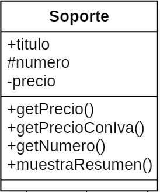

# PHP Orientado a Objetos

??? abstract "Duración y criterios de evaluación"

    Duración estimada: 20 sesiones

    <hr />

    Resultado de aprendizaje:

    5. Desarrolla aplicaciones Web identificando y aplicando mecanismos para separar el código de presentación de la lógica de negocio.

    Criterios de evaluación:

    1. Se han identificado las ventajas de separar la lógica de negocio de los aspectos de presentación de la aplicación. 
    2. Se han analizado tecnologías y mecanismos que permiten realizar esta separación y sus características principales. 
    3. Se han utilizado objetos y controles en el servidor para generar el aspecto visual de la aplicación web en el cliente. 
    4. Se han utilizado formularios generados de forma dinámica para responder a los eventos de la aplicación Web. 
    6. Se han escrito aplicaciones Web con mantenimiento de estado y separación de la lógica de negocio. 
    7. Se han aplicado los principios de la programación orientada a objetos. 
    8. Se ha probado y documentado el código.

## Clases y Objetos

PHP sigue un paradigma de programación orientada a objetos (POO) basada en clases.

Un clase es un plantilla que define las propiedades y métodos para poder crear objetos. De este manera, un objeto es una instancia de una clase.

Tanto las propiedades como los métodos se definen con una visibilidad (quien puede acceder)

* Privado - `private`:  Sólo puede acceder la propia clase
* Protegido - `protected`: Sólo puede acceder la propia clase o sus descendientes
* Público - `public`: Puede acceder cualquier otra clase

Para declarar una clase, se utiliza la palabra clave `class` seguido del nombre de la clase. Para instanciar un objeto a partir de la clase, se utiliza `new`:

``` php
<?php
class NombreClase {
// propiedades
// y métodos
}

$ob = new NombreClase();
```

!!! important "Clases con mayúscula"
 Todas las clases empiezan por letra mayúscula.

Cuando un proyecto crece, es normal modelar las clases mediante UML (¿recordáis *Entornos de Desarrollo*?). La clases se representan mediante un cuadrado, separando el nombre, de las propiedades y los métodos:

{ width=500 }

Una vez que hemos creado un objeto, se utiliza el operador `->` para acceder a una propiedad o un método:

``` php
$objeto->propiedad;
$objeto->método(parámetros);
```

Si desde dentro de la clase, queremos acceder a una propiedad o método de la misma clase, utilizaremos la referencia `$this`;

``` php
$this->propiedad;
$this->método(parámetros);  
```

Así pues, como ejemplo, codificaríamos una persona en el fichero `Persona.php` como:

``` php
<?php
class Persona {
    private $nombre;

    public function setNombre($nom) {
        $this->nombre=$nom;
    }

    public function imprimir(){
        echo $this->nombre;
        echo '<br>';
    }
}

$bruno = new Persona(); // creamos un objeto
$bruno->setNombre("Bruno Díaz");
$bruno->imprimir();
```

## Encapsulación

Las propiedades se definen privadas o protegidas (si queremos que las clases heredadas puedan acceder).

Para cada propiedad, se añaden métodos públicos (*getter/setter*):

``` php
public setPropiedad($param)
public getPropiedad()
```

Las constantes se definen públicas para que sean accesibles por todos los recursos.

``` php
<?php
class MayorMenor {
    private $mayor;
    private $menor;

    public function setMayor(int $may) {
        $this->mayor = $may;
    }

    public function setMenor(int $men) {
        $this->menor = $men;
    }

    public function getMayor() : int {
        return $this->mayor;
    }

    public function getMenor() : int {
        return $this->menor;
    }
}
```

### Recibiendo y enviando objetos

Es recomendable indicarlo en el tipo de parámetros. Si el objeto puede devolver nulos se pone `?` delante del nombre de la clase.

!!! important "Objetos por referencia"
 Los objetos que se envían y reciben como parámetros siempre se pasan por referencia.

``` php hl_lines="2"
<?php
function maymen(array $numeros) : ?MayorMenor {
    $a = max($numeros);
    $b = min($numeros);

    $result = new MayorMenor();
    $result->setMayor($a);
    $result->setMenor($b);

    return $result;
}

$resultado =  maymen([1,76,9,388,41,39,25,97,22]);
echo "<br>Mayor: ".$resultado->getMayor();
echo "<br>Menor: ".$resultado->getMenor();
```

## Constructor

El constructor de los objetos se define mediante el método mágico `__construct`.
Puede o no tener parámetros, pero sólo puede haber un único constructor.

``` php hl_lines="5"
<?php
class Persona {
    private $nombre;

    public function __construct($nom) {
      $this->nombre=$nom;
    }

    public function imprimir(){
      echo $this->nombre;
      echo '<br>';
    }
}

$bruno = new Persona("Bruno Díaz");
$bruno->imprimir();
```

## Clases estáticas

Son aquellas que tienes propiedades y/o métodos estáticos (también se conocen como *de clase*).
Se declaran con `static` y se referencian con `::`. Si desde un método estático queremos acceder a una propiedad estática de la misma clase, se utiliza la referencia `self`.

``` php
<?php
class Producto {
    const IVA = 0.23;
    private static $numProductos = 0; 

    public static function nuevoProducto() {
        self::$numProductos++;
    }
}

Producto::nuevoProducto();
$impuesto = Producto::IVA;
```

También podemos tener clases normales que tengan alguna propiedad estática:

``` php
<?php
class Producto {
    const IVA = 0.23;
    private static $numProductos = 0; 
    private $codigo;

    public function __construct(string $cod) {
        self::$numProductos++;
        $this->codigo = $cod;
    }

    public function mostrarResumen() : string {
        return "El producto ".$this->codigo." es el número ".self::$numProductos;
    }
}

$prod1 = new Producto("PS5");
$prod2 = new Producto("XBOX Series X");
$prod3 = new Producto("Nintendo Switch");
echo $prod3->mostrarResumen();
```

## Funciones predefinidas

Al trabajar con clases y objetos, existen un conjunto de funciones ya definidas por el lenguaje que conviene conocer:

* `instanceof`: permite comprobar si un objeto es de una determinada clase
* `get_class`: devuelve el nombre de la clase
* `get_declared_class`: devuelve un array con los nombres de las clases definidas
* `class_alias`: crea un alias
* `class_exists` / `method_exists` / `property_exists`: `true` si la clase / método / propiedad está definida
* `get_class_methods` / `get_class_vars` / `get_object_vars`: Devuelve un array con los nombres de los métodos / propiedades de una clase / propiedades de un objeto que son accesibles desde dónde se hace la llamada.

Un ejemplo de estas funciones puede ser el siguiente:

``` php
<?php
$p = new Producto("PS5");
if ($p instanceof Producto) {
    echo "Es un producto";
    echo "La clase es ".get_class($p);

    class_alias("Producto", "Articulo");
    $c = new Articulo("Nintendo Switch");
    echo "Un articulo es un ".get_class($c);

    print_r(get_class_methods("Producto"));
    print_r(get_class_vars("Producto"));
    print_r(get_object_vars($p));

    if (method_exists($p, "mostrarResumen")) {
        $p->mostrarResumen();
    }
}
```

!!! caution "Clonado"
    Al asignar dos objetos no se copian, se crea una nueva referencia. Si queremos una copia, hay que clonarlo mediante el método `clone(object) : object`

    Si queremos modificar el clonado por defecto, hay que definir el método mágico `__clone()` que se llamará después de copiar todas las propiedades.

    Más información en <https://www.php.net/manual/es/language.oop5.cloning.php>

## Herencia

PHP soporta herencia simple, de manera que una clase solo puede heredar de otra, no de dos clases a la vez. Si queremos que la clase A hereda de la clase B haremos:

```
class A extends B
```

El hijo hereda los atributos y métodos públicos y protegidos.

Por ejemplo, tenemos una clase Producto y una Tv que hereda de Producto:

``` php
<?php
class Producto {
    public $codigo;
    public $nombre;
    public $nombreCorto;
    public $PVP;

    public function mostrarResumen() {
        echo "<p>Prod:".$this->codigo."</p>";
    }
}

class Tv extends Producto {
    public $pulgadas;
    public $tecnologia;
}
```

Podemos utilizar las siguientes funciones para averiguar si hay relación entre dos clases:

* `get_parent_class(object): string`
* `is_subclass_of(object, string): bool`

``` php
<?php
$t = new Tv();
$t->codigo = 33;
if ($t instanceof Producto) {
    echo $t->muestra();
}

$padre = get_parent_class($t);
echo "<br>La clase padre es: " . $padre;
$objetoPadre = new $padre;
echo $objetoPadre->mostrarResumen();

if (is_subclass_of($t, 'Producto')) {
    echo "<br>Soy un hijo de Producto";
}
```

### Sobreescribir métodos

Podemos crear métodos en los hijos con el mismo nombre que el padre, cambiando su comportamiento.
Para invocar a los métodos del padre -> `parent::nombreMetodo()`

``` php
<?php
class Tv extends Producto {
   public $pulgadas;
   public $tecnologia;

   public function mostrarResumen() {
      parent::muestra();
      echo "<p>TV ".$this->tecnologia." de ".$this->pulgadas."</p>";
   }
}
```

### Constructor en hijos

En los hijos no se crea ningún constructor de manera automática. Por lo que si no lo hay, se invoca automáticamente al del padre. En cambio, si lo definimos en el hijo, hemos de invocar al del padre de manera explícita.

``` php
<?php
public function __construct(string $codigo, int $pulgadas, string $tecnologia) {
    parent::__construct($codigo);
    $this->pulgadas = $pulgadas;
    $this->tecnologia = $tecnologia;
}
```

## Clases abstractas

Obliga a heredar de una clase, ya que no se permite su instanciación. Se define mediante `abstract class NombreClase {`.  
Una clase abstracta puede contener propiedades y métodos no-abstractos, y/o métodos abstractos.

``` php
<?php
// Clase abstracta
abstract class Producto {
    private $codigo;
    public function getCodigo() : string {
        return $this->codigo;
    }
    // Método abstracto
    abstract public function mostrarResumen();
}
```

Cuando una clase hereda de una clase abstracta, obligatoriamente debe implementar los métodos marcados como abstractos.

``` php
<?php
class Tv extends Producto {
    public $pulgadas;
    public $tecnologia;

    public function mostrarResumen() { //obligado a implementarlo
        echo "<p>Código ".$this->getCodigo()."</p>";
        echo "<p>TV ".$this->tecnologia." de ".$this->pulgadas."</p>";
    }
}

$t = new Tv();
echo $t->getCodigo();
```

## Clases finales

Son clases opuestas a abstractas, ya que evita que se pueda heredar una clase o método para sobreescribirlo.

``` php
<?php
class Producto {
    private $codigo;

    public function getCodigo() : string {
        return $this->codigo;
    }

    final public function mostrarResumen() : string {
        return "Producto ".$this->codigo;
    }
}

final class Microondas extends Producto {
    private $potencia;

    public function getPotencia() : int {
        return $this->potencia;
    }
}
```

## Interfaces

Permite definir un contrato con las firmas de los métodos a cumplir. Así pues, sólo contiene declaraciones de funciones y todas deben ser públicas.

Se declaran con `interface` y luego las clases que cumplan el contrato lo realizan mediante `implements`.

``` php
<?php
interface Nombreable {
// declaración de funciones
}
class NombreClase implements NombreInterfaz {
// código de la clase
```

Permite herencia de interfaces. Una clase puede implementar varios interfaces

``` php
<?php
interface Mostrable {
    public function mostrarResumen() : string;
}

interface MostrableTodo extends Mostrable {
    public function mostrarTodo() : string;
}

interface Facturable {
    public function generarFactura() : string;
}

class Producto implements MostrableTodo, Facturable {
    // Implementaciones de los métodos
    
}
```

## Referencias

* [Manual de PHP](https://www.php.net/manual/es/index.php)

## Actividades

300. Investiga la diferencia entre un paradigma orientado a objetos basado en clases (*PHP*) respecto a uno basado en prototipos (*JavaScript*).

### Objetos

301. `301Empleado.php`: Crea una clase `Empleado` con su nombre, apellidos y sueldo.
Encapsula las propiedades mediante *getters/setters* y añade métodos para:
    * Obtener su nombre completo -> `getNombreCompleto(): string`
    * Que devuelva un booleano indicando si debe o no pagar impuestos (se pagan cuando el sueldo es superior a 3333€) -> `debePagarImpuestos(): bool`
302. `302EmpleadoTelefonos.php`: Copia la clase del ejercicio anterior y modifícala.
Añade una propiedad privada que almacene un array de números de telefonos.
Añade los siguientes métodos:
    * `public function anyadirTelefono(int $telefono) : void` -> Añade un teléfono al array
    * `public function listarTelefonos(): string` -> Muestra los teléfonos separados por comas
    * `public function vaciarTelefonos(): void` -> Elimina todos los teléfonos
303. `303EmpleadoConstructor.php`: Copia la clase del ejercicio anterior y modifícala.
Elimina los *setters* de `nombre` y `apellidos`, de manera que dichos datos se asignan mediante el constructor.
Si el constructor recibe un tercer parámetro, será el sueldo del Empleado. Si no, se le asignará 1000€ como sueldo inicial.
304. `304EmpleadoConstante.php`: Copia la clase del ejercicio anterior y modifícala.
Añade una constante `SUELDO_TOPE` con el valor del sueldo que debe pagar impuestos, y modifica el código para utilizar la constante.
305. `305EmpleadoSueldo.php`: Copia la clase del ejercicio anterior y modifícala.
Cambia la constante por una variable estática `sueldoTope`, de manera que mediante *getter/setter* puedas modificar su valor.
306. `306EmpleadoStatic.php`: Copia la clase del ejercicio anterior y modifícala.
Completa el siguiente método con una cadena HTML que muestre los datos de un empleado dentro de un párrafo y todos los teléfonos mediante una lista ordenada:
    * `public static function toHtml(Empleado $emp): string`

    <figure style="float: right;">
    
    <figcaption>Ejercicio 307</figcaption>
    </figure>

307. `307Persona.php`: Copia la clase del ejercicio anterior en `307Empleado.php` y modifícala.  
Crea una clase `Persona` que sea padre de `Empleado`, de manera que `Persona` contenga el nombre y los apellidos, y en `Empleado` quede el salario y los teléfonos.
308. `308PersonaH.php`: Copia las clases del ejercicio anterior y modifícalas.  
Crea en `Persona` el método estático `toHtml(Persona $p)`.  
Modifica en `Empleado` el mismo método `toHtml()`, pero cambia la firma para que reciba una `Persona` como parámetro.
309. `309PersonaE.php`: Copia las clases del ejercicio anterior y modifícalas.  
Añade en `Persona` un atributo `edad`  
A la hora de saber si un empleado debe pagar impuestos, lo hará siempre y cuando tenga más de 21 años.  
Modifica todo el código necesario para mostrar y/o editar la edad cuando sea necesario.

310. `310PersonaS.php`: Copia las clases del ejercicio anterior y modifícalas.  
Añade nuevos métodos que hagan una representación de todas las propiedades de las clases `Persona` y `Empleado`, de forma similar a los realizados en HTML, pero sin que sean estáticos, de  manera que obtenga los datos mediante `$this`.
    * `function public __toString(): string`

!!! tip "*Magic methods*"
 El método `__toString()` es un método mágico que se invoca automáticamente cuando queremos obtener la representación en cadena de un objeto.

311. `311PersonaA.php`: Copia las clases del ejercicio anterior y modifícalas.  
Transforma `Persona` a una clase abstracta donde su método `toHtml()` tenga que ser redefinido en todos sus hijos.

312. `312Trabajador.php`: Copia las clases del ejercicio anterior y modifícalas.
    * Cambia la estructura de clases conforme al gráfico respetando todos los métodos que ya están hechos.
    * `Trabajador` es una clase abstracta que ahora almacena los `telefonos` y donde `calcularSueldo` es un método abstracto.
    * El sueldo de un `Empleado` se calcula a partir de las horas trabajadas y lo que cobra por hora.
    * Para los `Gerente`s, su sueldo se incrementa porcentualmente en base a su edad: `salario + salario*edad/100`

    <figure>
    
    <figcaption>Ejercicio 312</figcaption>
    </figure>

313. `313Empresa.php`: Copia las clases del ejercicio anterior y modifícalas.
    * Crea una clase `Empresa` que además del nombre y la dirección, contenga una propiedad con un array de `Trabajador`es, ya sean `Empleado`s o `Gerente`s. 
    * Añade *getters/setters* para el nombre y dirección.
    * Añade métodos para añadir y listar los trabajadores.
        * `public function anyadirTrabajador(Trabajador $t)`
        * `public function listarTrabajadoresHtml() : string`
    * Añade un método para obtener el coste total en nóminas.
        * `public function getCosteNominas(): float`

314. `314EmpresaI.php`: Copia las clases del ejercicio anterior y modifícalas.
    * Crea un interfaz JSerializable, de manera que ofrezca los métodos:
        * `toJSON(): string` -> utiliza la función `json_encode(mixed)`
        * `toSerialize(): string` -> utiliza la función `serialize(mixed)`
    * Modifica todas las clases que no son abstractas para que implementen el interfaz creado.

### Proyecto Videoclub

En los siguientes ejercicios vamos a simular un pequeño proyecto de un Videoclub, el cual vamos a realizar mediante un desarrollo incremental.

!!! warning "Proyecto no real"
    El siguiente proyecto está pensado desde un punto de vista formativo. Algunas de las decisiones que se toman no se deben usar (como hacer `echo` dentro de las clases) o probar el código comparando el resultado en el navegador.

Cada clase debe ir en un archivo php separado. Para facilitar su implementación, se muestra la estructura UML del modelo y un fragmento de código para probar las clases:

<figure style="float: right;">
    
    <figcaption>Creamos el Soporte</figcaption>
</figure>

320. Crea una clase para almacenar soportes (`Soporte.php`). Esta clase será la clase padre de los diferentes soportes con los que trabaje nuestro videoclub (cintas de vídeo, videojuegos, etc...):

    * Crea el constructor que inicialice sus propiedades. Fíjate que la clase no tiene métodos *setters*.
    * Definir una constante IVA = 1.16
    * Crear un archivo (`inicio.php`) para usar las clases y copia el siguiente fragmento:

=== "Código de prueba"

    ``` php
    <?php
    include "Soporte.php";

    $soporte1 = new Soporte("Tenet", 22, 3); 
    echo "<strong>" . $soporte1->titulo . "</strong>"; 
    echo "<br>Precio: " . $soporte1->getPrecio() . " euros"; 
    echo "<br>Precio IVA incluido: " . $soporte1->getPrecioConIVA() . " euros";
    $soporte1->muestraResumen();
    ```

=== "Navegador"

    <pre>
    **Tenet**
    Precio: 3 euros
    Precio IVA incluido: 3.48 euros
    *Tenet*
    3 (IVA no incluido)
    </pre>

<figure style="float: right;">
    
    <figcaption>Añadimos Cinta de Video</figcaption>
</figure>

321. Crea la clase `CintaVideo` la cual hereda de `Soporte`. Añade el atributo `duracion` y sobreescribe tanto el contructor como el método `muestraResumen` (desde `CintaVideo` deberás llamar al método `muestraResumen` del padre).

    Añade a `inicio.php` el código para probar la clase:

=== "Código de prueba"

    ``` php
    <?php
    include "CintaVideo.php";

    $miCinta = new CintaVideo("Los cazafantasmas", 23, 3.5, 107); 
    echo "<strong>" . $miCinta->titulo . "</strong>"; 
    echo "<br>Precio: " . $miCinta->getPrecio() . " euros"; 
    echo "<br>Precio IVA incluido: " . $miCinta->getPrecioConIva() . " euros";
    $miCinta->muestraResumen();
    ```

=== "Navegador"

    <pre>
    **Los cazafantasmas**
    Precio: 3.5 euros
    Precio IVA incluido: 4.06 euros
    Película en VHS:
    *Los cazafantasmas*
    3.5 (IVA no incluido)
    Duración: 107 minutos
    </pre>

<figure style="float: right;">
    
    <figcaption>Añadimos Dvd</figcaption>
</figure>

322. Crea la clase `Dvd` la cual hereda de `Soporte`. Añade los atributos `idiomas` y `formatoPantalla`. A continuación sobreescribe tanto el contructor como el método `muestraResumen`.

    Añade a `inicio.php` el código para probar la clase:

=== "Código de prueba"

    ``` php
    <?php
    include "Dvd.php";

    $miDvd = new Dvd("Origen", 24, 15, "es,en,fr", "16:9"); 
    echo "<strong>" . $miDvd->titulo . "</strong>"; 
    echo "<br>Precio: " . $miDvd->getPrecio() . " euros"; 
    echo "<br>Precio IVA incluido: " . $miDvd->getPrecioConIva() . " euros";
    $miDvd->muestraResumen();
    ```

=== "Navegador"

    <pre>
    **Origen**
    Precio: 15 euros
    Precio IVA incluido: 17.4 euros
    Película en DVD:
    *Origen*
    15 € (IVA no incluido)
    Idiomas:es,en,fr
    Formato Pantalla:16:9
    </pre>

<figure style="float: right;">
    
    <figcaption>Añadimos Juego</figcaption>
</figure>

323. Crea la clase `Juego` la cual hereda de `Soporte`. Añade los atributos `consola`, `minNumJugadores` y `maxNumJugadores`. A continuación añade el método `muestraJugadoresPosibles`, el cual debe mostrar *Para un jugador*, *Para X jugadores* o *De X a Y jugadores* dependiendo de los valores de las atributos creados. Finalmente, sobreescribe tanto el contructor como el método `muestraResumen`.

    Añade a `inicio.php` el código para probar la clase:

=== "Código de prueba"

    ``` php
    <?php
    include "Juego.php";

    $miJuego = new Juego("The Last of Us Part II", 26, 49.99, "PS4", 1, 1); 
    echo "<strong>" . $miJuego->titulo . "</strong>"; 
    echo "<br>Precio: " . $miJuego->getPrecio() . " euros"; 
    echo "<br>Precio IVA incluido: " . $miJuego->getPrecioConIva() . " euros";
    $miJuego->muestraResumen();
    ```

=== "Navegador"

    <pre>
    **The Last of Us Part II**
    Precio: 49.99 euros
    Precio IVA incluido: 57.9884 euros
    Juego para: PS4
    *The Last of Us Part II*
    49.99 € (IVA no incluido)
    Para un jugador
    </pre>

Llegados a este punto, nuestro modelo es similar al siguiente diagrama:

<figure>
    
    <figcaption>Modelo inicial de Videoclub</figcaption>
</figure>

<figure style="float: right;">
    
    <figcaption>Añadimos Cliente</figcaption>
</figure>

324. Crear la clase `Cliente`. El constructor recibirá el `nombre`, `numero` y `maxAlquilerConcurrente`, este último pudiendo ser opcional y tomando como valor por defecto 3. Tras ello, añade *getter/setter* únicamente a `numero`. Finalmente, añade el método `muestraResumen` que muestre el nombre y la cantidad de alquileres.

325. Dentro de `Cliente`, añade las siguiente operaciones:
    * `tieneAlquilado(Soporte $s): bool` -> Recorre el array de soportes y comprueba si está el soporte
    * `alquilar(Soporte $s): bool` --> Debe comprobar si el soporte está alquilado y si no ha superado el cupo de alquileres. Al alquilar, incrementará el numSoportesAlquilados y almacenará el soporte en el array. Para cada caso debe mostrar un mensaje informado de lo ocurrido.

326. Seguimos con `Cliente` para añadir las operaciones:
    * `devolver(int $numSoporte): bool` -> Debe comprobar que el soporte estaba alquilado  y actualizar la cantidad de soportes alquilados. Para cada caso debe mostrar un mensaje informado de lo ocurrido
    * `listarAlquileres(): void` -> Informa de cuantos alquileres tiene el cliente y los muestra

Crea el archivo `inicio2.php` con el siguiente código fuente para probar la clase:

=== "Código de prueba"

    ``` php
    <?php
    include_once "CintaVideo.php";
    include_once "Dvd.php";
    include_once "Juego.php";
    include_once "Cliente.php";

    //instanciamos un par de objetos cliente
    $cliente1 = new Cliente("Bruce Wayne", 23);
    $cliente2 = new Cliente("Clark Kent", 33);

    //mostramos el número de cada cliente creado 
    echo "<br>El identificador del cliente 1 es: " . $cliente1->getNumero();
    echo "<br>El identificador del cliente 2 es: " . $cliente2->getNumero();

    //instancio algunos soportes 
    $soporte1 = new CintaVideo("Los cazafantasmas", 23, 3.5, 107);
    $soporte2 = new Juego("The Last of Us Part II", 26, 49.99, "PS4", 1, 1);  
    $soporte3 = new Dvd("Origen", 24, 15, "es,en,fr", "16:9");
    $soporte4 = new Dvd("El Imperio Contraataca", 4, 3, "es,en","16:9");

    //alquilo algunos soportes
    $cliente1->alquilar($soporte1);
    $cliente1->alquilar($soporte2);
    $cliente1->alquilar($soporte3);

    //voy a intentar alquilar de nuevo un soporte que ya tiene alquilado
    $cliente1->alquilar($soporte1);
    //el cliente tiene 3 soportes en alquiler como máximo
    //este soporte no lo va a poder alquilar
    $cliente1->alquilar($soporte4);
    //este soporte no lo tiene alquilado
    $cliente1->devolver(4);
    //devuelvo un soporte que sí que tiene alquilado
    $cliente1->devolver(2);
    //alquilo otro soporte
    $cliente1->alquilar($soporte4);
    //listo los elementos alquilados
    $cliente1->listaAlquileres();
    //este cliente no tiene alquileres
    $cliente2->devolver(2);
    ```

=== "Navegador"

    <pre>
    El identificador del cliente 1 es: 23
    El identificador del cliente 2 es: 33
    **Alquilado soporte a**: Bruce Wayne

    Película en VHS:
    *Los cazafantasmas*
    3.5 € (IVA no incluido)
    Duración: 107 minutos

    **Alquilado soporte a**: Bruce Wayne

    Juego para: PS4
    *The Last of Us Part II*
    49.99 € (IVA no incluido)
    Para un jugador

    **Alquilado soporte a**: Bruce Wayne

    Película en DVD:
    *Origen*
    15 € (IVA no incluido)
    Idiomas:es,en,fr
    Formato Pantalla:16:9

    El cliente ya tiene alquilado el soporte **Los cazafantasmas**

    Este cliente tiene 3 elementos alquilados. No puede alquilar más en este videoclub hasta que no devuelva algo

    No se ha podido encontrar el soporte en los alquileres de este cliente

    No se ha podido encontrar el soporte en los alquileres de este cliente

    Este cliente tiene 3 elementos alquilados. No puede alquilar más en este videoclub hasta que no devuelva algo

    **El cliente tiene 3 soportes alquilados**

    Película en VHS:
    *Los cazafantasmas*
    3.5 € (IVA no incluido)
    Duración: 107 minutos

    Juego para: PS4
    *The Last of Us Part II*
    49.99 € (IVA no incluido)
    Para un jugador

    Película en DVD:
    *Origen*
    15 € (IVA no incluido)
    Idiomas:es,en,fr
    Formato Pantalla:16:9

    Este cliente no tiene alquilado ningún elemento
    </pre>

327. Llegado a este punto, vamos a relacionar los clientes y los soportes mediante la clase `Videoclub`. Así pues crea la clase que representa el gráfico, teniendo en cuenta que:
    * `productos` es un array de `Soporte`
    * `socios` es una array de `Cliente`
    * Los métodos públicos de incluir algún soporte, crearán la clase y llamarán al método privado de `incluirProducto`, el cual es el encargado de introducirlo dentro del array.

El modelo completo quedará de la siguiente manera:

<figure>
    
    <figcaption>Modelo completo de Videoclub</figcaption>
</figure>

Y para probar el proyecto, dentro `inicio3.php` colocaremos:

=== "Código de prueba"

    ``` php
    <?php
    include_once "Videoclub.php"; // No incluimos nada más

    $vc = new videoclub("La Eliana Video"); 

    //voy a incluir unos cuantos soportes de prueba 
    $vc->incluirJuego("God of War", 19.99, "PS4", 1, 1); 
    $vc->incluirJuego("The Last of Us Part II", 49.99, "PS4", 1, 1);
    $vc->incluirDvd("Torrente", 4.5, "es","16:9"); 
    $vc->incluirDvd("Origen", 4.5, "es,en,fr", "16:9"); 
    $vc->incluirDvd("El Imperio Contraataca", 3, "es,en","16:9"); 
    $vc->incluirCintaVideo("Los cazafantasmas", 3.5, 107); 
    $vc->incluirCintaVideo("El nombre de la Rosa", 1.5, 140); 

    //listo los productos 
    $vc->listarProductos(); 

    //voy a crear algunos socios 
    $vc->incluirSocio("Amancio Ortega"); 
    $vc->incluirSocio("Pablo Picasso", 2); 

    $vc->alquilaSocioProducto(1,2); 
    $vc->alquilaSocioProducto(1,3); 
    //alquilo otra vez el soporte 2 al socio 1. 
    // no debe dejarme porque ya lo tiene alquilado 
    $vc->alquilaSocioProducto(1,2); 
    //alquilo el soporte 6 al socio 1. 
    //no se puede porque el socio 1 tiene 2 alquileres como máximo 
    $vc->alquilaSocioProducto(1,6); 

    //listo los socios 
    $vc->listarSocios();
    ```

=== "Navegador"

    <pre>
    Incluido soporte 0
    Incluido soporte 1
    Incluido soporte 2
    Incluido soporte 3
    Incluido soporte 4
    Incluido soporte 5
    Incluido soporte 6

    Listado de los 7 productos disponibles:
    1.- Juego para: PS4
    *God of War*
    19.99 € (IVA no incluido)
    Para un jugador
    2.- Juego para: PS4
    *The Last of Us Part II*
    49.99 € (IVA no incluido)
    Para un jugador
    3.- Película en DVD:
    *Torrente*
    4.5 € (IVA no incluido)
    Idiomas:es
    Formato Pantalla:16:9
    4.- Película en DVD:
    *Origen*
    4.5 € (IVA no incluido)
    Idiomas:es,en,fr
    Formato Pantalla:16:9
    5.- Película en DVD:
    *El Imperio Contraataca*
    3 € (IVA no incluido)
    Idiomas:es,en
    Formato Pantalla:16:9
    6.- Película en VHS:
    *Los cazafantasmas*
    3.5 € (IVA no incluido)
    Duración: 107 minutos
    7.- Película en VHS:
    *El nombre de la Rosa*
    1.5 € (IVA no incluido)
    Duración: 140 minutos

    Incluido socio 0
    Incluido socio 1

    **Alquilado soporte a**: Pablo Picasso

    Película en DVD:
    *Torrente*
    4.5 € (IVA no incluido)
    Idiomas:es
    Formato Pantalla:16:9

    ** Alquilado soporte a**: Pablo Picasso

    Película en DVD:
    *Origen*
    4.5 € (IVA no incluido)
    Idiomas:es,en,fr
    Formato Pantalla:16:9

    El cliente ya tiene alquilado el soporte Torrente

    Este cliente tiene 2 elementos alquilados. No puede alquilar más en este videoclub hasta que no devuelva algo

    Listado de 2 socios del videoclub:
    1.- **Cliente 0**: Amancio Ortega
    Alquileres actuales: 0
    2.- **Cliente 1**: Pablo Picasso
    Alquileres actuales: 2
    </pre>

428. Transforma `Soporte` a una clase abstracta y comprueba que todo sigue funcionando. ¿Qué conseguimos al hacerla abstracta?

429. Crea un interfaz `Resumible`, de manera que las clases que lo implementen deben ofrecer el método `muestraResumen()`. Modifica la clase `Soporte` y haz que implemente el interfaz. ¿Hace falta que también lo implementen los hijos?
