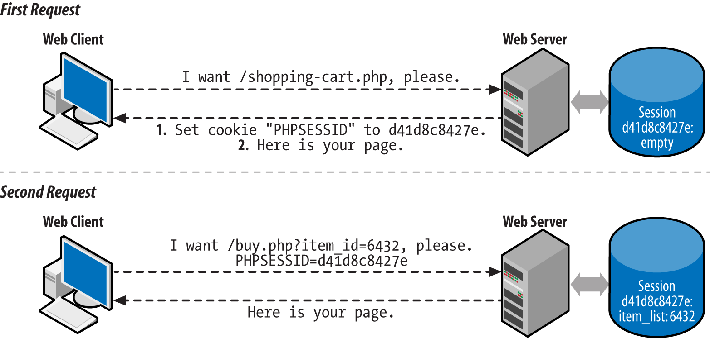

# Programación Web

??? abstract "Duración y criterios de evaluación"

    Duración estimada: 12 sesiones

    <hr />

    | Resultado de aprendizaje  | Criterios de evaluación   |
    | ------                    | -----                     |
    | 4. Desarrolla aplicaciones Web embebidas en lenguajes de marcas analizando e incorporando funcionalidades según especificaciones.     |  a) Se han identificado los mecanismos disponibles para el mantenimiento de la información que concierne a un cliente web concreto y se han señalado sus ventajas.<br /> b) Se han utilizado sesiones para mantener el estado de las aplicaciones Web. <br /> c) Se han utilizado *cookies* para almacenar información en el cliente Web y para recuperar su contenido. <br /> d) Se han identificado y caracterizado los mecanismos disponibles para la autentificación de usuarios. <br /> e) Se han escrito aplicaciones que integren mecanismos de autentificación de usuarios. <br /> f) Se han realizado adaptaciones a aplicaciones Web existentes como gestores de contenidos u otras. <br /> g) Se han utilizado herramientas y entornos para facilitar la programación, prueba y depuración del código. |

## Variables de servidor

PHP almacena la información del servidor y de las peticiones HTTP en seis arrays globales:

* `$_ENV`: información sobre las variables de entorno
* `$_GET`: parámetros enviados en la petición GET
* `$_POST`: parámetros enviados en el envio POST
* `$_COOKIE`: contiene las cookies de la petición, las claves del array son los nombres de las *cookies*
* `$_SERVER`: información sobre el servidor
* `$_FILES`: información sobre los ficheros cargados via upload

Si nos centramos en el array `$_SERVER` podemos consultar las siguientes propiedades:

* `PHP_SELF`: nombre del script ejecutado, relativo al document root (p.ej: `/tienda/carrito.php`)
* `SERVER_SOFTWARE`: (p.ej: Apache)
* `SERVER_NAME`: dominio, alias DNS (p.ej: `www.elche.es`)
* `REQUEST_METHOD`: GET
* `REQUEST_URI`: URI, sin el dominio
* `QUERY_STRING`: todo lo que va después de `?` en la URL (p.ej: `heroe=Batman&nombre=Bruce`)

Más información en <https://www.php.net/manual/es/reserved.variables.server.php>

``` php
<?php
echo $_SERVER["PHP_SELF"]."<br>"; // /u4/401server.php
echo $_SERVER["SERVER_SOFTWARE"]."<br>"; // Apache/2.4.46 (Win64) OpenSSL/1.1.1g PHP/7.4.9
echo $_SERVER["SERVER_NAME"]."<br>"; // localhost

echo $_SERVER["REQUEST_METHOD"]."<br>"; // GET
echo $_SERVER["REQUEST_URI"]."<br>"; // /u4/401server.php?heroe=Batman
echo $_SERVER["QUERY_STRING"]."<br>"; // heroe=Batman
```

Otras propiedades relacionadas:

* `PATH_INFO`: ruta extra tras la petición. Si la URL es `http://www.php.com/php/pathInfo.php/algo/cosa?foo=bar`, entonces `$_SERVER['PATH_INFO']` será `/algo/cosa`.
* `REMOTE_HOST`: hostname que hizo la petición
* `REMOTE_ADDR`: IP del cliente
* `AUTH_TYPE`: tipo de autenticación (p.ej: Basic)
* `REMOTE_USER`: nombre del usuario autenticado

Apache crea una clave para cada cabecera HTTP, en mayúsculas y sustituyendo los guiones por subrayados:

* `HTTP_USER_AGENT`: agente (navegador)
* `HTTP_REFERER`: página desde la que se hizo la petición

``` php
<?php
echo $_SERVER["HTTP_USER_AGENT"]."<br>"; // Mozilla/5.0 (Windows NT 10.0; Win64; x64) AppleWebKit/537.36 (KHTML, like Gecko) Chrome/87.0.4280.88 Safari/537.36
```

## Formularios

A la hora de enviar un formulario, debemos tener claro cuando usar GET o POST

* GET: los parámetros se pasan en la URL
    * <2048 caracteres, sólo ASCII
    * Permite almacenar la dirección completa (marcador  / historial)
    * Idempotente: dos llamadas con los mismos datos siempre debe dar el mismo resultado
    * El navegador puede cachear las llamadas

* POST: parámetros ocultos (no encriptados)
    * Sin límite de datos, permite datos binarios.
    * No se pueden cachear
    * No idempotente → actualizar la BBDD

Así pues, para recoger los datos accederemos al array dependiendo del método del formulario que nos ha invocado:

``` php
<?php
$par = $_GET["parametro"]
$par = $_POST["parametro"]
```

Para los siguientes apartados nos vamos a basar en el siguiente ejemplo:

``` html
<form action="formulario.php" method="GET">
    <p><label for="nombre">Nombre del alumno:</label>
        <input type="text" name="nombre" id="nombre" value="" />
    </p>

    <p><input type="checkbox" name="modulos[]" id="modulosDWES" value="DWES" />
        <label for="modulosDWES">Desarrollo web en entorno servidor</label>
    </p>

    <p><input type="checkbox" name="modulos[]" id="modulosDWEC" value="DWEC" />
        <label for="modulosDWEC">Desarrollo web en entorno cliente</label>
    </p>

    <input type="submit" value="Enviar" name="enviar" />
</form>
```

### Validación

Respecto a la validación, es conveniente siempre hacer **validación doble**:

* En el cliente mediante JS
* En servidor, antes de llamar a negocio, es conveniente volver a validar los datos.

``` php
<?php
if (isset($_GET["parametro"])) {
    $par = $_GET["parametro"];
    // comprobar si $par tiene el formato adecuado, su valor, etc...
}
```

!!! info "Librerías de validación"
    Existen diversas librerías que facilitan la validación de los formularios, como son [respect/validation](https://respect-validation.readthedocs.io/en/latest/) o [particle/validator](http://validator.particle-php.com/en/latest/).
    Cuando estudiemos Laravel profundizaremos en la validación de forma declarativa.

### Parámetro multivalor

Existen elementos HTML que envían varios valores:

* `select multiple`
* `checkbox`

Para recoger los datos, el nombre del elemento debe ser un array.

``` html
<select name="lenguajes[]" multiple="true">
    <option value="c">C</option>
    <option value="java">Java</option>
    <option value="php">PHP</option>
    <option value="python">Python</option>
</select>

<input type="checkbox" name="lenguajes[]" value="c" /> C<br />
<input type="checkbox" name="lenguajes[]" value="java" /> Java<br />
<input type="checkbox" name="lenguajes[]" value="php" /> Php<br />
<input type="checkbox" name="lenguajes[]" value="python" /> Python<br />
```

De manera que luego al recoger los datos:

``` php
<?php
$lenguajes = $_GET["lenguajes"];

foreach ($lenguajes as $lenguaje) {
    echo "$lenguaje <br />";
}
```

### Volviendo a rellenar un formulario

Un *sticky form* es un formulario que recuerda sus valores. Para ello, hemos de rellenar los atributos `value` de los elementos HTML con la información que contenían:

``` html+php
<?php
if (!empty($_POST['modulos']) && !empty($_POST['nombre'])) {
  // Aquí se incluye el código a ejecutar cuando los datos son correctos
} else {
  // Generamos el formulario
  $nombre = $_POST['nombre'] ?? "";
  $modulos = $_POST['modulos'] ?? [];
  ?>
  <form action="<?php echo $_SERVER['PHP_SELF'];?>" method="POST">
   <p><label for="nombre">Nombre del alumno:</label>
    <input type="text" name="nombre" id="nombre" value="<?= $nombre ?>" /> 
   </p>
   <p><input type="checkbox" name="modulos[]" id="modulosDWES" value="DWES"
    <?php if(in_array("DWES",$modulos)) echo 'checked="checked"'; ?> />
    <label for="modulosDWES">Desarrollo web en entorno servidor</label>
   </p>
   <p><input type="checkbox" name="modulos[]" id="modulosDWEC" value="DWEC"
    <?php if(in_array("DWEC",$modulos)) echo 'checked="checked"'; ?> />
    <label for="modulosDWEC">Desarrollo web en entorno cliente</label>
   </p>
   <input type="submit" value="Enviar" name="enviar"/>
  </form>
<?php } ?>
```

### Subiendo archivos

Se almacenan en el servidor en el array `$_FILES` con el nombre del campo del tipo `file` del formulario.

``` html
<form enctype="multipart/form-data" action="<?php echo $_SERVER['PHP_SELF']; ?>"  method="POST">
    Archivo: <input name="archivoEnviado" type="file" />
    <br />
    <input type="submit" name="btnSubir" value="Subir" />
</form>
```

Configuración en `php.ini`

* `file_uploads`: on / off
* `upload_max_filesize`: 2M
* `upload_tmp_dir`: directorio temporal. No es necesario configurarlo, cogerá el predeterminado del sistema
* `post_max_size`: tamaño máximo de los datos POST. Debe ser mayor a upload_max_filesize.
* `max_file_uploads`: número máximo de archivos que se pueden cargar a la vez.
* `max_input_time`: tiempo máximo empleado en la carga (GET/POST y upload → normalmente se configura en 60)
* `memory_limit`: 128M
* `max_execution_time`: tiempo de ejecución de un script (no tiene en cuenta el upload)

Para cargar los archivos, accedemos al array `$_FILES`:

``` php
<?php
if (isset($_POST['btnSubir']) && $_POST['btnSubir'] == 'Subir') {
    if (is_uploaded_file($_FILES['archivoEnviado']['tmp_name'])) {
        // subido con éxito
        $nombre = $_FILES['archivoEnviado']['name'];
        move_uploaded_file($_FILES['archivoEnviado']['tmp_name'], "./uploads/{$nombre}");

        echo "<p>Archivo $nombre subido con éxito</p>";
    }
}
```

Cada archivo cargado en `$_FILES` tiene:

* `name`: nombre
* `tmp_name`: ruta temporal
* `size`: tamaño en bytes
* `type`: tipo MIME
* `error`: si hay error, contiene un mensaje. Si ok → 0.

## Cabeceras de respuesta

Debe ser lo primero a devolver. Se devuelven mediante la función `header(cadena)`. Mediante las cabeceras podemos configurar el tipo de contenido, tiempo de expiración, redireccionar el navegador, especificar errores HTTP, etc.

``` php
<?php header("Content-Type: text/plain"); ?>
<?php header("Location: http://www.ejemplo.com/inicio.html");
exit(); 
```

Se puede comprobar en las herramientas del desarrollador de los navegadores web mediante *Developer Tools --> Network --> Headers*.

Es muy común configurar las cabeceras para evitar consultas a la caché o provocar su renovación:

``` php
<?php
header("Expires: Sun, 31 Jan 2021 23:59:59 GMT");
// tres horas
$now = time();
$horas3 = gmstrftime("%a, %d %b %Y %H:%M:%S GMT", $now + 60 * 60 * 3);
header("Expires: {$horas3}");
// un año
$now = time();
$anyo1 = gmstrftime("%a, %d %b %Y %H:%M:%S GMT", $now + 365 * 86440);
header("Expires: {$anyo1}");
// se marca como expirado (fecha en el pasado)
$pasado = gmstrftime("%a, %d %b %Y %H:%M:%S GMT");
header("Expires: {$pasado}");
// evitamos cache de navegador y/o proxy
header("Expires: Mon, 26 Jul 1997 05:00:00 GMT");
header("Last-Modified: " . gmdate("D, d M Y H:i:s") . " GMT");
header("Cache-Control: no-store, no-cache, must-revalidate");
header("Cache-Control: post-check=0, pre-check=0", false);
header("Pragma: no-cache");
```

## Gestión del estado

HTTP es un protocolo *stateless*, sin estado. Por ello, se simula el estado mediante el uso de cookies, tokens o la sesión. El estado es necesario para procesos tales como el carrito de la compra, operaciones asociadas a un usuario, etc...
El mecanismo de PHP para gestionar la sesión emplea cookies de forma interna.
Las cookies se almacenan en el navegador, y la sesión en el servidor web.

### Cookies

Las cookies se almacenan en el array global `$_COOKIE`. Lo que coloquemos dentro del array, se guardará en el cliente. Hay que tener presente que el cliente puede no querer almacenarlas. 

Existe una limitació de 20 cookies por dominio y 300 en total en el navegador.

En PHP, para crear una cookie se utiliza la función `setcookie`:

``` php
<?php
setcookie(nombre [, valor [, expira [, ruta [, dominio [, seguro [, httponly ]]]]]]);
setcookie(nombre [, valor = "" [, opciones = [] ]] )
?>
```

Destacar que el nombre no puede contener espacios ni el caracter `;`. Respecto al contenido de la cookie, no puede superar los 4 KB.


Por ejemplo, mediante *cookies* podemos comprobar la cantidad de visitas diferentes que realiza un usuario:

``` php
<?php
$accesosPagina = 0;
if (isset($_COOKIE['accesos'])) { 
    $accesosPagina = $_COOKIE['accesos']; // recuperamos una cookie
    setcookie('accesos', ++$accesosPagina); // le asignamos un valor
}
?>
```

!!! tip "Inspeccionando las cookies"
    Si queremos ver que contienen las cookies que tenemos almacenadas en el navegador, se puede comprobar su valor en *Dev Tools --> Application --> Storage*

El tiempo de vida de las cookies puede ser tan largo como el sitio web en el que residen. Ellas seguirán ahí, incluso si el navegador está cerrado o abierto.

Para borrar una cookie se puede poner que expiren en el pasado:

``` php
<?php
setcookie(nombre, "", 1) // pasado
```

O que caduquen dentro de un periodo de tiempo deteminado:

``` php
<?php
setcookie(nombre, valor, time() + 3600) // Caducan dentro de una hora
```

<figure style="align: center;">
    
    <figcaption>Comunicación con cookies</figcaption>
</figure>

Se utilizan para:

* Recordar los inicios de sesión
* Almacenar valores temporales de usuario
* Si un usuario está navegando por una lista paginada de artículos, ordenados de cierta manera, podemos almacenar el ajuste de la clasificación.

La alternativa en el cliente para almacenar información en el navegador es el objeto [LocalStorage](https://developer.mozilla.org/es/docs/Web/API/Window/localStorage).

### Sesión

La sesión añade la gestión del estado a HTTP, almacenando en este caso la información en el servidor.
Cada visitante tiene un ID de sesión único, el cual por defecto se almacena en una cookie denominada `PHPSESSID`.
Si el cliente no tiene las cookies activas, el ID se propaga en cada URL dentro del mismo dominio.
Cada sesión tiene asociado un almacén de datos mediante el array global `$_SESSION`, en el cual podemos almacenar y recuperar información.

La sesión comienza al ejecutar un script PHP. Se genera un nuevo ID y se cargan los datos del almacén:

<figure style="align: center;">
    
    <figcaption>Comunicación con sesión</figcaption>
</figure>

Las operaciones que podemos realizar con la sesión son:

``` php
<?php
session_start(); // carga la sesión
session_id() // devuelve el id
$_SESSION[clave] = valor; // inserción
session_destroy(); // destruye la sesión
unset($_SESSION[clave]; // borrado
```

Vamos a ver mediante un ejemplo como podemos insertar en un página datos en la sesión para posteriormente en otra página acceder a esos datos. Por ejemplo, en `sesion1.php` tendríamos

``` php
<?php
session_start(); // inicializamos
$_SESSION["ies"] = "IES Severo Ochoa"; // asignación
$instituto = $_SESSION["ies"]; // recuperación
echo "Estamos en el $instituto ";
?>
<br />
<a href="sesion2.php">Y luego</a>
```

Y posteriormente podemos acceder a la sesión en `sesion2.php`:

``` php
<?php
session_start();
$instituto = $_SESSION["ies"]; // recuperación
echo "Otra vez, en el $instituto ";
?>
```

!!! note "Configurando la sesión en `php.ini`"
    Las siguiente propiedades de `php.ini` permiten configurar algunos aspectos de la sesión:

    * `session.save_handler`: controlador que gestiona cómo se almacena (`files`)
    * `session.save_path`: ruta donde se almacenan los archivos con los datos (si tenemos un cluster, podríamos usar `/mnt/sessions` en todos los servidor de manera que apuntan a una carpeta compartida)
    * `session.name`: nombre de la sesión (`PHSESSID`)
    * `session.auto_start`: Se puede hacer que se autocargue con cada script. Por defecto está deshabilitado
    * `session.cookie_lifetime`: tiempo de vida por defecto

    Más información en la [documentación oficial](https://www.php.net/manual/es/session.configuration.php).

## Autentificación de usuarios

Una sesión establece una relación anónima con un usuario particular, de manera que podemos saber si es el mismo usuario entre dos peticiones distintas. Si preparamos un sistema de login, podremos saber quien utiliza nuestra aplicación.

Para ello, preparemos un sencillo sistema de autenticación:

* Mostrar el formulario login/password
* Comprobar los datos enviados
* Añadir el login a la sesión
* Comprobar el login en la sesión para realizar tareas específicas del usuario
* Eliminar el login de la sesión cuando el usuario la cierra.

Vamos a ver en código cada paso del proceso. Comenzamos con el archivo `index.php`:

``` html
<form action='login.php' method='post'>
  <fieldset>
    <legend>Login</legend>
    <div><span class='error'><?php echo $error; ?></span></div>
    <div class='fila'>
        <label for='usuario'>Usuario:</label><br />
        <input type='text' name='inputUsuario' id='usuario' maxlength="50" /><br />
    </div>
    <div class='fila'>
        <label for='password'>Contraseña:</label><br />
        <input type='password' name='inputPassword' id='password' maxlength="50" /><br />
    </div>
    <div class='fila'>
        <input type='submit' name='enviar' value='Enviar' />
    </div>
  </fieldset>
  </form>
```

Al hacer *submit* nos lleva a `login.php`, el cual hace de controlador:

``` php
<?php
// Comprobamos si ya se ha enviado el formulario
if (isset($_POST['enviar'])) {
    $usuario = $_POST['inputUsuario'];
    $password = $_POST['inputPassword'];

    // validamos que recibimos ambos parámetros
    if (empty($usuario) || empty($password)) {
        $error = "Debes introducir un usuario y contraseña";
        include "index.php";
    } else {
        if ($usuario == "admin" && $password == "admin") {
            // almacenamos el usuario en la sesión
            session_start();
            $_SESSION['usuario'] = $usuario;
            // cargamos la página principal
            include "main.php";
        } else {
            // Si las credenciales no son válidas, se vuelven a pedir
            $error = "Usuario o contraseña no válidos!";
            include "index.php";
        }
    }
}
```

Dependiendo del usuario que se haya logueado, vamos a ir a una vista o a otra. Por ejemplo, en `main.php` tendríamos:

``` html+php
<?php
    // Recuperamos la información de la sesión
    if(!isset($_SESSION)) {
        session_start();
    }
    
    // Y comprobamos que el usuario se haya autentificado
    if (!isset($_SESSION['usuario'])) {
       die("Error - debe <a href='index.php'>identificarse</a>.<br />");
    }
?>
<!DOCTYPE html>
<html lang="es">
<head>
    <meta charset="UTF-8">
    <meta name="viewport" content="width=device-width, initial-scale=1.0">
    <title>Listado de productos</title>
</head>
<body>
    <h1>Bienvenido <?= $_SESSION['usuario'] ?></h1>
    <p>Pulse <a href="logout.php">aquí</a> para salir</p>
    <p>Volver al <a href="main.php">inicio</a></p>
    <h2>Listado de productos</h2>
    <ul>
        <li>Producto 1</li>
        <li>Producto 2</li>
        <li>Producto 3</li>
    </ul>
</body>
</html>
```

Finalmente, necesitamos la opción de cerrar la sesión que colocamos en `logout.php`:

``` php
<?php
// Recuperamos la información de la sesión
session_start();

// Y la destruimos
session_destroy();
header("Location: index.php");
?>
```

!!! warning "Autenticación en producción"
    En la actualidad la autenticación de usuario no se realiza gestionando la sesión direcamente, sino que se realiza mediante algún framekwork que abstrae todo el proceso o la integración de mecanismos de autenticación tipo *OAuth*, como  estudiaremos en la última unidad mediante *Laravel*.

## Referencias

* [Cookies en PHP](https://www.php.net/manual/es/features.cookies.php)
* [Manejo de sesiones en PHP](https://www.php.net/manual/es/book.session.php)

## Actividades

401. `401server.php`: igual que el ejemplo visto en los apuntes, muestra los valores de `$_SERVER` al ejecutar un script en tu ordenador.  
Prueba a pasarle parámetros por GET (y a no pasarle ninguno).  
Prepara un formulario (`401post.html`) que haga un envío por POST y compruébalo de nuevo.  
Crea una página (`401enlace.html`) que tenga un enlace a `401server.php` y comprueba el valor de `HTTP_REFERER`.

### Formularios

402. `402formulario.html` y `402formulario.php`: Crea un formulario que solicite:

    * Nombre y apellidos.
    * Email.
    * URL página personal.
    * Sexo (radio).
    * Número de convivientes en el domicilio.
    * Aficiones (checkboxes) – poner mínimo 4 valores.
    * Menú favorito (lista selección múltiple) – poner mínimo 4 valores.
     
    Muestra los valores cargados en una tabla-resumen.

403. `403validacion.php`: A partir del formulario anterior, introduce validaciones en HTML mediante el atributo `required` de los campos (uso los tipos adecuados para cada campo), y en comprueba los tipos de los datos y que cumplen los valores esperados (por ejemplo, en los checkboxes que los valores recogidos forman parte de todos los posibles). Puedes probar a pasarle datos erroneos via URL y comprobar su comportamiento.  
Tip: Investiga el uso de la función `filter_var`.

404. `404subida.html` y `404subida.php`: Crea un formulario que permita subir un archivo al servidor.
Además del fichero, debe pedir en el mismo formulario dos campos numéricos que soliciten la anchura y la altura. Comprueba que tanto el fichero como los datos llegan correctamente.

405. `405subidaImagen.php`: Modifica el ejercicio anterior para que únicamente permita subir imágenes (comprueba la propiedad `type` del archivo subido). Si el usuario selecciona otro tipo de archivos, se le debe informar del error y permitir que suba un nuevo archivo.  
En el caso de subir el tipo correcto, visualizar la imagen con el tamaño de anchura y altura recibido como parámetro.

### Cookies y Sesión

406. `406contadorVisitas.php`: Mediante el uso de cookies, informa al usuario de si es su primera visita, o si no lo es, muestre su valor (valor de un contador).
Además, debes permitir que el usuario reinicialice su contador de visitas.

407. `407fondo.php`: Mediante el uso de cookies, crea una página con un desplegable con varios colores, de manera que el usuario pueda cambiar el color de fondo de la página (atributo `bgcolor`).
Al cerrar la página, ésta debe recordar, al menos durante 24h, el color elegido y la próxima vez que se cargue la pagina, lo haga con el último color seleccionado.

408. `408fondoSesion1.php`: Modifica el ejercicio anterior para almacenar el color de fondo en la sesión y no emplear cookies. Además, debe contener un enlace al siguiente archivo.
    `408fondoSesion2.php`: Debe mostrar el color y dar la posibilidad de:
    * volver a la página anterior mediante un enlace
    * y mediante otro enlace, vaciar la sesión y volver a la página anterior.

409. Haciendo uso de la sesión, vamos a dividir el formulario del ejercicio `402formulario.php` en 2 subformularios:

    * `409formulario1.php` envía los datos (nombre y apellidos, email, url y sexo) a `409formulario2.php`.
    * `409formulario2.php` lee los datos y los mete en la sesión. A continuación, muestra el resto de campos del formulario a rellenar (convivientes, aficiones y menú). Envía estos datos a `409formulario3.php`.
    * `409formulario3.php` recoge los datos enviados en el paso anterior y junto a los que ya estaban en la sesión, se muestran todos los datos en una tabla/lista desordenada.

### Autenticación

En los siguientes ejercicios vamos a montar una estructura de inicio de sesión similar a la vista en los apuntes.

410. `410index.php`: formulario de inicio de sesión
411. `411login.php`: hace de controlador, por lo que debe comprobar los datos recibidos (solo permite la entrada de `usuario/usuario` y si todo es correcto, ceder el control a la vista del siguiente ejercicio. No contiene código HTML.
412. `412peliculas.php`: vista que muestra como título "Listado de Películas", y una lista desordenada con tres películas.
413. `413logout.php`: vacía la sesión y nos lleva de nuevo al formulario de inicio de sesión. No contiene código HTML
414. `414series.php`: Añade un nueva vista similar a `412peliculas.php` que muestra un "Listado de Series" con una lista desordenada con tres series. Tanto `412pelicuas.php` como la vista recien creadas, deben tener un pequeño menú (sencillo, mediante enlaces) que permita pasar de un listado a otro.
Comprueba que si se accede directamente a cualquiera de las vistas sin tener un usuario *logueado* via URL del navegador, no se muestra el listado.
415. Modifica tanto el controlador como las vistas para que:
    * los datos los obtenga el controlador (almacena en la sesión un array de películas y otro de series)
    * coloque los datos en la sesión
    * En las vistas, los datos se recuperan de la sesión y se *pintan* en la lista desordenada recorriendo el array correspondiente.

### Proyecto Videoclub 3.0

420. Para el Videoclub, vamos a crear una página `index.php` con un formulario que contenga un formulario de login/password.
Se comprobarán los datos en `login.php`. Los posibles usuarios son admin/admin o usuario/usuario
    * Si el usuario es correcto, en `main.php` mostrar un mensaje de bienvenida con el nombre del usuario, junto a un enlace para cerrar la sesión, que lo llevaría de nuevo al login.
    * Si el usuario es incorrecto, debe volver a cargar el formulario dando información al usuario de acceso incorrecto.

421. Si el usuario es administrador, se cargarán en la sesión los datos de soportes y clientes del videoclub que teníamos en nuestras pruebas (no mediante `include` sino copiando los datos e insertándolos en un array asociativo, el cual colocaremos posteriormente en la sesión).

    En la siguiente unidad los obtendremos de la base de datos.
    En `mainAdmin.php`, además de la bienvenida, debe mostrar:
        * Listado de clientes
        * Listado de soportes

    <figure style="float: right;">
        
        <figcaption>Esquema navegación ejercicio 423</figcaption>
    </figure>

422. Vamos a modificar la clase `Cliente` para almacenar el `user` y la `password` de cada cliente.
Tras codificar los cambios, modificar el listado de clientes de `mainAdmin.php` para añadir al listado el usuario.

423. Si el usuario que accede no es administrador y coincide con alguno de los clientes que tenemos cargados tras el login, debe cargar `mainCliente.php` donde se mostrará un listado de los alquileres del cliente. Para ello, modificaremos la clase `Cliente` para ofrecer el método `getAlquileres() : array`, el cual llamaremos y luego recorreremos para mostrar el listado solicitado.

Ahora volvemos a la parte de administración

424. Además de mostrar el listado de clientes, vamos a ofrecer la opción de dar de alta a un nuevo cliente en `formCreateCliente.php`.
Los datos se enviarán mediante POST a `createCliente.php` que los introducirá en la sesión.
Una vez creado el cliente, debe volver a cargar `mainAdmin.php` donde se podrá ver el cliente insertado.
Si hay algún dato incorrecto, debe volver a cargar el formulario de alta.

425. Crea en `formUpdateCliente.php` un formulario que permita editar los datos de un cliente.
Debes recoger los datos en `updateCliente.php`
Los datos de cliente se deben poder modificar desde la propia página de un cliente, así como desde el listado del administrador.

426. Desde el listado de clientes del administrador debes ofrecer la posibilidad de borrar un cliente.
En el navegador, antes de redirigir al servidor, el usuario debe confirmar mediante JS que realmente desea eliminar al cliente.
Finalmente, en `removeCliente.php` elimina al cliente de la sesión.
Una vez eliminado, debe volver al listado de clientes.

<figure style="align: center;">
    
    <figcaption>Esquema navegación Videoclub 3.0</figcaption>
</figure>
