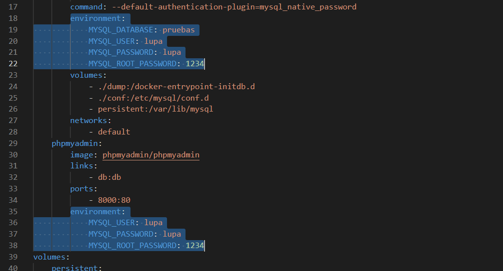

[arquitectura-3-niveles]: imagenes/06/06-bbdd-arquitectura-3-niveles.png "Arquitectura de 3 niveles"
[phpMyAdmin-logo]: imagenes/06/06-bbdd-phpMyAdmin-logo.png "phpMyAdmin"
[bbdd-estructura]: imagenes/06/06-bbdd-estructura.png "Estructura de una base de datos"

<!-- ////////////////////////////////////////////////////////////////////// -->

<style>
    img { margin: 20px 0; border-radius: 8px; }

    .alert { color: #BD1550; }
    .warning { color: #E97F02; }
    .success { color: #8A9B0F; }

    .center { text-align: center; }
    .right { text-align: right; }

    .img-small { max-width: 200px; margin: auto; }
    .img-medium { max-width: 400px; margin: auto; }
    .img-large { max-width: 800px; margin: auto; }

    .leyenda {
        font-size: small;
        margin: 10px 0;
    }
</style>

# Acceso a datos
<!-- 
> Duración estimada: 26 sesiones
 -->
En esta unidad vamos a aprender a acceder a datos que se encuentran en un servidor; recuperando, editando y creando dichos datos a través de una base de datos.

A través de las distintas capas o niveles, de las cuales 2 de ellas ya conocemos (*Apache*, *PHP*) y *MySQL*la que vamos a estudiar en este tema.

![arquitectura-3-niveles]

## Instalación
A través de ***XAMPP*** es muy sencillo, simplemente nos descargaríamos el programa y lo activaríamos. Para descargar XAMPP [pulsa aquí](https://www.apachefriends.org/es/download.html).

Con ***Docker*** es algo distinto, primero de todo necesitamos descargar una imagen ya preparada con todos los paquetes necesario, es decir; MySQL, PHP, Apache y PHPMyAdmin. Para ello nos descargaremos [esta imagen de docker](https://github.com/jersonmartinez/docker-lamp/archive/refs/heads/main.zip).

### Configuración del docker

Una vez [descargada la imagen de docker](https://github.com/jersonmartinez/docker-lamp/archive/refs/heads/main.zip) tenemos que configurar el archivo ***docker-compose.yml*** para que exista un usuario y la contraseña de root.


<div class="center img-large">
    
</div>

- MYSQL_DATABASE: pruebas
- MYSQL_USER: vuestroUsuario
- MYSQL_PASSWORD: unaContraseña
- MYSQL_ROOT_PASSWORD: unaContraseñaDeRoot <br>
[...]
- MYSQL_USER: vuestroUsuario
- MYSQL_PASSWORD: unaContraseña
- MYSQL_ROOT_PASSWORD: unaContraseñaDeRoot

Ahora que ya tenemos el archivo de configuración modificado, podemos ejecutar el comando para instalar el contenedor a través de la consola <span class="alert">en el directorio donde se encuentra nuestro ***docker-compose.yml***</span>

``` bash
docker-compose up -d
```

En la configuración que hemos modificado, el puerto para acceder al phpMyAdmin es el 800 así que:

- Arrancamos la imagen de docker
- Nos metemos al phpMyAdmin

```
http://localhost:8000
```

<div class="center img-medium">
    
</div>

Recuerda que hemos configurado el contenedor con un usuario normal y hemos cambiado la contraseña de root, en este caso nos meteremos con las siguientes credenciales.

```
usuario: root
contraseña: 1234
```

## Estructura de una base de datos

Sabemos que una base de datos tiene muchos campos con sus nombres y valores, pero además sabemos que la base de datos debe tener un nombre. por tanto tendríamos la siguiente estructura para una base de datos:

    NombreBaseDeDatos
        |__Tabla-#1
        |       |__DatosTabla-#1
        |
        |__Tabla-#2
        |       |__DatosTabla-#2
        |
        |__Tabla-#3
        |       |__DatosTabla-#3
        [...]


Veámoslo en un ejemplo real

    Ryanair
        |__pasajero
        |    |__id[*]
        |    |__nombre
        |    |__apellidos
        |    |__edad
        |    |__id_vuelo[^]
        |
        |__vuelo
        |    |__id[*]
        |    |__n_plazas
        |    |__disponible
        |    |__id_pais[^]
        |
        |__pais
             |__id[*]
             |__nombre

<div class="leyenda">
    [*] Clave primaria [^] Clave Foránea
</div>

![bbdd-estructura]

## SQL

Este lenguaje de consulta estructurada (*Structured Query Language*) es el que vamos a utilizar para realizar las consultas a nuestras bases de datos para mostrar el contenido en las distintas interfaces web que creemos a lo largo de la unidad. Si quieres saber más detalles visita [Wiki SQL](https://es.wikipedia.org/wiki/SQL)

Ejemplo de una sentencia SQL donde seleccionamos todas las filas y columnas de nuestra tabla llamada **'pais'**

``` sql
SELECT * FROM pais
```

Estas sentencias pueden invocarse desde la consola de comandos mediante el intérprete *mysql* (previamente instalado en el sistema) o a través de la herramienta phpMyAdmin.

Las sentencias SQL también las podemos usar dentro de nuestro código php, de tal manera que cuando se cargue nuestra interfaz web, lance una sentecia SQL para mostrar los datos que queramos.

``` php
<?php
    // Listado de clientes, ordenados por DNI de manera ASCendente
    $clientesOrdenadosPorDNI = "SELECT * FROM `pasajero` ORDER BY `dni`" ASC;
?>
```

## phpMyAdmin

<div class="center img-medium">
    
</div>

Este software funciona bajo Apache y PHP y es más que nada una interfaz web para gestionar las bases de datos que tengamos disponibles en nuestro servidor local. Muchos *hostings* ofrecen esta herramienta por defecto para poder gestionar las BBDD que tengamos configuradas bajo nuestra cuenta.

### Creando una base de datos dentro de phpMyAdmin

<div class="center img-large">
    
</div>

1.  Para crear una nueva base de datos debemos entrar en phpMyAdmin como **usuario root** y pinchar en la opción <span class="warning">***Nueva***</span> del menú de la izquierda.

2.  En la nueva ventana de creación pondremos un **nombre** a nuestra bbdd.

3.  También estableceremos el **cotejamiento** <span class="warning">***utf8m4_unicode_ci***</span> para que nuestra bbdd soporte todo tipo de caracteres (como los asiáticos) e incluso emojis ;)

4.  Le damos al botón de **Crear** para crear la bbdd y empezar a escribir las distintas tablas que vayamos a introducir en ella.

El sistema generará el código SQL para crear todo lo que le hemos puesto y creará la base de datos con las tablas que le hayamos metido.

``` sql
CREATE TABLE `persona`. ( `id` INT NOT NULL AUTO_INCREMENT , `nombre` TINYTEXT NOT NULL , `apellidos` TEXT NOT NULL , `telefono` TINYTEXT NOT NULL , PRIMARY KEY (`id`)) ENGINE = InnoDB;
```

### Opciones en phpMyAdmin

Cuando seleccionamos una base de datos de la lista, el sistema nos muestra varias pestañas con las cuales interactuar con la base de datos en cuestión:

- `Estructura`: Podemos ver las distintas tablas que consolidan nuestra base de datos

- `SQL`: Por si queremos inyectar código SQL para que el sistema lo interprete

- `Buscar`: Sirve para buscar por términos, en nuestra base de datos, aplicando distintos filtros de búsqueda

- `Generar consulta`: parecido a SQL pero de una manera más gráfica, sin tener que saber nada del lenguaje

- `Exportar e importar`: Como su nombre indica, para hacer cualquiera de las 2 operaciones sobre la base de datos

- `Operaciones`: Distintas opciones avanzadas para realizar en nuestra base de datos, de la cual destacaremos la opción ***Cotejamiento*** dondte podremos cambiar el cotejamiento de nuestra tabla pero <span class="alert">***OJO CON ÉSTO*** porque podemos eliminar datos sin querer, ya que al cambiar el cotejamiento podemos suprimir caracteres no soportados por el nuevo cotejamiento</span>

No vamos a profundizar en el resto de opciones pero, en la pestaña **Màs** existe la opción ***Diseñador*** para poder editar las relaciones entre tablas de una manera gráfica (pinchando y arrastrando) que veremos más adelante.

## MySQLi

PHP hace uso de esta extensión mejorada para poder comunicarse con las bases de datos, ya sean MySQL (4.1 o superior) o MariaDB.

Cualquier consulta que queramos hacer a una base de datos necesitaremos hacer uso de la extensión mysqli()

Veamos como conectarnos con una base de datos a través del código PHP

``` php
<?php
    // ▒▒▒▒▒▒▒▒ pruebas.php ▒▒▒▒▒▒▒▒

    // "SERVIDOR", "USUARIO", "CONTRASEÑA", "BASE DE DATOS"
    $conexion = mysqli_connect("d939ebf6a741","tuUsuario","1234","pruebas");

    // COMPROBAMOS LA CONEXIÓN
    if(mysqli_connect_errno()) {
        echo "Failed to connect to MySQL: " . mysqli_connect_error();
        exit();
    }

    echo "<h1>Bienvenid@ a MySQL !!</h1>";
?>
```

- `servidor`: El servidor donde se encuentra la base de datos que queremos usar suele ser **localhost**, pero en nuestro caso, al utilizar Docker será el nombre de la imagen <span class="warning">***mysql:8.0***</span> que aparece al dejar el ratón encima en el Visual Studio Code

<div class="center img-large">
    
</div>

- `usuarioDB`: El usuario de la base de datos
- `passwordDB`: La contraseña para ese usuario de la base de datos
- `baseDeDatos`: Nombre de la base de datos que queramos usar

Si todo ha salido bien habréis visto un mensaje diciendo <span class="success">***Bienvenid@ a MySQL !!***</span>

### Recuperando datos de una BD

Ahora que ya sabemos cómo conectarnos a una base de datos alojada en nuestro servidor, lo que necesitamos saber es cómo recuperar datos almacenados en la base de datos.

Durante la instalación de la imagen de Docker, se ha creado una tabla llamada **Pruebas** que contiene varios registros de distintas personas.

Vamos a recuperar esos datos para ver de qué forma se hace con PHP.

``` php
<?php
    // ▒▒▒▒▒▒▒▒ pruebas.php ▒▒▒▒▒▒▒▒

    $conexion = mysqli_connect("d939ebf6a741", "lupa", "1234", "pruebas");

    // COMPROBAMOS LA CONEXIÓN
    if (mysqli_connect_errno()) {
        echo "Failed to connect to MySQL: " . mysqli_connect_error();
        exit();
    }

    // CONSULTA A LA BASE DE DATOS
    $consulta = "SELECT * FROM `Person`";
    $listaUsuarios = mysqli_query($conexion, $consulta);

    // COMPROBAMOS SI EL SERVIDOR NOS HA DEVUELTO RESULTADOS
    if($listaUsuarios) {

        // RECORREMOS CADA RESULTADO QUE NOS DEVUELVE EL SERVIDOR
        foreach ($listaUsuarios as $usuario) {
            echo "
                $usuario[id]
                $usuario[name]
                <br>
            ";
        }
    }
?>
```

Si todo ha salido bien, por pantalla verás el siguiente listado

    ▒▒▒▒▒▒▒▒ http://localhost/pruebas.php ▒▒▒▒▒▒▒▒

    1 William
    2 Marc
    3 John
    4 Antonio Moreno

## CholloSevero

Como muy bien habéis elegido, a lo largo de esta unidad vamos a trabajar con una base de datos que iremos confeccionando conforme avancemos, donde almacenaremos la información relacionada con ofertas que publiquen los usuarios y los listaremos en función de varios filtros; nuevos, más votados, más vistos, más comentados entre otros, al más puro estilo ***[Chollometro](https://www.chollometro.com)***.

<div class="center img-large">
    
</div>

## Actividades

601. Crea una nueva base de datos con el nombre `lol` y cotejamiento de datos `utf8mb4_unicode_ci`.

602. En nuestra base de datos `lol` que acabamos de crear, vamos a crear la tabla `campeon` con los siguientes campos.

- id [*]
- nombre
- rol
- dificultad
- descripcion

    Acuérdate que [*] significa que es clave primaria y no olvides poner el tipo de datos de cada uno de los campos.

603. Rellena la tabla `campeon` con, al menos 5 registros, con los datos que tú quieras o si lo prefieres, puedes basarte en la [página oficial del juego](https://www.leagueoflegends.com/es-es/champions) pero <span class="alert">**¡¡ NO TE PONGAS A JUGAR !!**</span>

605. Crea el archivo `604campeones.php` donde listes todos los campeones del LOL que has metido en tu base de datos. Acuérdate que para ello deberas hacer una conexión con la base de datos y un `foreach` para cada campeón que tengas albergado en la tabla `campeon`.

<!--

### La Severo Tienda

A lo largo de esta unidad vamos a trabajar con una base de datos existente, que almacena la información de un tienda:

Vamos a ver como crear la base de datos dependiendo de nuestra instalación,

### PDO

## Acceso a ficheros

### Archivos CSV

### Archivos PDF

## Eloquent

### Mapeo ORM

#### Modelo

``` console
php artisan make:model Pregunta
```
 -->