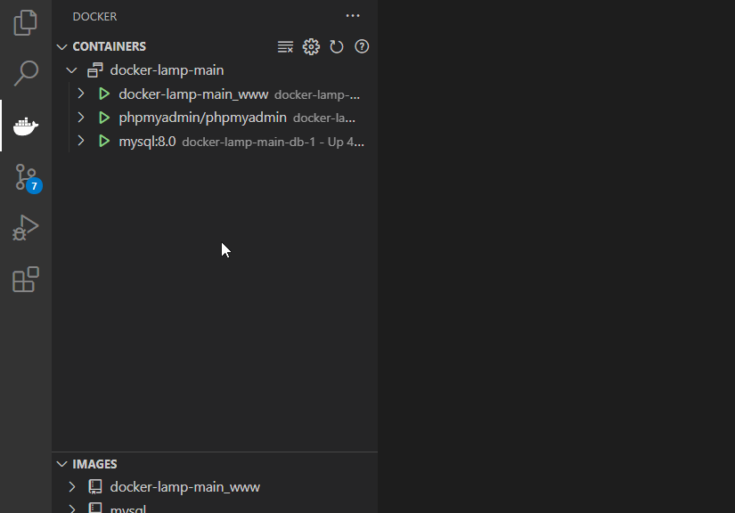

<style>
    img { margin: 20px 0; border-radius: 8px; }

    .alert { color: #BD1550; }
    .warning { color: #E97F02; }
    .success { color: #8A9B0F; }

    .center { text-align: center; }
    .right { text-align: right; }

    .img-small { max-width: 200px; margin: auto; }
    .img-medium { max-width: 400px; margin: auto; }
    .img-large { max-width: 800px; margin: auto; }

    .leyenda {
        font-size: small;
        margin: 10px 0;
    }
</style>

# Acceso a datos
<!-- 
> Duración estimada: 26 sesiones
 -->
En esta unidad vamos a aprender a acceder a datos que se encuentran en un servidor; recuperando, editando y creando dichos datos a través de una base de datos.

A través de las distintas capas o niveles, de las cuales 2 de ellas ya conocemos (*Apache*, *PHP*) y *MySQL*la que vamos a estudiar en este tema.

<div class="center img-large">
    
</div>

## Instalación
A través de ***XAMPP*** es muy sencillo, simplemente nos descargaríamos el programa y lo activaríamos. Para descargar XAMPP [pulsa aquí](https://www.apachefriends.org/es/download.html).

Con ***Docker*** es algo distinto, primero de todo necesitamos descargar una imagen ya preparada con todos los paquetes necesario, es decir; MySQL, PHP, Apache y PHPMyAdmin. Para ello nos descargaremos [esta imagen de docker](https://github.com/jersonmartinez/docker-lamp/archive/refs/heads/main.zip).

### Configuración del docker

Una vez [descargada la imagen de docker](https://github.com/jersonmartinez/docker-lamp/archive/refs/heads/main.zip) tenemos que configurar el archivo ***docker-compose.yml*** para que exista un usuario y la contraseña de root.


<div class="center img-large">
    
</div>

- MYSQL_DATABASE: pruebas
- MYSQL_USER: vuestroUsuario
- MYSQL_PASSWORD: unaContraseña
- MYSQL_ROOT_PASSWORD: unaContraseñaDeRoot <br>
[...]
- MYSQL_USER: vuestroUsuario
- MYSQL_PASSWORD: unaContraseña
- MYSQL_ROOT_PASSWORD: unaContraseñaDeRoot

Ahora que ya tenemos el archivo de configuración modificado, podemos ejecutar el comando para instalar el contenedor a través de la consola <span class="alert">en el directorio donde se encuentra nuestro ***docker-compose.yml***</span>

``` bash
docker-compose up -d
```

En la configuración que hemos modificado, el puerto para acceder al phpMyAdmin es el 800 así que:

- Arrancamos la imagen de docker
- Nos metemos al phpMyAdmin

```
http://localhost:8000
```

<div class="center img-medium">
    
</div>

Recuerda que hemos configurado el contenedor con un usuario normal y hemos cambiado la contraseña de root, en este caso nos meteremos con las siguientes credenciales.

```
usuario: root
contraseña: 1234
```

## Estructura de una base de datos

Sabemos que una base de datos tiene muchos campos con sus nombres y valores, pero además sabemos que la base de datos debe tener un nombre. por tanto tendríamos la siguiente estructura para una base de datos:

    NombreBaseDeDatos
        |__Tabla-#1
        |       |__DatosTabla-#1
        |
        |__Tabla-#2
        |       |__DatosTabla-#2
        |
        |__Tabla-#3
        |       |__DatosTabla-#3
        [...]


Veámoslo en un ejemplo real

    Ryanair
        |__pasajero
        |    |__id[*]
        |    |__nombre
        |    |__apellidos
        |    |__edad
        |    |__id_vuelo[^]
        |
        |__vuelo
        |    |__id[*]
        |    |__n_plazas
        |    |__disponible
        |    |__id_pais[^]
        |
        |__pais
             |__id[*]
             |__nombre

<div class="leyenda">
    [*] Clave primaria [^] Clave Foránea
</div>

<div class="center img-large">
    
</div>

## SQL

Este lenguaje de consulta estructurada (*Structured Query Language*) es el que vamos a utilizar para realizar las consultas a nuestras bases de datos para mostrar el contenido en las distintas interfaces web que creemos a lo largo de la unidad. Si quieres saber más detalles visita [Wiki SQL](https://es.wikipedia.org/wiki/SQL)

Ejemplo de una sentencia SQL donde seleccionamos todas las filas y columnas de nuestra tabla llamada **'pais'**

``` sql
SELECT * FROM pais
```

Estas sentencias pueden invocarse desde la consola de comandos mediante el intérprete *mysql* (previamente instalado en el sistema) o a través de la herramienta phpMyAdmin.

Las sentencias SQL también las podemos usar dentro de nuestro código php, de tal manera que cuando se cargue nuestra interfaz web, lance una sentecia SQL para mostrar los datos que queramos.

``` php
<?php
    // Listado de clientes, ordenados por DNI de manera ASCendente
    $clientesOrdenadosPorDNI = "SELECT * FROM `pasajero` ORDER BY `dni`" ASC;
?>
```

## phpMyAdmin

<div class="center img-medium">
    
</div>

Este software funciona bajo Apache y PHP y es más que nada una interfaz web para gestionar las bases de datos que tengamos disponibles en nuestro servidor local. Muchos *hostings* ofrecen esta herramienta por defecto para poder gestionar las BBDD que tengamos configuradas bajo nuestra cuenta.

### Creando una base de datos dentro de phpMyAdmin

<div class="center img-large">
    
</div>

1.  Para crear una nueva base de datos debemos entrar en phpMyAdmin como **usuario root** y pinchar en la opción <span class="warning">***Nueva***</span> del menú de la izquierda.

2.  En la nueva ventana de creación pondremos un **nombre** a nuestra bbdd.

3.  También estableceremos el **cotejamiento** <span class="warning">***utf8m4_unicode_ci***</span> para que nuestra bbdd soporte todo tipo de caracteres (como los asiáticos) e incluso emojis ;)

4.  Le damos al botón de **Crear** para crear la bbdd y empezar a escribir las distintas tablas que vayamos a introducir en ella.

El sistema generará el código SQL para crear todo lo que le hemos puesto y creará la base de datos con las tablas que le hayamos metido.

``` sql
CREATE TABLE `persona`. ( `id` INT NOT NULL AUTO_INCREMENT , `nombre` TINYTEXT NOT NULL , `apellidos` TEXT NOT NULL , `telefono` TINYTEXT NOT NULL , PRIMARY KEY (`id`)) ENGINE = InnoDB;
```

### Opciones en phpMyAdmin

Cuando seleccionamos una base de datos de la lista, el sistema nos muestra varias pestañas con las cuales interactuar con la base de datos en cuestión:

- `Estructura`: Podemos ver las distintas tablas que consolidan nuestra base de datos

- `SQL`: Por si queremos inyectar código SQL para que el sistema lo interprete

- `Buscar`: Sirve para buscar por términos, en nuestra base de datos, aplicando distintos filtros de búsqueda

- `Generar consulta`: parecido a SQL pero de una manera más gráfica, sin tener que saber nada del lenguaje

- `Exportar e importar`: Como su nombre indica, para hacer cualquiera de las 2 operaciones sobre la base de datos

- `Operaciones`: Distintas opciones avanzadas para realizar en nuestra base de datos, de la cual destacaremos la opción ***Cotejamiento*** donde podremos cambiar el cotejamiento de nuestra tabla pero <span class="alert">***OJO CON ÉSTO*** porque podemos eliminar datos sin querer, ya que al cambiar el cotejamiento podemos suprimir caracteres no soportados por el nuevo cotejamiento</span>

No vamos a profundizar en el resto de opciones pero, en la pestaña **Más** existe la opción ***Diseñador*** para poder editar las relaciones entre tablas de una manera gráfica (pinchando y arrastrando) que veremos más adelante.

## MySQLi

PHP hace uso de esta extensión mejorada para poder comunicarse con las bases de datos, ya sean MySQL (4.1 o superior) o MariaDB.

Cualquier consulta que queramos hacer a una base de datos necesitaremos hacer uso de la extensión mysqli()

Veamos como conectarnos con una base de datos a través del código PHP

``` php
<?php
    // ▒▒▒▒▒▒▒▒ pruebas.php ▒▒▒▒▒▒▒▒

    // "SERVIDOR", "USUARIO", "CONTRASEÑA", "BASE DE DATOS"
    $conexion = mysqli_connect("d939ebf6a741","tuUsuario","1234","pruebas");

    // COMPROBAMOS LA CONEXIÓN
    if(mysqli_connect_errno()) {
        echo "Failed to connect to MySQL: " . mysqli_connect_error();
        exit();
    }

    echo "<h1>Bienvenid@ a MySQL !!</h1>";
?>
```

- `servidor`: El servidor donde se encuentra la base de datos que queremos usar suele ser **localhost**, pero en nuestro caso, al utilizar Docker será el nombre de la imagen <span class="warning">***mysql:8.0***</span> que aparece al dejar el ratón encima en el Visual Studio Code

<div class="center img-large">
    
</div>

- `usuarioDB`: El usuario de la base de datos
- `passwordDB`: La contraseña para ese usuario de la base de datos
- `baseDeDatos`: Nombre de la base de datos que queramos usar

Si todo ha salido bien habréis visto un mensaje diciendo <span class="success">***Bienvenid@ a MySQL !!***</span>

### Recuperando datos de una BD

Ahora que ya sabemos cómo conectarnos a una base de datos alojada en nuestro servidor, lo que necesitamos saber es cómo recuperar datos almacenados en la base de datos.

Durante la instalación de la imagen de Docker, se ha creado una tabla llamada **Pruebas** que contiene varios registros de distintas personas.

Vamos a recuperar esos datos para ver de qué forma se hace con PHP.

``` php
<?php
    // ▒▒▒▒▒▒▒▒ pruebas.php ▒▒▒▒▒▒▒▒

    $conexion = mysqli_connect("d939ebf6a741", "lupa", "1234", "pruebas");

    // COMPROBAMOS LA CONEXIÓN
    if (mysqli_connect_errno()) {
        echo "Failed to connect to MySQL: " . mysqli_connect_error();
        exit();
    }

    // CONSULTA A LA BASE DE DATOS
    $consulta = "SELECT * FROM `Person`";
    $listaUsuarios = mysqli_query($conexion, $consulta);

    // COMPROBAMOS SI EL SERVIDOR NOS HA DEVUELTO RESULTADOS
    if($listaUsuarios) {

        // RECORREMOS CADA RESULTADO QUE NOS DEVUELVE EL SERVIDOR
        foreach ($listaUsuarios as $usuario) {
            echo "
                $usuario[id]
                $usuario[name]
                <br>
            ";
        }
    }
?>
```

Si todo ha salido bien, por pantalla verás el siguiente listado

    ▒▒▒▒▒▒▒▒ http://localhost/pruebas.php ▒▒▒▒▒▒▒▒

    1 William
    2 Marc
    3 John
    4 Antonio Moreno

## CholloSevero

Como muy bien habéis elegido, a lo largo de esta unidad vamos a trabajar con una base de datos que iremos confeccionando conforme avancemos, donde almacenaremos la información relacionada con ofertas que publiquen los usuarios y los listaremos en función de varios filtros; nuevos, más votados, más vistos, más comentados entre otros, al más puro estilo ***[Chollometro](https://www.chollometro.com)***.

<div class="center img-large">
    
</div>

## PHP Data Objects :: PDO

De la misma manera que hemos visto con mysqli, PHP Data Objects (o PDO) es un driver de PHP que se utiliza para trabajar bajo una interfaz de objetos con la base de datos. A día de hoy es lo que más se utiliza para manejar información desde una base de datos, ya sea relacional o no relacional.

De igual manera que pasaba con los objetos en PHP nativos, en la interfaz de MySQL la cosa cambia la hora de conectarnos con una base de datos.

``` php
$conexion = new PDO('mysql:host=localhost; dbname=dwes', 'dwes', 'abc123');
```

Además, con PDO podemos usar las excepciones con try catch para gestionar los errores que se produzcan en nuestra aplicación, para ello, como hacíamos antes, debemos encapsular el código entre bloques try / catch.

``` php
$dsn = 'mysql:dbname=prueba;host=127.0.0.1';
$usuario = 'usuario';
$contraseña = 'contraseña';

try {
    $mbd = new PDO($dsn, $usuario, $contraseña);
    $mbd->setAttribute(PDO::ATTR_ERRMODE, PDO::ERRMODE_EXCEPTION);
} catch (PDOException $e) {
    echo 'Falló la conexión: ' . $e->getMessage();
}
```
En primer lugar, creamos la conexión con la base de datos a través del constructor PDO pasándole la información de la base de datos.

En segundo lugar, establecemos los parámetros para manejar las excepciones, en este caso hemos utilizado:

- `PDO::ATTR_ERRMODE` indicándole a PHP que queremos un reporte de errores.
- `PDO::ERRMODE_EXCEPTION` con este atributo obligamos a que lance excepciones, además de ser la opción más humana y legible que hay a la hora de controlar errores.

Cualquier error que se lance a través de PDO, el sistema lanzará una <span class="alert">**PDOException**</span>.

### Fichero de configuración de la BD

De la misma manera que creamos nuestro archivo de funciones `funciones-php` y albergamos todas las funciones que se usan de manera global en la aplicación, podemos establecer un archivo de constantes donde definamos los parámetros de conexión con la base de datos.

```php
//  ▒▒▒▒▒▒▒▒ conexion.php ▒▒▒▒▒▒▒▒

constDSN = "mysql:host=localhost;dbname=dwes";
constUSUARIO = "dwes";
constPASSWORD = "abc123";

/*  ▒▒▒▒▒▒▒▒▒▒▒▒▒▒▒▒▒▒▒▒▒▒▒▒▒▒▒▒▒▒▒▒▒▒▒▒▒▒▒▒▒▒▒▒▒

    ▒▒▒▒▒▒▒▒ NO SUBAS ESTE ARCHIVO A git ▒▒▒▒▒▒▒▒

    ▒▒▒▒▒▒▒▒▒▒▒▒▒▒▒▒▒▒▒▒▒▒▒▒▒▒▒▒▒▒▒▒▒▒▒▒▒▒▒▒▒▒▒▒▒ */

```

Este archivo contiene información <span class="alert">**muy sensible**</span> así que no es recomendable que subas este archivo a git.

### Sentencias preparadas

Se trata de sentencias que se establecen como si fueran plantillas de la SQL que vamos a lanzar, aceptando parámetros que son establecidos a posteriori de la declaración de la sentencia preparada.

Las sentencias preparadas evitan la injección de SQL (SQL Injection) y mejoran el rendimiento de nuestras aplicaciónes o páginas web.

``` php
$sql = "INSERT INTO Clientes VALUES (?, ?, ?, ?)";
```

Cada interrogante es un parámetro que estableceremos después, unas cuantas líneas más abajo.

Una vez tenemos la plantilla de nuestra consulta, debemos seguir con la preparación junto con 3 métodos más de PHP para su completa ejecución:

- `prepare:` prepara la sentencián antes de ser ejecutada
- `bind`: el tipo de unión (bind) de dato que puede ser mediante ' ? ' o ' :parametro '
- `execute` se ejecuta la consulta uniendo la plantilla con las bariables o parámetros que hemos establecido.

### Ejemplo parámetros

```php
//  ▒▒▒▒▒▒▒▒ Borrando con parámetros ▒▒▒▒▒▒▒▒

include "config/database.inc.php";

$conexion = null;

try { 
    $cantidad = $_GET["cantidad"];

    $conexion = new PDO(DSN, USUARIO, PASSWORD);
    $conexion -> setAttribute(PDO::ATTR_ERRMODE, PDO::ERRMODE_EXCEPTION);

    $sql = "DELETE FROM stock WHERE unidades = ?";
    $sentencia = $conexion -> prepare($sql);

    $isOk = $sentencia -> execute([$cantidad]);
    $cantidadAfectada = $sentencia -> rowCount();

    echo $cantidadAfectada;
} catch (PDOException $e) {
    echo $e -> getMessage();
}

$conexion = null
```

### Ejemplo bindParam

Muy parecido a utilizar parámetros pero esta vez la variable está dentro de la sentencia SQL, en este caso la hemos llamado `:cant`

```php
include "config/database.inc.php";

$conexion=null;

try {
    $cantidad = $_GET["cantidad"] ?? 0;

    $conexion = new PDO(DSN, USUARIO, PASSWORD);
    $conexion -> setAttribute(PDO::ATTR_ERRMODE, PDO::ERRMODE_EXCEPTION);

    $sql = "DELETE FROM stock WHERE unidades = :cant";

    $sentencia = $conexion -> prepare($sql);
    $sentencia -> bindParam(":cant", $cantidad);
    
    $isOk = $sentencia -> execute();
    
    $cantidadAfectada = $sentencia -> rowCount();
    
    echo $cantidadAfectada;
} catch (PDOException $e) {
    echo $e -> getMessage();
}

$conexion = null;
```

### bindParam VS bindValue

Utilizaremos `bindValue()` cuando tengamos que insertar datos sólo una vez, en cambio, deberemos usar `bindParam()` cuando tengamos que pasar datos múltiples, como por ejemplo, un array.

```php
// se asignan nombre a los parámetros
$sql = "DELETE FROM stock WHERE unidades = :cant";
$sentencia = $conexion -> prepare($sql);

// bindParam enlaza por referencia
$cantidad = 0;

$sentencia -> bindParam(":cant", $cantidad);
$cantidad = 1;

// se eliminan con cant = 1
$isOk = $sentencia -> execute();

// bindValue enlaza por valor
$cantidad = 0;

$sentencia -> bindValue(":cant", $cantidad);
$cantidad = 1;

// se eliminan con cant = 0
$isOk = $sentencia->execute();
```

Para más información y uso de las variables PDO [consulta el manual de PHP](https://www.php.net/manual/es/pdo.constants.php).

### Insertando registros

A la hora de insertar registros en una base de datos, debemos tener en cuenta que en la tabla puede haber valores autoincrementados. Para salvaguardar ésto, lo que debemos hacer es dejar ese cambpo autoincrementado vacío, pero a la hora de hacer la conexión, debemos recuperarlo con el método `lastInsertId()`.

``` php
$nombre = $_GET["nombre"] ?? "SUCURSAL X";
$telefono = $_GET["telefono"] ?? "636123456";

$sql="INSERT INTO tienda(nombre, tlf) VALUES (:nombre, :telefono)";

$sentencia = $conexion -> prepare($sql);
$sentencia -> bindParam(":nombre", $nombre);
$sentencia -> bindParam(":telefono", $telefono);

$isOk = $sentencia -> execute();
$idGenerado = $conexion -> lastInsertId();

echo $idGenerado;
```

### Consultando registros

A la hora de recuperar los resultados de una consulta, bastará con invocar al método `PDOStatement::fetch` para listar las filas generadas por la consulta.

Pero debemos elegir el tipo de dato que queremos recibir entre los 3 que hay disponibles:

- `PDO::FETCH_ASSOC:` array indexado cuyos keys son el nombre de las columnas.
- `PDO::FETCH_NUM:` array indexado cuyos keys son números.
- `PDO::FETCH_BOTH:` valor por defecto. Devuelve un array indexado cuyos keys son tanto el nombre de las columnas como números.

<div class="center img-large">
    
</div>

``` php
//  ▒▒▒▒▒▒▒▒ consulta con array asociativo.php ▒▒▒▒▒▒▒▒

include "config/database.inc.php";

$conexion=null;

try{
    $conexion = new PDO(DSN, USUARIO, PASSWORD);
    $conexion -> setAttribute(PDO::ATTR_ERRMODE, PDO::ERRMODE_EXCEPTION);

    $sql = "select * from tienda";

    $sentencia = $conexion -> prepare($sql);
    $sentencia -> setFetchMode(PDO::FETCH_ASSOC);
    $sentencia -> execute();
    
    while($fila = $sentencia -> fetch()){
        echo "Codigo:" . $fila["cod"] . "<br />";
        echo "Nombre:" . $fila["nombre"] . "<br />";
        echo "Teléfono:" . $fila["tlf"] . "<br />";
    }

}catch(PDOException $e) {
    echo $e -> getMessage();
}

$conexion = null;
```

Recuperando datos con una matriz como resultado de nuestra consulta

``` php
//  ▒▒▒▒▒▒▒▒ consulta con array asociativo ▒▒▒▒▒▒▒▒

$sql="SELECT * FROM tienda";

$sentencia = $conexion -> prepare($sql);
$sentencia -> setFetchMode(PDO::FETCH_ASSOC);
$sentencia -> execute();

$tiendas = $sentencia -> fetchAll();

foreach($tiendasas$tienda) {
    echo"Codigo:" . $tienda["cod"] . "<br />";
    echo"Nombre:" . $tienda["nombre"] . "<br />";
}
```
Pero si lo que queremos es leer datos con forma de objeto utilizando `PDO::FETCH_OBJ`, debemos crear un objeto con propiedades públicas con el mismo nombre que las columnas de la tabla que vayamos a consultar.

``` php
//  ▒▒▒▒▒▒▒▒ consulta con formato de objeto ▒▒▒▒▒▒▒▒

$sql="SELECT * FROM tienda";

$sentencia = $conexion -> prepare($sql);
$sentencia -> setFetchMode(PDO::FETCH_OBJ);
$sentencia -> execute();

while($t = $sentencia -> fetch()) {
    echo"Codigo:" . $t -> cod . "<br />";
    echo"Nombre:" . $t -> nombre . "<br />";
    echo"Teléfono:" . $t -> tlf . "<br />";
}
```

### Consultas con modelos

Llevamos tiempo creando clases en PHP y las consultas también admiten este tipo de datos mediante el uso de `PDO::FETCH_CLASS`

Si usamos este método, debemos tener en cuenta que los nombres de los atributos privados deben coincidir con los nombres de las columnas de la tabla que vayamos a manejar.

Así pues, si por lo que sea cambiamos la estructura de la tabla <span class="alert">**DEBEMOS CAMBIAR**</span> nuestra clase para que todo siga funcionando.

``` php
//  ▒▒▒▒▒▒▒▒ clase Tienda ▒▒▒▒▒▒▒▒

classTienda {
    private int $cod;
    private string $nombre;
    private ? string $tlf;
    
    public function getCodigo() : int {
        return $this -> cod;
    }
    
    public function getNombre() : string {
        return $this -> nombre;
    }
    
    public function getTelefono() : ?string {
        return $this -> tlf;
    }
}
```

``` php
//  ▒▒▒▒▒▒▒▒ Consultando a través de la clase Tienda ▒▒▒▒▒▒▒▒

$sql = "SELECT * FROM tienda";
$sentencia = $conexion -> prepare($sql);

// Aquí 'Tienda' es el nombre de nuestra clase
$sentencia -> setFetchMode(PDO::FETCH_CLASS, "Tienda");
$sentencia -> execute();

while($t = $sentencia -> fetch()) {
    echo "Codigo: " . $t -> getCodigo() . "<br />";
    echo "Nombre: " . $t -> getNombre() . "<br />";
    echo "Teléfono: " . $t -> getTelefono() . "<br />";
    
    var_dump($t);
}
```

Pero ¿qué pasa si nuestras clases tienen constructor? pues que debemos indicarle, al método FECTH, que rellene las propiedades después de llamar al constructor y para ello hacemos uso de `PDO::FETCH_PROPS_LATE`.

``` php
//  ▒▒▒▒▒▒▒▒ Consulta para una clase con constructor ▒▒▒▒▒▒▒▒

$sql = "SELECT * FROM tienda";

$sentencia = $conexion -> prepare($sql);
$sentencia -> setFetchMode(PDO::FETCH_CLASS | PDO::FETCH_PROPS_LATE, Tienda::class);
$sentencia -> execute();

$tiendas = $sentencia -> fetchAll();
```

### Consultas con LIKE

Para utilizar el comodín LIKE u otros comodines, debemos asociarlo al dato y NUNCA en la propia consulta.

``` php
//  ▒▒▒▒▒▒▒▒ Utilizando comodines :: LIKE ▒▒▒▒▒▒▒▒

$sql = "SELECT * FROM tienda where nombre like :nombre or tlf like :tlf";

$sentencia = $conexion -> prepare($sql);
$sentencia -> setFetchMode(PDO::FETCH_CLASS | PDO::FETCH_PROPS_LATE, Tienda::class);

$cadBuscar = "%" . $busqueda . "%";

$sentencia -> execute(["nombre" => $cadBuscar,"tlf" => $cadBuscar]);

$result = $sentencia -> fetchAll();
```

Tenéis una lista de ejemplos muy completa en la [documentación oficial](https://phpdelusions.net/pdo/objects).

<hr><hr>

## Actividades

601. Crea una nueva base de datos con el nombre `lol` y cotejamiento de datos `utf8mb4_unicode_ci`.

602. En nuestra base de datos `lol` que acabamos de crear,  vamos a crear la tabla `campeon` con los siguientes campos.

- id [*]
- nombre
- rol
- dificultad
- descripcion

    Acuérdate que [*] significa que es clave primaria y no olvides poner el tipo de datos de cada uno de los campos.

603. Rellena la tabla `campeon` con, al menos 5 registros, con los datos que tú quieras o si lo prefieres, puedes basarte en la [página oficial del juego](https://www.leagueoflegends.com/es-es/champions) pero <span class="alert">**¡¡ NO TE PONGAS A JUGAR !!**</span>

604. Crea el archivo `604campeones.php` donde listes todos los campeones del LOL que has metido en tu base de datos. Acuérdate que para ello deberas hacer una conexión con la base de datos y un `foreach` para cada campeón que tengas albergado en la tabla `campeon`.

605. Modifica el archivo `604campeones.php` y guárdalo como `606campeones.php` pero pon al lado de cada uno de los campeones listados un botón para `editar` y otro para `borrar`. Cada uno de esos botones hará la correspondiente función dependiendo del id del campeón seleccionado.

- Al pinchar en editar, el usuario será redirigido al archivo `605editando.php` donde mostrará un formulario con los campos rellenos por los datos del campeón seleccionado. Al darle al botón de `guardar` los datos se guardarán en la base de datos y el usuario será redirigido a la lista de campones para poder ver los cambios.

- Al pinchar en borrar, el usuario será preguntado a través de un mensaje de JavaScript (prompt) si está seguro de que quiere borrar al campeón seleccionado. En el mensaje de confirmación debe aparecer el **nombre del campeón seleccionado**. Si el usuario pincha en `Aceptar` el campeón será eliminado de la base de datos y el usuario será redirigido nuevamente al listado de campeones para comprobar que, efectivamente dicho campeón se ha eliminado de la lista.

606. modifica el archivo `604campeones.php` y guárdalo como `606campeones.php` para que se muestre como una tabla con las columnas de la propia tabla de la base de datos, es decir; id, nombre, rol, dificultad, descripción. Al lado de cada nombre de cada columna, pon 2 iconos que sean ˄ ˅ y que cada uno de ellos ordene el listado en función de cuál se haya pinchado.

- Si se ha pulsado en Nombre el icono de ˄, el listado debe aparecer ordenado por nombre ascendente. Si por el contrario se ha pulsado ˅ tendrá que ordenarse por nombre descendente.

- Ten en cuenta que cada icono debe llevar consigo un enlace al listado que contenga parámetros en la URL que satisfagan las opciones seleccionadas así que haced uso de $_GET para poder capturarlos y escribid las consultas SQL que sean necesarias para hacer cada uno de los filtros.

- Puedes usar [Font Awesome](https://fontawesome.com) para los iconos pero es algo opcional


<!--

### La Severo Tienda

A lo largo de esta unidad vamos a trabajar con una base de datos existente, que almacena la información de un tienda:

Vamos a ver como crear la base de datos dependiendo de nuestra instalación,

### PDO

## Acceso a ficheros

### Archivos CSV

### Archivos PDF

## Eloquent

### Mapeo ORM

#### Modelo

``` console
php artisan make:model Pregunta
```
 -->