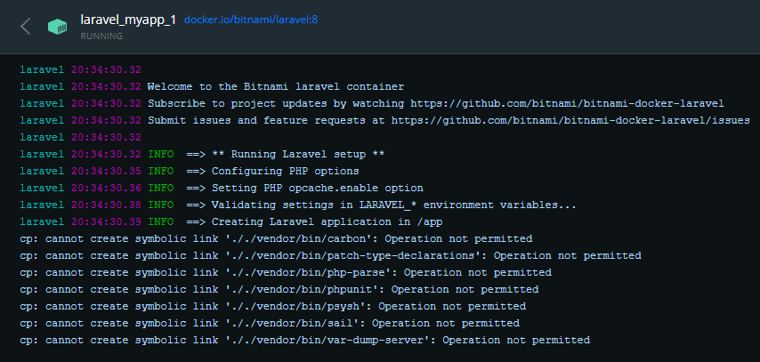
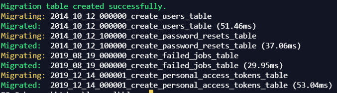

<style>
    img { margin: 20px 0; border-radius: 8px; }

    .alert { color: #BD1550; }
    .warning { color: #E97F02; }
    .success { color: #8A9B0F; }

    .center { text-align: center; }
    .right { text-align: right; }

    .img-small { max-width: 200px; margin: auto; }
    .img-medium { max-width: 400px; margin: auto; }
    .img-large { max-width: 800px; margin: auto; }

    .leyenda {
        font-size: small;
        margin: 10px 0;
    }
</style>

# Frameworks PHP. Laravel

> Duración estimada: 40 sesiones

## Puesta en marcha

Lo primero de todo es crear una carpeta con el nombre del proyecto que vayamos a crear y nos metemos en ella.

Vamos a utilizar la imagen de Bitnami ya preparada, así que lo que hacer ahora es [descargar el archivo docker-compose.yml](https://github.com/bitnami/bitnami-docker-laravel/blob/master/docker-compose.yml) del repositorio de Github oficial.

Una vez descargado el archivo en nuestra carpeta que acabamos de crear con el nombre del proyecto, lanzamos el siguiente comando por consola para instalar todas las dependencias y crear las imágenes de Docker correspondientes.

```console
docker-compose -p Laravel up -d
```

Si todo ha salido bien podrás ver en el Visual Studio Code que se han creado 2 imágenes y que el servidor web de Laravel está funcionando bajo la siguiente URL.

```console
http://localhost:8000
```

Si por alguna extraña razón **estás en Windows** y no te funciona una de las 2 imágenes, puede ser debido a la instalción de composer dentro de la imagen de Laravel.

<div class="center img-large">
    
</div>

Para solucionarlo, nos vamos a la carpeta del proyecto que se te habrá creado por defecto al hacer docker-compose, en este caso y si no has modificado el archivo .yml la carpeta del proyecto sera `my-proyect` y dentro de ella eliminamos la carpeta `vendor`.

Cuando hayamos eliminado dicha carpeta, necesitaremos instalar `Composer` de manera global en nuestro sistema Windows. Para ello. bájate el instalador [desde este enlace](https://getcomposer.org/Composer-Setup.exe).

Una vez lo instales ya serás capaz de lanzar el comando `composer` desde cualquier consola de Windows.

Por último, abrimos una consola dentro de la carpeta `my-project` o el nombre que le hayas puesto a la carpeta del proyecto de Laravel y ejecutamos el siguiente comando.

```console
composer install
```

Para terminar tan sólo tendremos que volver a ejecutar el contenedor de Laravel desde Docker.

### VSCode extensiones

Recomendable instalar los siguientes plugins para Visual Studio Code

      Laravel Blade Snippets


## Carpetas en Laravel

Al crear un nuevo proyecto con este framework, Laravel crea una serie de carpetas por defecto. Esta estructura de carpetas es la recomendada para utilizar Laravel.

### Public

Esta es la carpeta más importante ya que es donde se ponen todos los archivos que el cliente va a mostrar al usuario cuando introduzcamos la URL de nuestro sitio web. Normalmente se carga el archivo `index.php` por defecto.

### Routes

Otra de las carpetas que más vamos a usar a lo largo de este curso de Laravel. En ella se albergan todas las rutas (redirecciones web) de nuestro proyecto, pero más concretamente en el archivo `web.php`

    Dada una ruta → se cargará una vista

### Resources

Esta es nuestra carpeta de recursos donde guardaremos los siguientes archivos, que también, están separados por sus carpetas... como cada nombre indica:

- `css` Archivos CSS
- `js` Archivos JS (JavaScript)
- `lang` Archivos relacionados con el idioma del sitio (variables & strings)
- `views` Archivos de nuestras vistas, lo que las rutas cargan

## Rutas

Las rutas en Laravel (y en casi cualquier Framework) sirven para redireccionar al cliente (o navegador) a las vistas que nosotros queramos.

Estas rutas se configuran en el archivo `public/routes/web.php` donde se define la ruta que el usuario pone en la URL después del dominio y se retorna la vista que se quiere cargar al introducir dicha dirección en el navegador.

```php
<?php

// Ruta por defecto para cargar la vista welcome cuando el usuario introduce simplemente el dominio

Route::get('/', function () {
    return view('welcome');
});
```

En el ejemplo de arriba vamos a cargar la vista llamada `welcome` que hace referencia a la vista `resources/views/welcome.blade.php`

### Alias

Es interesante darle un alias o un nombre a nuestras rutas para poder utilizar dichos alias en nuestras plantillas de Laravel que veremos más adelante.

Para ello, basta con utilizar la palabra `name` al final de la estructura de la ruta y darle un nombre que queramos; normalmente descriptivo y asociado a la vista que tiene que cargar el enroutador de Laravel.

```php
<?php

Route::get('/users', function () {
    return view('users');
}) -> name('usuarios');
```

Después veremos que es muy útil ya que a la hora de refactorizar o hacer un cambio, si tenemos enlaces o menús de navegación que apuntan a esta ruta, sólo tendríamos que cambiar el parámetro dentro del `get()` y no tener que ir archivo por archivo.

Laravel nos proporciona una manera más cómoda a la hora de cargar una vista si no queremos parámetros ni condiciones. Tan sólo definiremos la siguiente línea que hace referencia la ruta `datos` en la URL y va a cargar el archivo `usuarios.php` de nuestra carpeta `views` como le hemos indicado en el segundo parámetro.

```php
<?php

/* http://localhost/datos/ */

Route::view('datos', 'usuarios');
```

Pero no sólo podemos retornar una vista sino, desde un simple string a módulos propios de Laravel.

### Parámetros

Ya hemos visto que con PHP podemos pasar parámetros a través de la URL, como si fueran variables, que las recuperábamos a través del método GET o POST.

Con Laravel también podemos introducir parámetros pero de una forma más vistosa y ordenada, de tal manera que sea visualmente más cómodo de recordar y de indexar por los motores de búsqueda como Google.

      http://localhost/cliente/324

Para configurar este tipo de rutas en nuestro archivo de rutas `public/routes/web.php` haremos lo siguiente.

``` php
<?php

Route::get('cliente/{id}', function($id) {
    return('Cliente con el id: ' . $id);
});
```

¿Qué pasa si no introducimos un id y sólo navegamos hasta `cliente/` ? ... Nos va a devolver un 404

Para resolver ésto, podemos definir una ruta por defecto en caso de que el `id` (o parámetro) no sea pasado. Para ello usaremos el símbolo `?` en nuestro nombre de ruta e inicializaremos la variable con el valor que queramos.

``` php
<?php

Route::get('cliente/{id?}', function($id = 1) {
    return ('Cliente con el id: ' . $id);
});
```

Ahora tenemos otro problema, porque estamos filtrando por id del cliente que, normalmente es un número, pero si metemos un parámetro que no sea un número, vamos a obtener un resultado no deseado.

Para resolver este caso haremos uso de la cláusula `where` junto con una expresión regular númerica.

``` php
<?php

Route::get('cliente/{id?}', function($id = 1) {
    return ('Cliente con el id: ' . $id);
}) -> where('id', '[0-9]+');
```

Además, podemos pasarle variables a nuestra URL para luego utilzarlas en nuestros archivos de plantillas o en archivos `.php` haciendo uso de un array asociativo. Veamos un ejemplo con la forma reducida para ahorrarnos código

```php
<?php

Route::view('datos', 'usuarios', ['id' => 5446]);
```

... y el archivo `resources/views/usuarios.php` debe tener algo parecido a ésto

```html
<!-- Estructura típica de un archivo HTML5 -->

<p>Usuario con id: <?= $id ?></p>

<!-- ... -->
```

***Con las plantillas de Laravel `blade.php` veremos cómo simplificar aún más nuestro código.***

Para más información acerca de las rutas, parámetros y expresiones regulares en las rutas puedes echar un vistazo a la [documentación oficial de rutas](https://laravel.com/docs/8.x/routing#route-parameters) que contiene numerosos ejemplos.


## Plantillas o Templates

A través de las plantillas de Laravel vamos a escribir menos código PHP y vamos a tener nuestros archivos mejor organizados.

**Blade** es el sistema de plantillas que trae Laravel, por eso los archivos de plantillas que guardamos en el directorio de `views` llevan la extensión `blade.php`.

De esta manera sabemos inmediatamente que se trata de una plantilla de Laravel y que forma parte de una vista que se mostrará en el navegador.

### Directivas

Laravel tiene un gran número de directivas que podemos utilizar para ahorrarnos mucho código repetitivo entre otras funciones.

Digamos que las directivas son pequeñas funciones ya escritas que aceptan parámetros y que cada una de ellas hace una función diferente dentro de Laravel.

- `@yield` Define el contenido dinámico que se va a cargar. Se usa conjuntamente con @section
- `@section` y `@endsection` bloque de código dinámico
- `@extends` importa el contenido de una plantilla ya creada

### Separando código

Veamos un ejemplo de cómo hacer uso del poder de Laravel para crear plantillas y no repetir código.

Supongamos que tenemos ciertas estructuras HTML repetidas como puede ser una cabecera `header`, un menú de navegación `nav` y un par de secciones que hacen uso de este mismo código.

Supongamos que tenemos 2 apartados en la web:

- `Blog`
- `Fotos`

Primero de todo tendremos que generar un archivo que haga de `plantilla` de nuestro sitio web.

Para ello creamos el archivo `plantilla.blade.php` dentro de nuestro directorio de plantillas `resources/views`.

Dicho archivo va a contener el típico código de una página simple de HTML y en el body añadiremos nuestros contenido estático y dinámico.

```html
<body>
    <!-- CONTENIDO ESTÁTICO PARA TODAS LAS SECCIONES -->
    <h1>Bienvenid@s a Laravel</h1>
    <hr>
    
    <!-- MENÚ -->
    <nav>
        <a href={{ route('noticias') }}>Blog</a> | 
        <a href={{ route('galeria') }}>Fotos</a>
    </nav>

    <!-- CONTENIDO DINÁMICO EN FUNCIÓN DE LA SECCIÓN QUE SE VISITA -->
    <header>
        @yield('apartado')
    </header>
</body>
```

Cada sección que haga uso de esta plantilla contendrá el texto estático `Bienvenid@s a Laravel` seguido de un menú de navegación con enlaces a cada una de las secciones y el contenido dinámico de cada sección.

Ahora crearemos los archivos dinámicos de cada una de las secciones, en nuestro caso `blog.blade.php` y `fotos.blade.php`

```php
<?php

// blog.blade.php

@extends('plantilla')

@section('apartado')
  <h2>Estás en BLOG</h2>
@endsection
```

Importamos el contenido de `plantilla` bajo la directiva `@extends` para que cargue los elementos estáticos que hemos declarado y con la directiva `@section` y `@endsection` definimos el bloque de código dinámico, en función de la sección que estemos visitando.

Ahora casi lo mismo para la sección de `fotos`

```php
<?php

// fotos.blade.html

@extends('plantilla')

@section('apartado')
  <h2>Estás en FOTOS</h2>
@endsection
```

El último paso que nos queda es configurar el archivo de rutas `routes/web.php`

```php
<?php

// web.php

Route::view('blog', 'blog') -> name('noticias');
Route::view('fotos', 'fotos') -> name('galeria');
```

De esta manera podremos hacer uso del menú de navegación que hemos puesto en nuestra plantilla y gracias a los alias `noticias` y `galeria`, la URL será más amigable.

### Estructuras de control

Como en todo buen lenguaje de programación, en Laravel también tenemos estructuras de control.

En Blade (plantillas de Laravel) siempre que iniciemos un bloque de estructura de control DEBEMOS cerrarla

- `@foreach` ~ `@endforeach` lo usamos para recorrer arrays
- `@if` ~ `@endif` para comprobar condiciones lógicas
- `@switch` ~ `@endswitch` en función del valor de una variable ejecutar un código
  - `@case` define la casuística del switch
  - `@break` rompe la ejecución del código en curso
  - `@default` si ninguna casuística se cumple

```php
<?php

$equipo = ['María', 'Alfredo', 'William', 'Verónica'];

@foreach ($equipo as $nombre)
  <p> {{ $nombre }} </p>
@endforeach
```

Acordaros que podemos pasar variables a través de las rutas como si fueran parámetros. Pero en este caso, vamos a ver otra directiva más; el uso de `@compact`.

```php
<?php

// Uso de @compact
$equipo = ['María', 'Alfredo', 'William', 'Verónica'];

// Route::view('nosotros', ['equipo' => 'equipo']);
Route::view('nosotros', @compact('equipo'));
```

## Controladores

Los controladores son el lugar perfecto para definir la lógica de negocio de nuestra aplicación o sitio web.

Hace de intermediario entre la vista (lo que vemos con nuestro navegador o cliente) y el servidor donde la app está alojada.

Por defecto, los controladores se guardan en una carpeta específica situada en `app/Http/Controllers` y tienen extensión `.php`.

Para crear un controlador nuevo debemos hacer uso de nuestro querido autómata `artisan` donde le diremos que cree un controlador con el nombre que nosotros queramos.

Abrimos la consola y nos situamos en la raíz de nuestro proyecto

```console
php artisan make:controller PagesController
```
Si todo ha salido bien, recibiremos un mensaje por consola con que todo ha ido bien y podremos comprobar que, efectivamente se ha creado el archivo `PagesController.php` con una estructura básica de controlador, dentro de la carpeta `Controllers` que hemos descrito anteriormente.

Ahora podemos modificar nuestro archivo de rutas `web.pbp` para dejarlo limpio de lógica y trasladar ésta a nuestro nuevo controlador.

La idea de ésto es dejar el archivo `web.php` tan limpio como podamos para que, de un vistazo, se entienda todo perfectamente.

**RECUERDA** que sólo movemos la lógica, mientras que las cláusulas como `where` y `name` las seguimos dejando en el archivo de rutas `web.php`

Veamos cómo quedaría un refactor del archivo de rutas utilizando un `Controller` como el que acabamos de crear

Ahora nos quedaría de la siguiente manera

```php
<?php

// web.php (v2.0) ▒▒▒▒ Refactorizado

use App\Http\Controllers\PagesController;
use Illuminate\Support\Facades\Route;

Route::get('/', [ PagesController::class, 'inicio' ]);
Route::get('datos', [ PagesController::class, 'datos' ]);
Route::get('cliente/{id?}', [ PagesController::class, 'cliente' ]) -> where('id', '[0-9]+');
Route::get('nosotros/{nosotros?}', [ PagesController::class, 'nosotros']) -> name('nosotros');
```

y en nuestro archivo controlador lo dejaríamos de la siguiente manera

```php
<?php

// PagesController.php

namespace App\Http\Controllers;

class PagesController extends Controller
{
    public function inicio() { return view('welcome'); }

    public function datos() { 
        return view('usuarios', ['id' => 56]);
    }

    public function cliente($id = 1) {
        return ('Cliente con el id: ' . $id);
    }

    public function nosotros($nombre = null) {
        $equipo = [
            'Paco',
            'Enrique',
            'Maria',
            'Veronica'
        ];

        return view('nosotros', @compact('equipo', 'nombre'));
    }
}
```

## Migraciones & Eloquent

Con las migraciones vamos a gestionar la base de datos de nuestro sitio web; tanto crear nuevas BBDD como editarlas desde Laravel.

Las migraciones de un sitio hecho con Laravel se alojan en la ruta `database/migrations` y tienen extensión `.php`.

Si te fijas, nada más instalar Laravel con la imagen de Bitnami, se han creado varios archivos de migraciones que podemos usar, pero de momento los dejamos ahí y **NO LOS BORRAMOS** porque son muy útiles.

### Archivos .env

Es de uso común trabajr con archivos de entorno llamados también `archivos .env`. Normalmente, eun unproyecto real puedes encontrarte con varios archivos de este tipo en función del despliegue que se quiera hacer; como por ejemplo:

  - `test.env` config. para desplegar en entorno seguro de pruebas
  - `release.env` config. para desplegar cambios de versión que se envía a los *beta testers*
  - `production.env`config. para desplegar el código ya probado al resto del mundo.

En nuestro caso, como no vamos a desplegar nada, sólo vamos a usar un único archivo `.env` y en cuestión de las migraciones vamos a fijarnos a partir de la línea 11 donde dice:

```console
DB_CONNECTION=mysql
DB_HOST=127.0.0.1
DB_PORT=3306
DB_DATABASE=blog
DB_USERNAME=root
DB_PASSWORD=
```

En este archivo debemos configurar los datos de nuestro servidor MySQL y rellenarlo con la información correspondiente a nuestra base de datos <span class="alert">***ya creada***</span>

Una vez tengamos ésto, lo que nos queda es ejecutar el comando de las migraciones a través del CLI `artisan`

```console
php artisan migrate
```

Si todo ha salido bien obtendremos el siguiente resultado donde podremos observar que todas las migraciones se han insertado correctamente en la base de datos.

<div class="center img-large">
    
</div>

Si nos vamos al cliente que utilicemos para manejar la base de datos (phpMyAdmin por ejemplo) veremos que en nuestra base de datos se han creado todas las tablas de la migración que hemos ejecutado y **además** una tabla que se llama <span class="success">***migrations***</span>.

La tabla `migrations` es simplemente un registro de todas las migraciones llevadas a cabo. Además, podemos hacer un ***rollback*** en caso de que queramos reestablecer nuestra base de datos.

```console
php artisan migrate:rollback
```

### Modelos

Gracias a Eloquent y su integración con Laravel, podremos crear modelos de datos de una manera automatizada a través de `artisan`

Ahora que ya sabemos manejar las migraciones es hora de crear nuestras propias migraciones pero a través de Eloquent.

A través de la instrucción `make:model` creamos un nuevo modelo de datos, a continuación ponemos el nombre <span class="alert">***siempre empezando en Mayúsucla y en SINGULAR***</span> y pasamos el parámetro relacionado con las migraciones `-m`.

```console
php artisan make:model Nota -m
```

Si todo ha salido bien, veremos en nuestro directorio de migraciones `database/migrations` un nuevo archivo que se llama `2022_01_07_81237_create_notas_table.php`.

El siguiente paso es ver nuestro archivo de migraciones y editarlo para que contenga las tablas que nosotros queramos. Si lo visualizamos tan sólo tendrá la estructura básica con un par de tablas. Vamos a añadir un par de tablas más.

```php
<?php

Schema::create('notas', function (Blueprint $table) {
  $table->id();
  $table->timestamps();

  $table->string('nombre');
  $table->text('descripcion');
});
```
En esta `Schema` podemos poner todas las tablas que nosotros queramos y establecer el tipo de dato para cada una de ellas, así como el nombre.

Una vez que estamos satisfechos con nuestro esquema debemos volver a ejecutar el código de migración a través de artisan para que se introduzca esta nueva información en la base de datos.

Para ver todos los tipos de datos que maneja Eloquent puedes visitar la [documentación oficial](https://laravel.com/docs/5.0/schema#adding-columns).

### Recuperando datos

Ya tenemos nuestra base de datos creada con nuestras tablas migradas, ahora sólo falta rellenar esas tablas con datos para poder pintarlos en nuestro código HTML.

Rellenamos las tablas a través del cliente de MySQL que más nos guste:

- PHP MyAdmin
- [MySQL Workbench](https://www.mysql.com/products/workbench/)
- [HeidiSQL](https://www.heidisql.com/download.php) *
- [SquirrelSQL](http://www.squirrelsql.org/#installation)

Ahora tendremos que irnos a una vista ya creada o creamos una nueva y solicitamos los datos desde el HTML.

¿Nos acordamos del `PagesController`? pues hacer uso de su magia junto con las rutas que creamos en `web.php`

```php
<?php

// estamos en ▓▓▓ web.php 

Route::get('notas', [ PagesController::class, 'notas' ]);
```

Antes de intentar entrar, debemos configurar nuestro controlador de la siguiente manera:

```php
<?php

// estamos en ▓▓▓ PagesController.php 

public function notas() {
  $notas = Nota::all();

  return view('notas', compact('notas'));
}

```

El último paso sería, crear la vista con la tabla que pinte los datos a través de la variable que le pasamos por parámetro en la ruta que acabamos de describir.

```php
<?php

// estamos en ▓▓▓ notas.blade.php 

<h1>Notas desde base de datos</h1>

<table border="1">
    <thead>
        <tr>
            <th>Nombre</th>
            <th>Descripción</th>
        </tr>
    </thead>
    
    @foreach ($notas as $nota)
        <tr>
            <td>{{$nota -> nombre}}</td>
            <td>{{$nota -> descripcion}}</td>
        </tr>
    @endforeach
</table>

```
Hay que fijarse bien en los nombres de las columnas que tienen nuestras bases de datos, es justo lo que va después de `->` y siempre rodeado por los símbolos `{{  }}` ya que estamos en un archivo de plantilla.

## Actividades

701. Crea un sitio web con Laravel que contenga el título "Bienvenidos a Laravel", un texto de bienvenida (puede ser un poco de Lorem Ipsum) y a continuación un menú de navegación con sus correspondientes alias y los siguientes enlaces:

  - `Inicio` enlace a la página principal donde se visualizará el texto de Lorem Ipsum además de los elementos estáticos (Título y menú de navegación).

  - `Nosotros` enlace que vaya a la página "nosotros"  y muestre, además de los elementos estáticos de todo el sitio, un h2 que diga "Estás en la sección Nosotros"

  - `Proyecto` enlace que cargue una vista con el siguiente texto "Estás en el proyecto numero: X" donde X es un número entero que podamos introducirlo en la propia ruta. Si no se mete ningún número en la ruta, por defecto tiene que ser 1; por ejemplo

        http://localhost:8000s/proyecto/210937

  - Recuerda que el título y el menú de navegación han de aparecer en todas las vistas que cargues.

---


702. Utilizando las `estructuras` de control y los `controladores` crea un sitio web que contenga lo siguiente:

  - `Inicio` página principal con un título que diga "Bienvenid@s a FOTO ░▒▓ BLOG" y un texto de bienvenida (con un par de frases sobra)

  - `Nosotros` un título de la sección en la que te encuentras y un listado de 3 personas diferentes que, cada uno de los nombres mostrará un texto descriptivo de cada persona cuando pinchemos sobre su nombre.

  - `Fotos` Una sección que aparezca el texto "Estás visualizando la foto con el ID: X" donde X es un parámetro que dependerá de la ruta que se haya introducido. Por defecto, si no se introduce dicho parámetro éste debe valer 1. 

  - Como elementos estáticos debe aparecer:
      - `Imagen` como logtipo
      - El título `FOTO ░▒▓ BLOG` a la derecha del logotipo
      - `Menú` de navegación para moverse por las distintas secciones

  - Puedes usar Bootstrap como algo opcional para practicar. Recuerda que viene incluido con la instalación de Laravel.

---
<!--
### Configuración

En el directorio raiz del proyecto tenemos el archivo `.env`. Este archivo define las variables de entorno que personalizan nuestro entorno. Así pues, es aquí donde deberemos configurar nuestra base de datos.

```
DB_HOST=localhost
DB_DATABASE=severorespuestas
DB_USERNAME=severo
DB_PASSWORD=ochoa
```

## Migraciones

<https://richos.gitbooks.io/laravel-5/content/capitulos/chapter6.html>

A la hora de definir nuestra base de datos, el primer paso suele ser su diseño tanto conceptual, como lógico y físico, haciendo uso de algúna herramienta gráfica tipo *MySQL Workbench* para la posterior generación del código SQL con la estructura de las tablas y sus relaciones.

Las migraciones (<https://laravel.com/docs/master/migrations>) permiten a *Laravel* definir la estructura de la base de datos de manera programática, esto es, mediante PHP en vez de SQL. 

Además de desacoplar el sistema gestor de base de datos de nuestra aplicación mediante el uso de la fachada `Schema`, las migraciones evitan errores de sintaxis y mantienen los entornos de producción, preproducción, pruebas y entorno local con la misma información.

Todo proyecto *Laravel* viene con tres migraciones por defecto, las cuales podemos modificar o eliminar.

### Creación

Para crear una migración podemos crear directamente nuestras clases en la ruta `database/migrations/` de nuestro proyecto *Laravel*, o utilizar los comandos de `artisan`.

Para crear nuestras migraciones en Laravel se usa el siguiente comando:

``` console
php artisan make:migration nombreMigracion
```

que nos crea la clase vacía para escribir nuestra migración, o bien el comando:

``` console
php artisan make:migration nombreMigracion --create=nombreTabla
```
que nos agrega una plantilla de trabajo básica para empezar a trabajar.

Esta clase que acabamos de crear hereda de `Illuminate\Database\Migrations\Migration`. El método que se encarga de generar la migración es `up()`, y dentro de él, mediante la clase `Schema` indicaremos la estructura de la tabla junto con sus atributos y dominios. Para deshacer las migraciones rescribiremos el método `down()`.

Por ejemplo, vamos a crear la tabla `preguntas` de nuestra aplicación.

!!! important "Tablas en plural"
  Ya lo comentamos en la unidad anterior. Laravel se basa en la convención sobre la configuración. Por ello, las tablas se nombran en plural.

Para ello, primero crearemos la migración mediante la consola:

``` console
php artisan make:migration createPreguntasTable
```
Y posteriormente rellenaremos los métodos con su definición:

``` php
<?php
use Illuminate\Database\Migrations\Migration;
use Illuminate\Database\Schema\Blueprint;
use Illuminate\Support\Facades\Schema;

class CreatePreguntasTable extends Migration
{
    /**
     * Ejecuta las migraciones.
     *
     * @return void
     */
    public function up()
    {
      Schema::create('preguntas', function(Blueprint $table) {
        $table->id();
        $table->string('titulo');
        $table->text('descripcion')->nullable();
        $table->timestamps();
      });
    }

    /**
     * Deshace las migraciones.
     *
     * @return void
     */
    public function down()
    {
      Schema::dropIfExists('preguntas');
    }
}
```

Si nos fijamos en el método `up()`, mediante `Schema::create('nombreTabla', funcionBlueprint)` le indicamos los campos, con sus tipos de datos y restricciones.

Podéis consultar todos los tipos disponibles en <https://laravel.com/docs/master/migrations#available-column-types>. Los tipos más utilizados son:

* `id`: crea un campo autoincrementable y le asigna la clave primaria. No recibe ningún parámetro.
* `integer`: crea un campo de tipo entero
* `decimal`: crea un campo de tipo decimal, al que se le indican tanto la precisión como las escala (dígitos decimales)
  ``` php
  table->decimal('amount', $precision = 8, $scale = 2);
  ```
* `string`: crea una campo de tipo cadena
* `text`: crea un campo de tipo texto
* `timestamp`: crea las columnas `created_at` y `updated_at`. No recibe ningún parámetro.

### Ejecución

Así pues, una vez creada la migración, sólo nos queda ejecutarla mediante la opción `migrate`:

```
php artisan migrate
```

Si en algún momento queremos deshacer la última migración, realizaremos un *rollback*:

```
php artisan migrate:rollback
```

Finalmente, si queremos deshacer todos los cambios, realizaremos un *reset*:

```
php artisan migrate:reset
```

Así pues, si ejecutamos nuestras migraciones y nos conectamos a nuestra base de datos, podremos ver cómo se ha creado la tabla `preguntas`.

``` console
$ php artisan migrate      
Migrating: 2021_08_06_112804_create_preguntas_table
Migrated:  2021_08_06_112804_create_preguntas_table (97.47ms)
```

Y si nos conectamos a la base de datos, veremos que realmente ha creado dos tablas: `migrations` y `preguntas`. La tabla `migrations` almacena un historico de las migraciones realizadas y nuestra tabla `preguntas` tiene la estructura que habíamos definido:


### Validaciones

https://laravel.com/docs/master/validation

## Integración con Eloquent

Para integrar nuestras migraciones con los modelos, si el nombre de la tabla coincide, ya estarían conectados.


!!! important "Modelos en singural"
  Ya lo comentamos en la unidad anterior. Laravel se basa en la convención sobre la configuración. Por ello, los modelos se nombran en singular, y su tablas asociadas en plural.


Para facilitar el trabajo a la hora de crear los modelos, podemos indicarle que también genere su migración con la opción `--migration` o `-m` (la migración se crea desde 0, con lo cual no puede existir una migración previa con dicho nombre):

``` console
php artisan make:model nombreModelo --migration
```

La migración creada tendrá el esqueleto rellenado con los atributos `$table->id()` y el `$table->timestamps()`.

### Controlador recurso

Métodos create, show....

Formulario de create Pregunta

Formulario de store Pregunta
1 Validar
2 Guardar en BD
3 Redirect a vista/controller

TODO: Revisar las validaciones de los controladores ... creo que el lugar correcto es aquí al recoger datos

## Referencias

* Curso de Laravel de www.pildorasinformaticas.es: <https://www.pildorasinformaticas.es/course/laravel/>
* Libro / Apuntes sobre Laravel 5 en castellano: <https://richos.gitbooks.io/laravel-5>
* Apuntes Laravel creados por `igomis`, docente del IES Batoi de Alcoy(valenciano): https://igomis.github.io/apunts/

## Actividades
-->